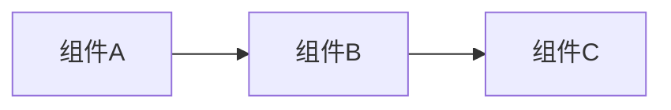

# 贡献指南

感谢你对 K8s Guide 的关注！本文档介绍如何参与贡献。

## 项目概述

K8s Guide 有两条学习轨道：

| 轨道 | 受众 | 内容风格 | 模板 |
|------|------|----------|------|
| 🌱 **初学者** | 零基础 / 入门用户 | 详细步骤 + 动手实验 + 比喻 | `docs/templates/beginner-template.md` |
| 💼 **求职者** | 准备 K8s 岗位面试 | 系统理解 + 实现深度 + 面试题 | `docs/templates/interview-deep-dive-template.md` |

**新贡献者建议从初学者轨道开始写。**

## 开发环境

```bash
# 克隆仓库
git clone https://github.com/callmebg/k8s-guide.git
cd k8s-guide

# 安装依赖
npm install

# 启动开发服务器（支持 HMR）
npm run docs:dev

# 构建生产版本
npm run docs:build

# 预览构建结果
npm run docs:preview
```

## 贡献流程

### 1. Fork 和分支

```bash
# Fork 后克隆你的仓库
git clone https://github.com/<your-username>/k8s-guide.git

# 创建分支（命名规范）
git checkout -b doc/add-pod-lifecycle      # 新增文章
git checkout -b fix/cni-deep-dive-typo    # 修复错误
git checkout -b feat/add-scheduling-deep  # 新增功能/深潜文章
```

### 2. 选择模板

根据你要写的轨道，复制对应模板：

```bash
# 初学者文章
cp docs/templates/beginner-template.md docs/beginner/XX-topic.md

# 求职者深潜文章
cp docs/templates/interview-deep-dive-template.md docs/interview/deep-dive/topic.md
```

### 3. 编写文章

按照模板结构编写，注意：
- 使用 Mermaid 绘制图表（VitePress 原生支持）
- 概念比喻图使用千问万相生成（见下方"插图规范"）
- 内部链接使用绝对路径：`[链接文字](/beginner/03-first-pod)`

### 4. 本地检查

```bash
# 运行 Markdown lint
npm run lint

# 本地预览，确认渲染效果
npm run docs:dev

# 构建检查（确保无死链）
npm run docs:build
```

### 5. 提交 PR

```bash
git add .
git commit -m "doc: add beginner article on Pod lifecycle"
git push origin doc/add-pod-lifecycle
```

然后在 GitHub 上创建 Pull Request。

## 插图规范

### Mermaid 图表（代码即图）

直接在 Markdown 中使用 Mermaid 代码块：

````markdown

````

VitePress 和 GitHub 都原生渲染 Mermaid。

### AI 生成插图（千问万相）

在 Markdown 中用 HTML 注释写 prompt，方便后续生成：

```html
<!-- 🎨 AI插图 | 千问万相 prompt -->
<!-- 提示词: "扁平化风格插画，一个集装箱货船在大海上航行，
     蓝色科技感配色，简洁干净，白色背景，16:9横版构图" -->
<!-- 文件: docs/assets/my-illustration.png -->
```

**Prompt 编写规范**：
- 指定风格：`扁平化插画` / `简约线条画` / `3D等距风格`
- 指定配色：`蓝色科技感` / `蓝白配色`
- 指定构图：`16:9横版` / `1:1方图`
- 指定背景：`白色背景` / `深色背景`（配合暗色模式）
- **避免在 prompt 中要求精确文字**（AI 生图容易把文字搞乱）

生成后将图片保存到 `docs/assets/` 目录，然后在文章中引用：

```markdown

```

## Frontmatter 规范

### 初学者文章

```yaml
---
track: beginner
step: 3                    # 文章序号
title: "文章标题"
description: "一句话描述"
estimated_time: 30min      # 预计阅读时间
lab_required: true         # 是否配套实验
tags:
  - Pod
  - 核心资源
---
```

### 求职者文章

```yaml
---
track: interview
type: deep-dive            # overview | breadth | deep-dive | question-bank | strategy
domain: networking         # networking | scheduling | storage | security | observability
title: "文章标题"
description: "一句话描述"
depth: advanced            # intermediate | advanced
prerequisites:
  - /interview/breadth/networking-review
---
```

## 分支保护

`main` 分支受保护，PR 需要满足：
- ✅ Markdown lint 通过
- ✅ VitePress 构建成功（无死链）
- ✅ 至少一个 reviewer 批准

## 问题反馈

- **内容错误**：提交 [Bug Report](https://github.com/callmebg/k8s-guide/issues/new?template=bug-report.md)
- **新增主题**：提交 [Content Request](https://github.com/callmebg/k8s-guide/issues/new?template=content-request.md)
- **改进建议**：提交 [Improvement](https://github.com/callmebg/k8s-guide/issues/new?template=improvement.md)

## 行为准则

本项目遵循 [Contributor Covenant](CODE_OF_CONDUCT.md)，请友善对待每一位贡献者。
