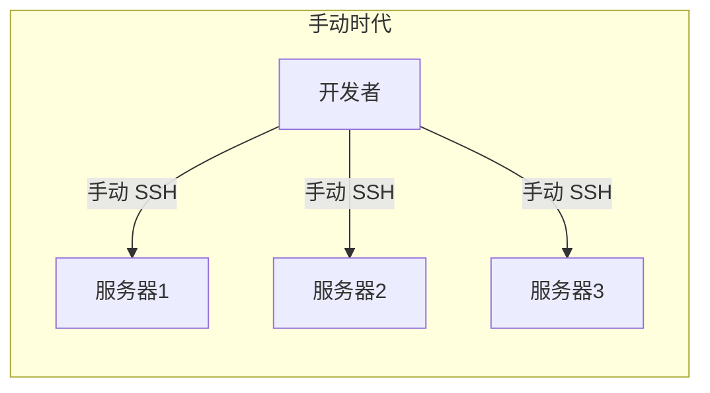
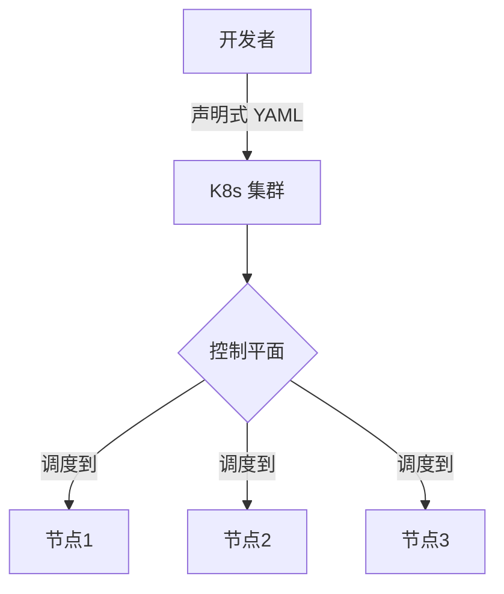
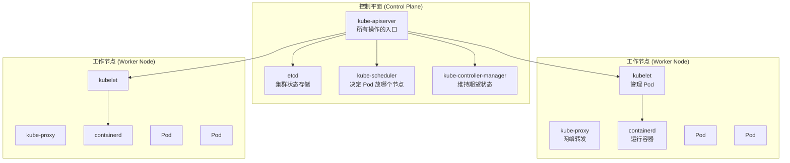

# 什么是 Kubernetes

## 概念引入

想象你经营一个巨大的**集装箱港口**：

- 每天有上百艘货船要停靠（你的应用程序）
- 每艘船需要泊位、电力、工人（CPU、内存、存储）
- 有的船坏了要换一艘顶上（自动修复）
- 旺季来了要多安排船，淡季要减少（自动扩缩）
- 你不可能每艘船都手动管

**Kubernetes（简称 K8s）就是那个港口调度系统。** 你告诉它"我要 3 艘这样的船"，它会自动帮你安排泊位、调度工人、坏了就替换、多了就缩减。

::: info 名字由来
Kubernetes 来自希腊语，意思是"舵手"或"飞行员"。Google 内部叫它 Borg，2014 年开源后改名 Kubernetes。因为 K 和 s 之间有 8 个字母，所以简称 **K8s**。
:::

## 原理讲解

### K8s 解决什么问题？

在 K8s 之前，你可能这样部署应用：

问题：每台服务器手动操作，不可扩展、容易出错、无法自动修复。

有了 K8s 之后：

你只需要**声明**"我要什么"，K8s 自动帮你实现。

### 核心概念速览

| 概念 | 比喻 | 说明 |
|------|------|------|
| **Cluster** | 整个港口 | 一组服务器组成的集群 |
| **Node** | 港口里的码头 | 集群中的一台服务器 |
| **Pod** | 一艘货船 | K8s 的最小调度单元，包含一个或多个容器 |
| **Deployment** | 航运公司的调度计划 | 声明"我要几艘这样的船" |
| **Service** | 港口接待处 | 稳定的访问入口，不管后面的船怎么换 |

### K8s 架构一览

> 💡 **现在不用记住每个组件。** 后面每篇文章会逐步介绍它们。这里只需要知道：控制平面负责"决策"，工作节点负责"干活"。

### 声明式 vs 命令式

K8s 最大的特点是**声明式**操作：

| | 命令式（传统） | 声明式（K8s） |
|---|---|---|
| 方式 | "在服务器 A 上启动这个容器" | "我要 3 个这样的 Pod" |
| 谁做决策 | 你 | K8s |
| 自动修复 | ❌ 需要手动 | ✅ K8s 自动补上 |
| 示例 | `docker run nginx` | `kubectl apply -f deploy.yaml` |

声明式的好处：你写一份 YAML 描述想要的状态，K8s 会**持续**把现实状态调整到与你声明的一致——即使 Pod 崩溃了、节点宕机了，K8s 都会自动修复。

## 自检问题

1. **K8s 的 K 和 s 之间有几个字母？为什么叫 K8s？**

查看答案

8 个字母（ubernete），所以 K + 8 + s = K8s。

2. **Pod 和容器是什么关系？**

查看答案

Pod 是 K8s 的最小调度单元，一个 Pod 可以包含一个或多个容器。Pod 里的容器共享网络和存储。

3. **声明式和命令式的核心区别是什么？**

查看答案

命令式是你告诉系统"怎么做"（具体步骤），声明式是你告诉系统"要什么"（期望状态），由系统自己决定怎么做。K8s 是声明式的。

## 下一步

现在你知道了 K8s 是什么。接下来，我们安装本地实验环境：

→ [02. 安装 Kind](./02-install-kind)
