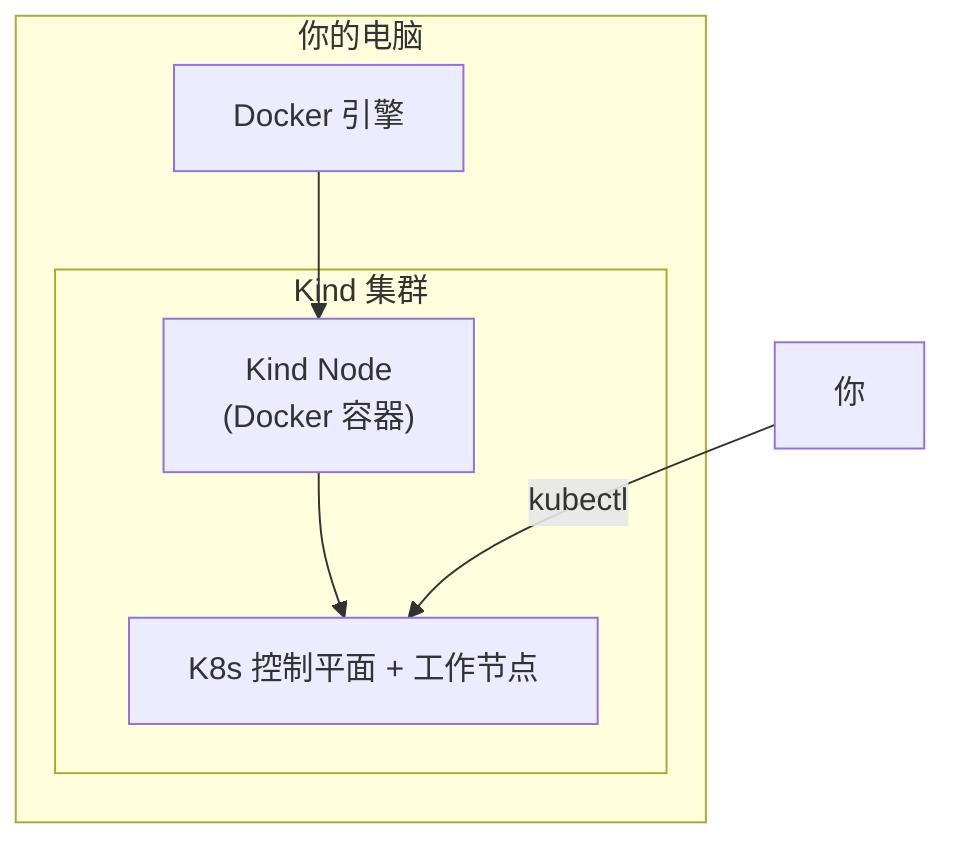
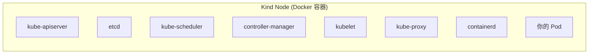

# 安装 Kind

## 概念引入

上一篇我们知道了 K8s 是什么，但你不可能在港口调度系统上直接练习——你需要一个**迷你港口**。

**Kind（Kubernetes in Docker）** 就是这样一个迷你港口。它在你电脑的 Docker 里运行一个完整的 K8s 集群，启动只要不到 1 分钟，用完随时删掉。就像在你书桌上放了一个港口模型，可以随便摆弄。



### 为什么选 Kind？

| 工具 | 启动速度 | 资源占用 | 多节点 | 适合场景 |
|------|----------|----------|--------|----------|
| **Kind** | ⚡ <1分钟 | 小 | ✅ | 本地学习、CI 测试 |
| Minikube | 🐢 2-5分钟 | 大 | ✅ | 需要完整 VM 隔离 |
| Docker Desktop | ⚡ 即开 | 小 | ❌ 单节点 | 只需要简单单节点 |

## 原理讲解

### Kind 的工作原理

Kind 的每个"节点"实际上是一个 Docker 容器。容器里运行着完整的 K8s 组件：



这意味着你可以在一台电脑上创建多节点集群——每个节点就是一个容器。

### 前提条件

Kind 依赖 Docker。你需要先安装：

1. **Docker Desktop**（macOS/Windows）或 **Docker Engine**（Linux）
2. **kubectl**（K8s 命令行工具）
3. **Kind** 本身

> 🪟 **Windows 用户**：本文所有实验命令均为 Linux/macOS shell 语法。建议通过 **WSL2** 学习：
> 1. 在 PowerShell（管理员）中执行 `wsl --install`，重启后进入 Ubuntu 终端
> 2. 安装 [Docker Desktop](https://www.docker.com/products/docker-desktop/)，在 Settings → Resources → WSL Integration 中启用你的 Ubuntu 发行版
> 3. 后续所有命令直接在 WSL2 Ubuntu 终端中执行（走下面的 **Linux** 路线即可）

## 动手实验

### 步骤 1：安装 Docker

**macOS**：从 [docker.com](https://www.docker.com/products/docker-desktop/) 下载 Docker Desktop

**Linux (Ubuntu)**：

```bash
# 安装 Docker
sudo apt-get update
sudo apt-get install -y docker.io
sudo usermod -aG docker $USER
# 重新登录使 docker 组生效
```

验证：

```bash
docker version
```

预期输出：

```
Client:
 Version:           24.x.x
Server:
 Version:           24.x.x
```

### 步骤 2：安装 kubectl

```bash
# macOS
brew install kubectl

# Linux
curl -LO "https://dl.k8s.io/release/$(curl -L -s https://dl.k8s.io/release/stable.txt)/bin/linux/amd64/kubectl"
chmod +x kubectl
sudo mv kubectl /usr/local/bin/
```

验证：

```bash
kubectl version --client
```

### 步骤 3：安装 Kind

```bash
# macOS
brew install kind

# Linux
[ $(uname -m) = x86_64 ] && curl -Lo ./kind https://kind.sigs.k8s.io/dl/v0.24.0/kind-linux-amd64
[ $(uname -m) = aarch64 ] && curl -Lo ./kind https://kind.sigs.k8s.io/dl/v0.24.0/kind-linux-arm64
chmod +x ./kind
sudo mv ./kind /usr/local/bin/kind
```

验证：

```bash
kind version
```

### 步骤 4：创建你的第一个集群

先创建配置文件（后续 Ingress 和 NodePort 实验需要端口映射）：

```bash
cat > kind-config.yaml << 'EOF'
kind: Cluster
apiVersion: kind.x-k8s.io/v1alpha4
nodes:
- role: control-plane
  kubeadmConfigPatches:
  - |
    kind: InitConfiguration
    nodeRegistration:
      kubeletExtraArgs:
        node-labels: "ingress-ready=true"
  extraPortMappings:
  - containerPort: 80
    hostPort: 80
    protocol: TCP
  - containerPort: 443
    hostPort: 443
    protocol: TCP
  - containerPort: 30080
    hostPort: 30080
    protocol: TCP
- role: worker
- role: worker
EOF
```

然后创建集群：

```bash
kind create cluster --name k8s-guide --config kind-config.yaml
```

预期输出：

```
Creating cluster "k8s-guide" ...
 ✓ Ensuring node image (kindest/node:v1.31.0) 🖼
 ✓ Preparing nodes 📦
 ✓ Writing configuration 📜
 ✓ Starting control-plane 🕹️
 ✓ Installing CNI 🔌
 ✓ Installing StorageClass 💾
Set kubectl context to "kind-k8s-guide"
You can now use your cluster with:

kubectl cluster-info --context kind-k8s-guide
```

### 步骤 5：验证集群

```bash
kubectl get nodes
```

预期输出：

```
NAME                      STATUS   ROLES           AGE   VERSION
k8s-guide-control-plane   Ready    control-plane   30s   v1.31.0
```

```bash
kubectl cluster-info
```

预期输出：

```
Kubernetes control plane is running at https://127.0.0.1:xxxxx
CoreDNS is running at https://127.0.0.1:xxxxx/api/v1/namespaces/kube-system/services/kube-dns:dns/proxy
```

🎉 **恭喜！你有了一个运行中的 K8s 集群！**

### 步骤 6：清理

实验完成后，删除集群：

```bash
kind delete cluster --name k8s-guide
```

> 💡 如果你还想继续学习，先不要删！后面的文章会继续用这个集群。

## 自检问题

1. **Kind 集群的"节点"实际上是什么？**

<details>
<summary>查看答案</summary>
是一个 Docker 容器。Kind 在 Docker 容器里运行完整的 K8s 组件（kubelet、kube-apiserver 等）。
</details>

2. **为什么 Kind 比 Minikube 启动快？**

<details>
<summary>查看答案</summary>
Kind 直接利用已有的 Docker 引擎创建容器，不需要启动完整的虚拟机。Minikube 默认需要启动一个 VM，所以更慢。
</details>

3. **kubectl 和 Kind 是什么关系？**

<details>
<summary>查看答案</summary>
Kind 负责创建和管理集群，kubectl 负责与集群交互（部署应用、查看状态等）。Kind 创建集群后会自动配置 kubectl 的 context。
</details>

## 下一步

集群准备好了，让我们部署第一个应用：

→ [03. 第一个 Pod](./03-first-pod)
