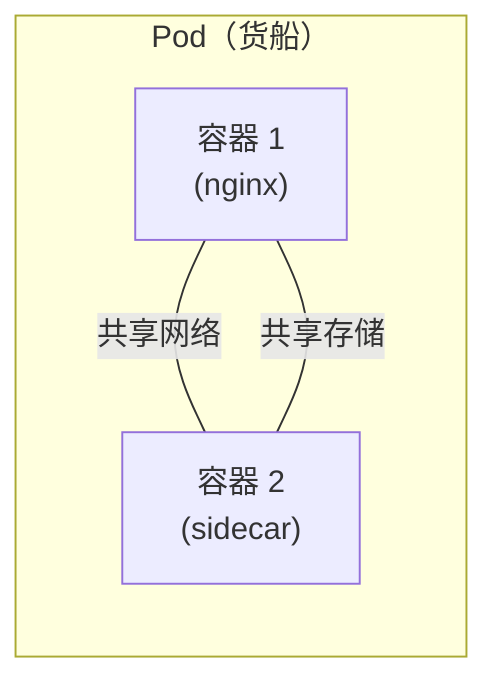
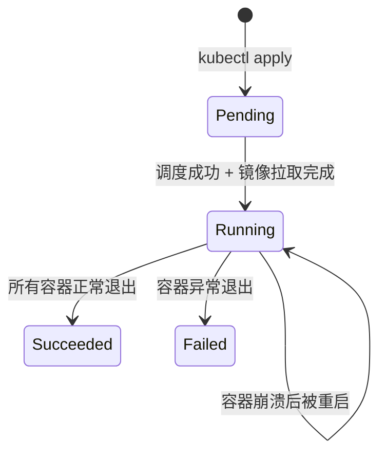
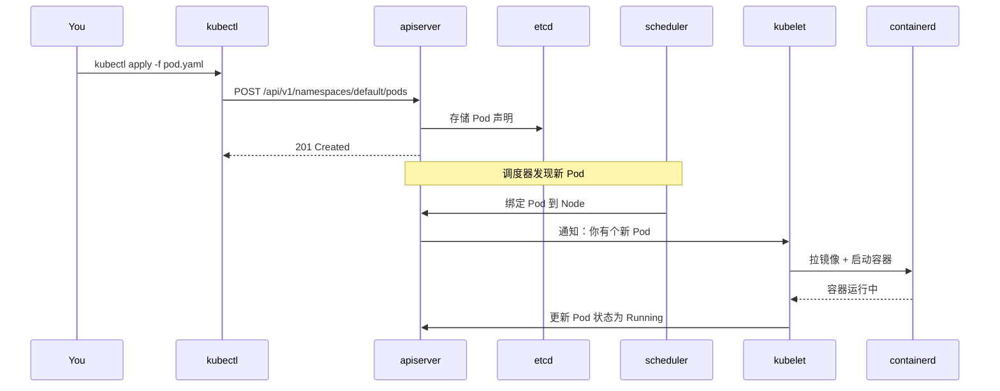

# 第一个 Pod

## 概念引入

还记得港口的比喻吗？**Pod 就是一艘货船。**

<!-- 🎨 AI插图 | 千问万相 prompt -->
<!-- 提示词: "扁平化风格插画，一个集装箱货船标注Pod在大海上航行，
     船上有多个标准化集装箱标注Container，蓝色科技感配色，
     简洁干净，白色背景，16:9横版构图" -->
<!-- 文件: docs/assets/pod-intro.png -->

在 K8s 里，你不会直接操作容器（Docker 容器），而是操作 **Pod**——一个 Pod 是容器的"包装"：



**一个 Pod 里可以有多个容器**，它们共享同一个 IP 地址和存储空间。大多数情况下，你的 Pod 只有一个容器——但知道"可以有多个"很重要。

### Pod 的关键特性

| 特性 | 说明 |
|------|------|
| 临时性 | Pod 会死、会被替换，不要依赖某个具体 Pod |
| 最小单元 | K8s 调度的最小粒度是 Pod，不是容器 |
| 共享网络 | Pod 内的容器用 `localhost` 互相通信 |
| 共享存储 | 可以挂载同一个 Volume |

## 原理讲解

### Pod 的生命周期



- **Pending**：Pod 已被接受，但还没调度到节点上，或者在拉镜像
- **Running**：Pod 已在节点上运行，至少一个容器在执行
- **Succeeded/Failed**：Pod 已终止

### YAML 是怎么描述 Pod 的？

K8s 用 YAML 文件来声明资源。一个最简单的 Pod YAML 长这样：

```yaml
apiVersion: v1        # API 版本
kind: Pod             # 资源类型
metadata:
  name: my-first-pod  # Pod 名称（在集群内唯一）
spec:
  containers:
  - name: web         # 容器名称
    image: nginx:1.27 # 使用什么镜像
    ports:
    - containerPort: 80
```

每个字段都有含义，我们会在后面的文章里逐步展开。

### kubectl 的工作原理



你只需要 `kubectl apply`，后面的调度和执行 K8s 自动完成。

## 动手实验

确保你的 Kind 集群在运行（参考 [02. 安装 Kind](./02-install-kind)）。

### 步骤 1：创建 Pod YAML

```bash
cat > my-first-pod.yaml << 'EOF'
apiVersion: v1
kind: Pod
metadata:
  name: my-first-pod
  labels:
    app: web
spec:
  containers:
  - name: web
    image: nginx:1.27
    ports:
    - containerPort: 80
EOF
```

### 步骤 2：部署 Pod

```bash
kubectl apply -f my-first-pod.yaml
```

预期输出：

```
pod/my-first-pod created
```

### 步骤 3：观察状态

```bash
kubectl get pods
```

预期输出：

```
NAME           READY   STATUS    RESTARTS   AGE
my-first-pod   1/1     Running   0          10s
```

看更详细的信息：

```bash
kubectl describe pod my-first-pod
```

这会显示 Pod 的完整信息：调度到哪个节点、使用了什么镜像、事件日志等。

### 步骤 4：访问 Nginx

通过端口转发在浏览器访问：

```bash
kubectl port-forward pod/my-first-pod 8080:80
```

打开浏览器访问 `http://localhost:8080`，你应该看到 Nginx 欢迎页面。

按 `Ctrl+C` 停止端口转发。

### 步骤 5：查看日志

```bash
kubectl logs my-first-pod
```

预期输出（Nginx 访问日志）：

```
127.0.0.1 - - [21/Jul/2026:10:00:00 +0000] "GET / HTTP/1.1" 200 615 "-" ...
```

### 步骤 6：进入容器

```bash
kubectl exec -it my-first-pod -- /bin/bash
```

现在你在容器内部了！试试：

```bash
# 在容器内执行
hostname     # 显示 Pod 名称
cat /etc/os-release   # 查看操作系统
exit         # 退出容器
```

### 步骤 7：删除 Pod

```bash
kubectl delete pod my-first-pod
```

预期输出：

```
pod "my-first-pod" deleted
```

### 步骤 8：清理 YAML

```bash
rm my-first-pod.yaml
```

## 自检问题

1. **Pod 和容器是什么关系？**

<details>
<summary>查看答案</summary>
Pod 是容器的"包装"。一个 Pod 可以包含一个或多个容器，这些容器共享网络和存储。K8s 调度的最小单位是 Pod，不是容器。
</details>

2. **`kubectl apply` 和 `kubectl delete` 分别做什么？**

<details>
<summary>查看答案</summary>
`kubectl apply` 是声明式的——它读取 YAML 文件并告诉 K8s "我要这个状态"。`kubectl delete` 告诉 K8s 删除指定资源。
</details>

3. **如何查看 Pod 的日志和进入容器？**

<details>
<summary>查看答案</summary>
`kubectl logs POD_NAME` 查看日志，`kubectl exec -it POD_NAME -- /bin/bash` 进入容器的 shell。
</details>

## 下一步

你已经手动创建了一个 Pod。但在生产中，你不会直接管理 Pod——你会用 **Deployment** 来管理它们：

→ [04. Deployment](./04-deployment)
