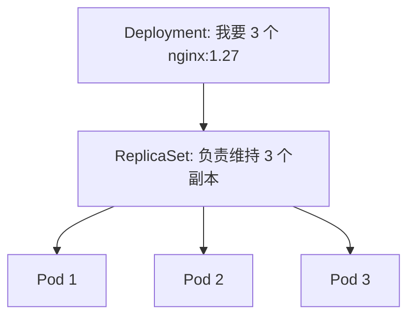
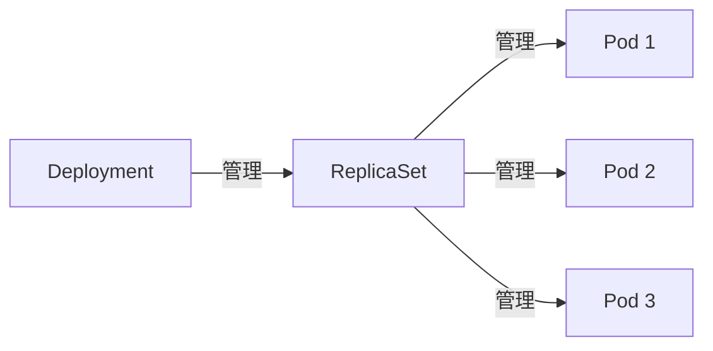
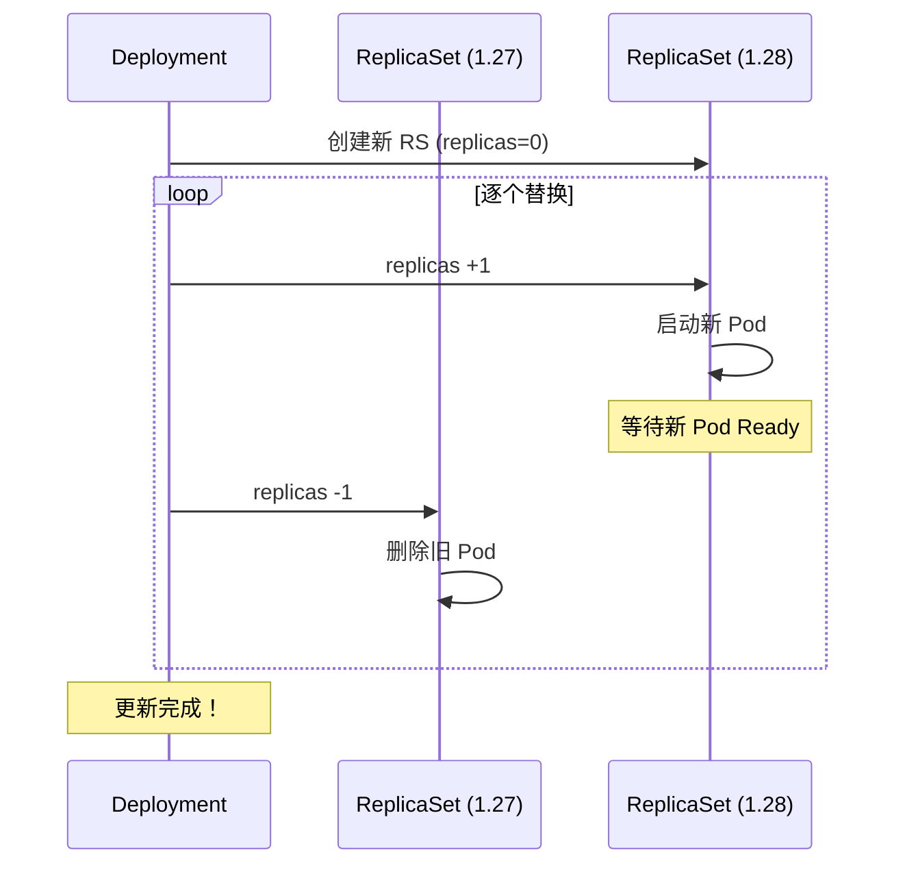

# Deployment

## 概念引入

上一篇你手动创建了一个 Pod。但如果这个 Pod 挂了怎么办？如果你想从 1 个 Pod 扩展到 5 个呢？如果想更新镜像版本又不想停机呢？

**Deployment 就是 Pod 的"管理员"。** 你告诉 Deployment "我要 3 个 nginx Pod"，它会：

- 确保始终有 3 个在运行（少了自动补，多了自动删）
- 更新时逐个替换（滚动更新，不停机）
- 出问题了可以一键回滚



## 原理讲解

### Deployment 的层级关系



- **Deployment**：声明"我要什么"（镜像、副本数、更新策略）
- **ReplicaSet**：确保"指定数量的 Pod 在运行"
- **Pod**：实际运行容器的单元

你几乎不直接操作 ReplicaSet 和 Pod——Deployment 帮你管。

### 滚动更新是怎么工作的？

当你把镜像从 `nginx:1.27` 改成 `nginx:1.28`：



关键参数：

- `maxSurge`：更新时最多多出几个 Pod（默认 25%）
- `maxUnavailable`：更新时最多几个 Pod 不可用（默认 25%）

### Deployment YAML 结构

```yaml
apiVersion: apps/v1
kind: Deployment
metadata:
  name: nginx-deploy
spec:
  replicas: 3          # 要几个 Pod
  selector:
    matchLabels:
      app: nginx       # 通过标签找到它管的 Pod
  strategy:
    type: RollingUpdate
    rollingUpdate:
      maxSurge: 1
      maxUnavailable: 0
  template:            # Pod 模板
    metadata:
      labels:
        app: nginx
    spec:
      containers:
      - name: nginx
        image: nginx:1.27
        ports:
        - containerPort: 80
```

## 动手实验

### 步骤 1：创建 Deployment

```bash
cat > nginx-deploy.yaml << 'EOF'
apiVersion: apps/v1
kind: Deployment
metadata:
  name: nginx-deploy
  labels:
    app: nginx
spec:
  replicas: 3
  selector:
    matchLabels:
      app: nginx
  template:
    metadata:
      labels:
        app: nginx
    spec:
      containers:
      - name: nginx
        image: nginx:1.27
        ports:
        - containerPort: 80
EOF

kubectl apply -f nginx-deploy.yaml
```

预期输出：

```
deployment.apps/nginx-deploy created
```

### 步骤 2：查看 Deployment 和 Pod

```bash
kubectl get deployments
```

预期输出：

```
NAME           READY   UP-TO-DATE   AVAILABLE   AGE
nginx-deploy   3/3     3            3           10s
```

```bash
kubectl get pods -l app=nginx
```

预期输出：

```
NAME                           READY   STATUS    RESTARTS   AGE
nginx-deploy-5d8f7b6c4-abc12   1/1     Running   0          15s
nginx-deploy-5d8f7b6c4-def34   1/1     Running   0          15s
nginx-deploy-5d8f7b6c4-ghi56   1/1     Running   0          15s
```

### 步骤 3：模拟 Pod 故障

删掉一个 Pod 看看会发生什么：

```bash
# 用你的 Pod 名字替换
POD_NAME=$(kubectl get pods -l app=nginx -o jsonpath='{.items[0].metadata.name}')
kubectl delete pod $POD_NAME
```

立刻查看：

```bash
kubectl get pods -l app=nginx -w
```

你会看到旧的被删除，**新的立刻被创建**，始终保持 3 个副本。按 `Ctrl+C` 退出 watch。

### 步骤 4：扩缩容

```bash
# 扩到 5 个
kubectl scale deployment nginx-deploy --replicas=5
kubectl get pods -l app=nginx
```

```bash
# 缩到 2 个
kubectl scale deployment nginx-deploy --replicas=2
kubectl get pods -l app=nginx
```

### 步骤 5：滚动更新

更新镜像版本：

```bash
kubectl set image deployment/nginx-deploy nginx=nginx:1.28
```

观察更新过程：

```bash
kubectl rollout status deployment/nginx-deploy
```

预期输出：

```
Waiting for deployment "nginx-deploy" rollout to finish: 1 out of 2 new replicas have been updated...
deployment "nginx-deploy" successfully rolled out
```

查看更新历史：

```bash
kubectl rollout history deployment/nginx-deploy
```

预期输出：

```text
REVISION  CHANGE-CAUSE
1         (none)
2         (none)
```

### 步骤 6：回滚

```bash
# 回滚到上一个版本
kubectl rollout undo deployment/nginx-deploy

# 回滚到指定版本
kubectl rollout undo deployment/nginx-deploy --to-revision=1
```

### 步骤 7：清理

```bash
kubectl delete -f nginx-deploy.yaml
rm nginx-deploy.yaml
```

## 自检问题

1. **Deployment 和 Pod 的关系是什么？**

<details>
<summary>查看答案</summary>
Deployment 管理 Pod 的生命周期。它通过 ReplicaSet 来确保指定数量的 Pod 始终在运行，并支持滚动更新和回滚。
</details>

2. **滚动更新时如何保证不停机？**

<details>
<summary>查看答案</summary>
通过 maxSurge 和 maxUnavailable 控制。默认先启动新 Pod（maxSurge），等新 Pod Ready 后再删旧 Pod（maxUnavailable）。这样始终有 Pod 在提供服务。
</details>

3. **如何回滚一个 Deployment？**

<details>
<summary>查看答案</summary>

`kubectl rollout undo deployment/名称` 回滚到上一版本，`--to-revision=N` 回滚到指定版本。

</details>

## 下一步

你已经学会了 Deployment。现在看看它背后的 ReplicaSet 是怎么工作的：

→ [05. ReplicaSet](./05-replicaset)
