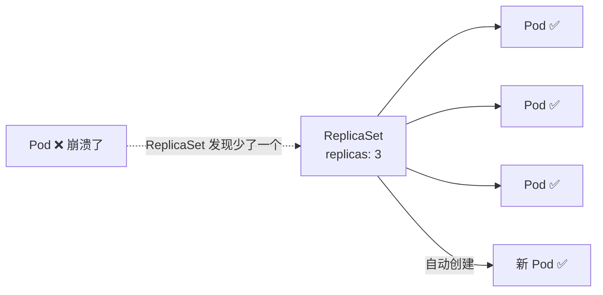
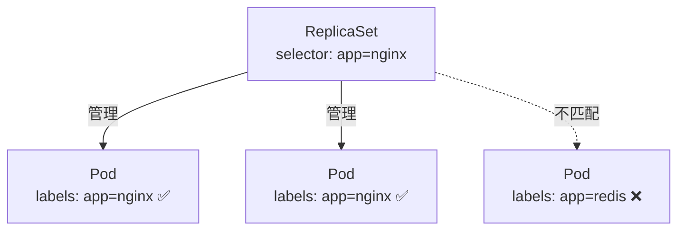
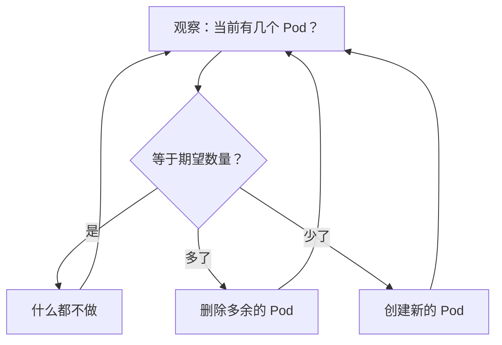

# ReplicaSet

## 概念引入

上一篇你用了 Deployment 来管理 Pod。但 Deployment 并不直接管 Pod——它委托给 **ReplicaSet**。

**ReplicaSet 就是一个"数量守护者"。** 你告诉它"我要 3 个这样的 Pod"，它就持续确保集群里恰好有 3 个匹配的 Pod 在运行——多了删、少了补。



### 为什么不直接用 ReplicaSet？

| | ReplicaSet | Deployment |
|---|---|---|
| 维持副本数 | ✅ | ✅ |
| 滚动更新 | ❌ | ✅ |
| 回滚 | ❌ | ✅ |
| 推荐使用 | 一般不直接用 | ✅ 推荐 |

Deployment 封装了 ReplicaSet，加了更新和回滚能力。**99% 的情况你只用 Deployment。** 但理解 ReplicaSet 有助于你排查问题。

## 原理讲解

### 标签选择器

ReplicaSet 怎么知道哪些 Pod 归它管？通过**标签选择器（selector）**：



标签是 K8s 的核心机制——几乎所有"谁管谁"的关系都靠标签建立。

### 控制循环

ReplicaSet 的工作原理是一个**控制循环**（Control Loop）：



这个循环每秒都在执行。这就是 K8s "声明式"的含义——你声明期望状态，K8s 的控制循环持续把现实状态调整到期望状态。

## 动手实验

### 步骤 1：创建 ReplicaSet

```bash
cat > nginx-rs.yaml << 'EOF'
apiVersion: apps/v1
kind: ReplicaSet
metadata:
  name: nginx-rs
spec:
  replicas: 3
  selector:
    matchLabels:
      app: nginx-rs
  template:
    metadata:
      labels:
        app: nginx-rs
    spec:
      containers:
      - name: nginx
        image: nginx:1.27
EOF

kubectl apply -f nginx-rs.yaml
```

### 步骤 2：查看 ReplicaSet

```bash
kubectl get replicasets
```

预期输出：

```text
NAME       DESIRED   CURRENT   READY   AGE
nginx-rs   3         3         3       5s
```

- **DESIRED**：期望数量
- **CURRENT**：当前数量
- **READY**：已就绪的数量

### 步骤 3：手动扩缩

```bash
# 扩到 5 个
kubectl scale replicaset nginx-rs --replicas=5
kubectl get pods -l app=nginx-rs
```

```bash
# 缩到 1 个
kubectl scale replicaset nginx-rs --replicas=1
kubectl get pods -l app=nginx-rs
```

### 步骤 4：观察自愈

```bash
# 确保有 3 个副本
kubectl scale replicaset nginx-rs --replicas=3

# 删掉一个 Pod
POD=$(kubectl get pods -l app=nginx-rs -o jsonpath='{.items[0].metadata.name}')
kubectl delete pod $POD

# 立刻查看——新 Pod 马上出现
kubectl get pods -l app=nginx-rs -w
```

你会看到一个 Pod 从 `Terminating` 变成消失，同时一个新 Pod 从 `Pending` → `Running`。按 `Ctrl+C` 退出。

### 步骤 5：清理

```bash
kubectl delete -f nginx-rs.yaml
rm nginx-rs.yaml
```

## 自检问题

1. **ReplicaSet 怎么知道哪些 Pod 归它管？**

<details>
<summary>查看答案</summary>
通过标签选择器（selector）。ReplicaSet 的 `matchLabels` 定义了哪些标签的 Pod 归它管理。
</details>

2. **为什么不推荐直接使用 ReplicaSet？**

<details>
<summary>查看答案</summary>
ReplicaSet 只能维持副本数量，不支持滚动更新和回滚。Deployment 封装了 ReplicaSet，提供了更完整的发布管理能力。
</details>

3. **如果手动创建了一个和 ReplicaSet selector 匹配的 Pod，会怎样？**

<details>
<summary>查看答案</summary>
ReplicaSet 会把它纳入管理。如果此时总数超过了 replicas 数量，ReplicaSet 会删除多余的 Pod（不一定是你手动创建的那个）。
</details>

## 下一步

你已经理解了 Deployment → ReplicaSet → Pod 的关系。接下来看看怎么让外部访问你的应用：

→ [06. Service](./06-service)
