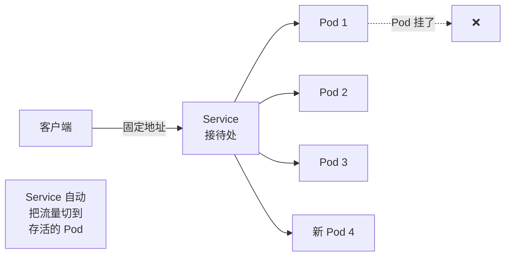
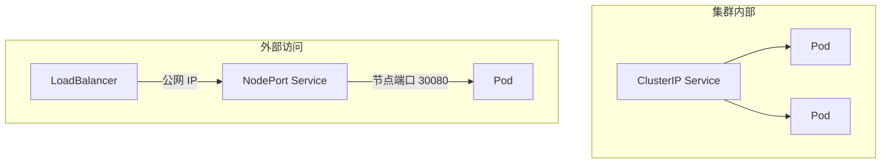

# Service

## 概念引入

还记得港口的比喻吗？Pod 是货船，但货船会来来去去——有的卸完货走了，有的坏了被替换。如果客户每次都要找到具体的某艘船，那就太麻烦了。

**Service 就是港口的"接待处"。** 不管后面的船怎么换，接待处的地址永远不变。客户只需要找接待处，接待处自动把请求转发给可用的船。



## 原理讲解

### 为什么需要 Service？

Pod 有两个问题：

1. **IP 会变**：Pod 重启后 IP 地址变化
2. **数量会变**：扩缩容时 Pod 数量不固定

Service 解决了这两个问题：提供一个**稳定的访问入口**，自动管理后端 Pod 的流量分发。

### Service 的类型

| 类型 | 谁能访问 | 用途 |
|------|----------|------|
| **ClusterIP** | 仅集群内部 | 微服务之间互相调用 |
| **NodePort** | 集群外部 | 通过节点端口暴露服务 |
| **LoadBalancer** | 公网 | 云厂商提供的负载均衡器 |
| **ExternalName** | 映射外部服务 | 把集群内名称映射到外部域名 |



### 标签选择器

Service 怎么知道哪些 Pod 是它的后端？和 ReplicaSet 一样，通过**标签选择器**：

```yaml
selector:
  app: nginx    # 匹配所有 labels 里有 app: nginx 的 Pod
```

### DNS 服务发现

K8s 内置了 DNS（CoreDNS），每个 Service 自动获得一个域名：

```
<service-name>.<namespace>.svc.cluster.local
```

比如名为 `nginx-svc` 的 Service 在同 namespace 下可以直接用 `nginx-svc` 访问。

### Service YAML 结构

```yaml
apiVersion: v1
kind: Service
metadata:
  name: nginx-svc
spec:
  type: ClusterIP       # Service 类型
  selector:
    app: nginx           # 匹配哪些 Pod
  ports:
  - port: 80             # Service 暴露的端口
    targetPort: 80       # Pod 上的目标端口
```

## 动手实验

### 步骤 1：创建 Deployment

```bash
kubectl create deployment nginx --image=nginx:1.27 --replicas=3
```

### 步骤 2：创建 ClusterIP Service

```bash
cat > nginx-svc.yaml << 'EOF'
apiVersion: v1
kind: Service
metadata:
  name: nginx-svc
spec:
  type: ClusterIP
  selector:
    app: nginx
  ports:
  - port: 80
    targetPort: 80
EOF

kubectl apply -f nginx-svc.yaml
```

### 步骤 3：查看 Service

```bash
kubectl get services
```

预期输出：

```text
NAME         TYPE        CLUSTER-IP     EXTERNAL-IP   PORT(S)   AGE
kubernetes   ClusterIP   10.96.0.1      (none)        443/TCP   10m
nginx-svc    ClusterIP   10.96.45.123   (none)        80/TCP    5s
```

### 步骤 4：测试集群内访问

启动一个临时 Pod 来访问 Service：

```bash
kubectl run curl-test --image=curlimages/curl --rm -it -- curl nginx-svc
```

预期输出：Nginx 的 HTML 页面内容。

### 步骤 5：创建 NodePort Service

```bash
cat > nginx-nodeport.yaml << 'EOF'
apiVersion: v1
kind: Service
metadata:
  name: nginx-nodeport
spec:
  type: NodePort
  selector:
    app: nginx
  ports:
  - port: 80
    targetPort: 80
    nodePort: 30080
EOF

kubectl apply -f nginx-nodeport.yaml
```

### 步骤 6：查看 NodePort

```bash
kubectl get service nginx-nodeport
```

预期输出：

```text
NAME             TYPE       CLUSTER-IP     EXTERNAL-IP   PORT(S)        AGE
nginx-nodeport   NodePort   10.96.78.45    (none)        80:30080/TCP   5s
```

### 步骤 7：从外部访问

在 Kind 集群中，需要先获取节点 IP：

```bash
# 获取 Kind 节点的内部 IP
kubectl get nodes -o wide
```

然后用端口转发来模拟外部访问：

```bash
kubectl port-forward service/nginx-nodeport 8080:80
```

打开浏览器访问 `http://localhost:8080`。

### 步骤 8：清理

```bash
kubectl delete -f nginx-svc.yaml -f nginx-nodeport.yaml
kubectl delete deployment nginx
rm nginx-svc.yaml nginx-nodeport.yaml
```

## 自检问题

1. **ClusterIP 和 NodePort 的区别是什么？**

<details>
<summary>查看答案</summary>

ClusterIP 只能在集群内部访问，NodePort 通过在每个节点上开一个端口（30000-32767）允许外部访问。

</details>

2. **Service 怎么知道把流量发给哪些 Pod？**

<details>
<summary>查看答案</summary>

通过标签选择器（selector）。Service 的 selector 匹配 Pod 的 labels，所有匹配的 Pod 自动成为后端。

</details>

3. **在同一个 namespace 里，怎么用一个简单的名字访问 Service？**

<details>
<summary>查看答案</summary>

直接用 Service 名字即可。比如 Service 叫 `nginx-svc`，其他 Pod 可以直接 `curl nginx-svc` 来访问。K8s 的 CoreDNS 自动做了域名解析。

</details>

## 下一步

应用能访问了，但配置信息（数据库地址、API 密钥等）怎么管理？

→ [07. ConfigMap 与 Secret](./07-configmap-secret)
