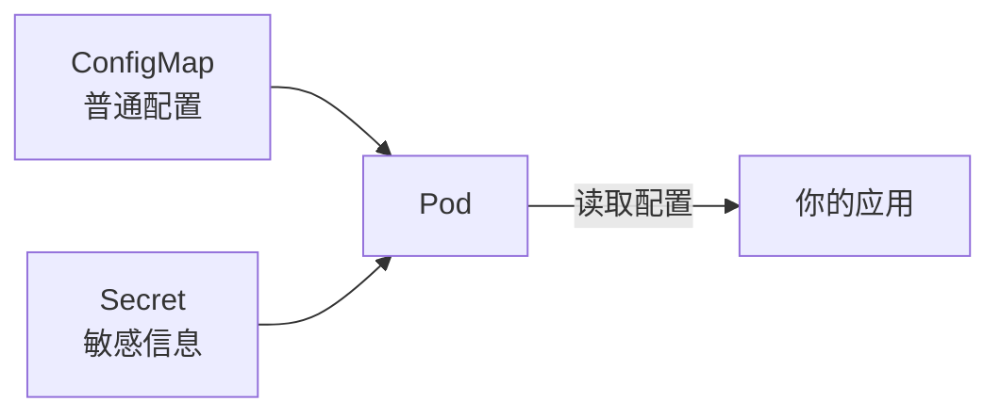
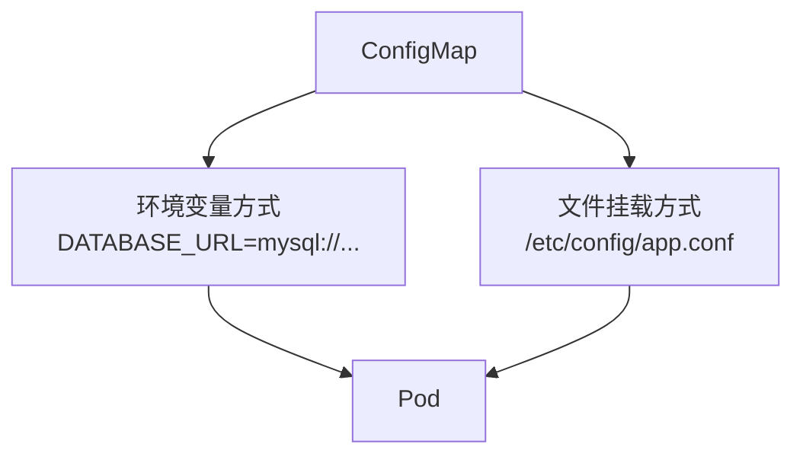

# ConfigMap 与 Secret

## 概念引入

你的应用总需要一些"外部信息"：数据库地址、API 密钥、日志级别……把它们硬编码在镜像里是个坏主意——换个环境就得重新打包。

**ConfigMap** 和 **Secret** 就是 K8s 的"配置管理中心"：

- **ConfigMap**：存普通配置（数据库地址、日志级别）
- **Secret**：存敏感信息（密码、证书、API 密钥），内容 Base64 编码



## 原理讲解

### 两种注入方式

ConfigMap/Secret 的内容可以通过两种方式注入到 Pod：

| 方式 | 怎么用 | 特点 |
|------|--------|------|
| **环境变量** | 变成容器里的环境变量 | 简单，但更新需重启 Pod |
| **文件挂载** | 变成容器里的文件 | 灵活，更新自动同步 |



### ConfigMap 创建方式

```yaml
apiVersion: v1
kind: ConfigMap
metadata:
  name: app-config
data:
  DATABASE_URL: "mysql://db:3306/myapp"
  LOG_LEVEL: "info"
  app.conf: |
    server.port=8080
    server.context-path=/api
```

### Secret 创建方式

```yaml
apiVersion: v1
kind: Secret
metadata:
  name: app-secret
type: Opaque
data:
  # 值需要 Base64 编码
  # echo -n "mypassword" | base64
  DB_PASSWORD: bXlwYXNzd29yZA==
```

> ⚠️ Secret 的"安全"只是 Base64 编码（不是加密）。真正的安全需要配合 RBAC 和加密方案。

## 动手实验

### 步骤 1：创建 ConfigMap

```bash
cat > app-config.yaml << 'EOF'
apiVersion: v1
kind: ConfigMap
metadata:
  name: app-config
data:
  LOG_LEVEL: "info"
  APP_COLOR: "blue"
EOF

kubectl apply -f app-config.yaml
```

### 步骤 2：用环境变量注入

```bash
cat > config-env-pod.yaml << 'EOF'
apiVersion: v1
kind: Pod
metadata:
  name: config-env-pod
spec:
  containers:
  - name: app
    image: busybox
    command: ["sh", "-c", "echo LOG_LEVEL=$LOG_LEVEL APP_COLOR=$APP_COLOR && sleep 3600"]
    env:
    - name: LOG_LEVEL
      valueFrom:
        configMapKeyRef:
          name: app-config
          key: LOG_LEVEL
    - name: APP_COLOR
      valueFrom:
        configMapKeyRef:
          name: app-config
          key: APP_COLOR
EOF

kubectl apply -f config-env-pod.yaml
```

### 步骤 3：验证环境变量

```bash
kubectl logs config-env-pod
```

预期输出：

```text
LOG_LEVEL=info APP_COLOR=blue
```

### 步骤 4：用文件挂载注入

```bash
cat > config-vol-pod.yaml << 'EOF'
apiVersion: v1
kind: Pod
metadata:
  name: config-vol-pod
spec:
  containers:
  - name: app
    image: busybox
    command: ["sh", "-c", "ls /etc/config/ && cat /etc/config/LOG_LEVEL && sleep 3600"]
    volumeMounts:
    - name: config-volume
      mountPath: /etc/config
  volumes:
  - name: config-volume
    configMap:
      name: app-config
EOF

kubectl apply -f config-vol-pod.yaml
```

### 步骤 5：验证文件挂载

```bash
kubectl logs config-vol-pod
```

预期输出：

```text
APP_COLOR
LOG_LEVEL
info
```

每个 ConfigMap 的 key 变成了 `/etc/config/` 下的一个文件，文件内容就是 value。

### 步骤 6：创建 Secret

```bash
# 用命令行创建（自动 Base64 编码）
kubectl create secret generic app-secret \
  --from-literal=DB_PASSWORD=supersecret \
  --from-literal=API_KEY=abc123

# 查看
kubectl get secret app-secret -o yaml
```

### 步骤 7：清理

```bash
kubectl delete pod config-env-pod config-vol-pod
kubectl delete configmap app-config
kubectl delete secret app-secret
rm -f app-config.yaml config-env-pod.yaml config-vol-pod.yaml
```

## 自检问题

1. **ConfigMap 和 Secret 的区别是什么？**

<details>
<summary>查看答案</summary>

ConfigMap 存普通配置，明文存储。Secret 存敏感信息，Base64 编码（不是加密）。两者注入 Pod 的方式相同。

</details>

2. **环境变量和文件挂载各有什么优缺点？**

<details>
<summary>查看答案</summary>

环境变量：简单直接，但更新 ConfigMap 后 Pod 需要重启才能生效。文件挂载：更灵活，ConfigMap 更新后文件会自动同步到容器内，不需要重启。

</details>

3. **Secret 真的安全吗？**

<details>
<summary>查看答案</summary>

不完全安全。Secret 只是 Base64 编码，不是加密。任何有权限读取 Secret 的人都能解码。生产环境应配合 RBAC 权限控制、etcd 加密、或外部密钥管理方案（如 HashiCorp Vault）。

</details>

## 下一步

配置管理搞定了。接下来看看怎么让你的应用自动扩缩容：

→ [08. 扩缩容与发布](./08-scaling-rollout)
