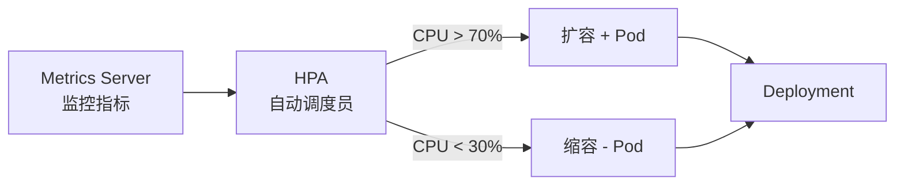
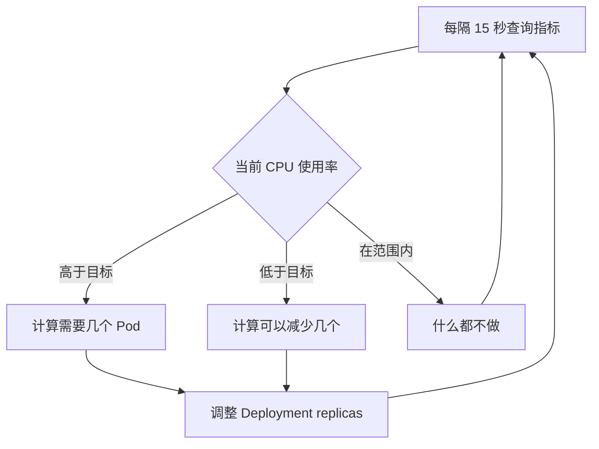

# 扩缩容与发布

## 概念引入

你的电商网站白天流量大需要 10 个 Pod，半夜没什么人只要 2 个就够了。每次手动 `kubectl scale` 太累了。

**HPA（Horizontal Pod Autoscaler）** 就是你的"自动调度员"——它监控 CPU/内存使用率，自动增减 Pod 数量。



## 原理讲解

### HPA 的工作流程



### HPA 的关键参数

| 参数 | 含义 | 示例 |
|------|------|------|
| minReplicas | 最少几个 Pod | 2 |
| maxReplicas | 最多几个 Pod | 10 |
| targetCPUUtilization | 目标 CPU 使用率 | 70% |

### 发布策略概览

除了自动扩缩容，你还需要了解常见的发布策略：

| 策略 | 原理 | 风险 |
|------|------|------|
| **滚动更新** | 逐个替换旧 Pod | 低（默认策略） |
| **蓝绿部署** | 新旧两套环境，切换流量 | 资源翻倍 |
| **金丝雀发布** | 先放少量流量到新版本 | 需要额外工具 |

> 💡 K8s 的 Deployment 原生支持滚动更新。蓝绿和金丝雀需要 Istio/Argo Rollouts 等工具。

## 动手实验

### 前提：安装 Metrics Server

Kind 集群默认没有 Metrics Server，需要先安装：

```bash
kubectl apply -f https://github.com/kubernetes-sigs/metrics-server/releases/latest/download/components.yaml

# Kind 需要额外配置（忽略 TLS 验证）
kubectl patch deployment metrics-server -n kube-system --type='json' -p='[{"op": "add", "path": "/spec/template/spec/containers/0/args/-", "value": "--kubelet-insecure-tls"}]'
```

等待 Metrics Server 就绪：

```bash
kubectl wait --for=condition=ready pod -l k8s-app=metrics-server -n kube-system --timeout=60s
```

### 步骤 1：创建 Deployment

```bash
cat > php-apache.yaml << 'EOF'
apiVersion: apps/v1
kind: Deployment
metadata:
  name: php-apache
spec:
  replicas: 1
  selector:
    matchLabels:
      app: php-apache
  template:
    metadata:
      labels:
        app: php-apache
    spec:
      containers:
      - name: php-apache
        image: registry.k8s.io/hpa-example
        resources:
          requests:
            cpu: 200m
          limits:
            cpu: 500m
        ports:
        - containerPort: 80
EOF

kubectl apply -f php-apache.yaml
```

### 步骤 2：创建 HPA

```bash
kubectl autoscale deployment php-apache --cpu-percent=50 --min=1 --max=10
```

### 步骤 3：查看 HPA

```bash
kubectl get hpa
```

预期输出：

```text
NAME         REFERENCE               TARGETS   MINPODS   MAXPODS   REPLICAS
php-apache   Deployment/php-apache   0%/50%    1         10        1
```

### 步骤 4：模拟压力

在另一个终端生成流量：

```bash
kubectl run load-gen --image=busybox --rm -it -- /bin/sh
# 进入 shell 后执行：
while true; do wget -q -O- http://php-apache; done
```

回到第一个终端观察：

```bash
kubectl get hpa -w
```

你会看到 CPU 使用率上升，HPA 自动扩容 Pod 数量。按 `Ctrl+C` 退出。

### 步骤 5：停止压力测试

关闭 load-gen 终端（或按 `Ctrl+C` 然后 `exit`）。

等待 1-2 分钟后：

```bash
kubectl get hpa
```

HPA 会自动缩容回最小值。

### 步骤 6：清理

```bash
kubectl delete hpa php-apache
kubectl delete -f php-apache.yaml
rm php-apache.yaml
```

## 自检问题

1. **HPA 多久检查一次指标？**

<details>
<summary>查看答案</summary>

默认每 15 秒查询一次 Metrics Server 的指标数据。
</details>

2. **HPA 扩容后什么时候会缩容？**

<details>
<summary>查看答案</summary>

HPA 使用缩容稳定窗口（默认 5 分钟）：在这 5 分钟内，HPA 取所有推荐副本数的**最大值**来决定缩容目标，而不是简单地看"CPU 是否持续低于阈值"。这样可以避免因短暂的指标波动导致过度缩容。
</details>

3. **滚动更新和蓝绿部署的区别？**

<details>
<summary>查看答案</summary>

滚动更新逐个替换 Pod，期间新旧版本共存，不需要额外资源。蓝绿部署维护两套完整环境，通过切换流量实现零停机，但需要双倍资源。
</details>

## 下一步

扩缩容搞定了。接下来了解 K8s 的网络是怎么工作的：

→ [09. 网络基础](./09-networking-basics)
