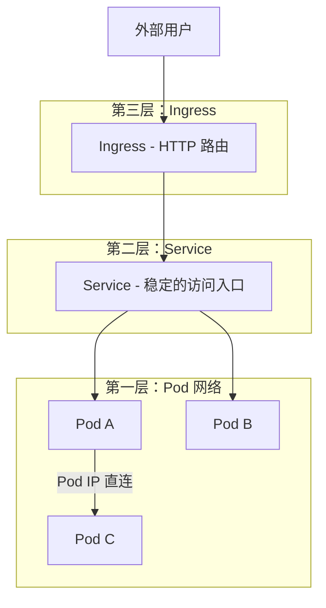
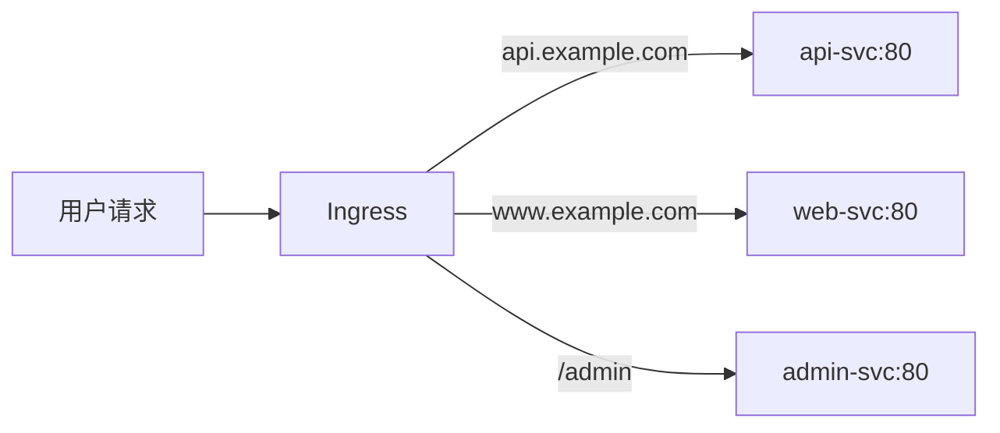

# 网络基础

## 概念引入

你的 K8s 集群里跑着好几个微服务：前端、后端、数据库。它们之间怎么通信？外部用户怎么访问你的网站？

K8s 提供了三层网络能力：



- **Pod 网络**：每个 Pod 有独立 IP，Pod 之间可以直接通信
- **Service**：提供稳定的访问入口（前面讲过）
- **Ingress**：HTTP 层的智能路由（根据域名/路径转发到不同 Service）

## 原理讲解

### Ingress 是什么？

Service 的 NodePort 方式虽然能从外部访问，但有缺点：端口范围有限（30000-32767）、不支持域名路由。

**Ingress 就是 K8s 的"HTTP 路由器"**，可以根据域名和路径把请求转发到不同的 Service：



### Ingress Controller

Ingress 资源本身只是一组规则，你需要一个 **Ingress Controller** 来执行这些规则：

| Controller | 特点 |
|------------|------|
| Nginx Ingress | 最流行，功能丰富 |
| Traefik | 自动发现，配置简单 |
| Kong | API 网关，插件丰富 |

Kind 集群默认不带 Ingress Controller，需要手动安装。

### DNS 服务发现

K8s 集群内置 CoreDNS，每个 Service 自动获得域名：

```text
# 同 namespace 访问
nginx-svc

# 跨 namespace 访问
nginx-svc.production

# 完整域名
nginx-svc.production.svc.cluster.local
```

### Pod 之间的网络

K8s 保证：

- 每个 Pod 有唯一 IP
- 任意两个 Pod 可以直接通信（不需要 NAT）
- 同一节点的 Pod 和不同节点的 Pod 都能互通

这个"扁平网络"由 CNI 插件实现（Kind 默认用 kindnet）。

## 动手实验

> ⚠️ **前置条件**：确保你的 Kind 集群是使用 [02 文中的 kind-config.yaml](./02-install-kind#步骤-4创建你的第一个集群) 创建的（包含 80/443 端口映射）。否则 `curl localhost` 将无法连通。

### 步骤 1：安装 Ingress Controller

```bash
kubectl apply -f https://raw.githubusercontent.com/kubernetes/ingress-nginx/main/deploy/static/provider/kind/deploy.yaml

# 等待就绪
kubectl wait --for=condition=ready pod \
  -l app.kubernetes.io/component=controller \
  -n ingress-nginx --timeout=90s
```

### 步骤 2：创建两个应用

```bash
# 应用 A（web）
kubectl create deployment web --image=nginx:1.27
kubectl expose deployment web --port=80

# 应用 B（api）
kubectl create deployment api --image=hashicorp/http-echo -- -text="Hello from API"
kubectl expose deployment api --port=5678
```

### 步骤 3：测试 DNS 解析

```bash
kubectl run dns-test --image=busybox --rm -it -- nslookup web
```

预期输出（包含 web Service 的 ClusterIP）：

```text
Name:      web.default.svc.cluster.local
Address 1: 10.96.xx.xx web.default.svc.cluster.local
```

### 步骤 4：创建 Ingress

```bash
cat > my-ingress.yaml << 'EOF'
apiVersion: networking.k8s.io/v1
kind: Ingress
metadata:
  name: my-ingress
spec:
  ingressClassName: nginx
  rules:
  - http:
      paths:
      - path: /
        pathType: Prefix
        backend:
          service:
            name: web
            port:
              number: 80
      - path: /api
        pathType: Prefix
        backend:
          service:
            name: api
            port:
              number: 5678
EOF

kubectl apply -f my-ingress.yaml
```

### 步骤 5：通过 Ingress 访问

```bash
# 访问根路径 -> web（Nginx 欢迎页）
curl localhost

# 访问 /api -> api
curl localhost/api
```

预期输出：`/api` 返回 "Hello from API"

### 步骤 6：清理

```bash
kubectl delete ingress my-ingress
kubectl delete deployment web api
kubectl delete service web api
rm my-ingress.yaml
```

## 自检问题

1. **Service 和 Ingress 的区别是什么？**

<details>
<summary>查看答案</summary>

Service 是 L4（TCP/UDP）层的负载均衡，提供稳定的 IP/端口。Ingress 是 L7（HTTP）层的路由器，可以根据域名和 URL 路径把请求转发到不同的 Service。
</details>

2. **为什么需要 Ingress Controller？**

<details>
<summary>查看答案</summary>

Ingress 资源只是一组路由规则，本身不执行任何操作。Ingress Controller（如 Nginx Ingress）是实际处理流量的组件，它读取 Ingress 规则并配置自己的转发逻辑。
</details>

3. **Pod A 怎么通过名字找到 Service B？**

<details>
<summary>查看答案</summary>

通过 K8s 内置的 CoreDNS。每个 Service 自动注册域名（如 `my-svc.default.svc.cluster.local`），同 namespace 下可直接用 Service 名字访问。
</details>

## 下一步

网络搞定了。最后一课——K8s 怎么管理持久化数据：

→ [10. 存储基础](./10-storage-basics)
