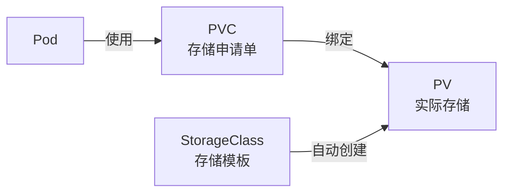
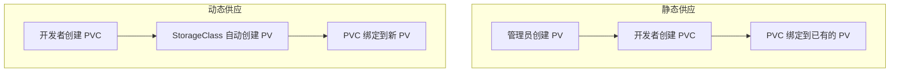

# 存储基础

## 概念引入

容器是"临时"的——Pod 重启后，容器里的数据就没了。但数据库、文件上传这些场景需要**持久化存储**。

K8s 用三层抽象来解决这个问题：



打个比喻：

- **PV（PersistentVolume）**：仓库里的实际货架（存储空间）
- **PVC（PersistentVolumeClaim）**：你提交的"我需要一个 10GB 货架"的申请单
- **StorageClass**：自动货架供应系统——你申请，它自动创建

## 原理讲解

### 三种存储概念

| 概念 | 角色 | 谁创建 |
|------|------|--------|
| **PV** | 实际的存储资源 | 管理员预先创建，或由 StorageClass 自动创建 |
| **PVC** | 用户对存储的需求 | 开发者在 YAML 中声明 |
| **StorageClass** | 存储供应模板 | 管理员配置，定义存储类型和供应方式 |

### 静态供应 vs 动态供应



现代 K8s 集群基本都用**动态供应**——开发者只管写 PVC，StorageClass 自动搞定 PV。

### 访问模式

| 模式 | 缩写 | 含义 |
|------|------|------|
| ReadWriteOnce | RWO | 单节点读写 |
| ReadOnlyMany | ROX | 多节点只读 |
| ReadWriteMany | RWX | 多节点读写 |

### PVC YAML 结构

```yaml
apiVersion: v1
kind: PersistentVolumeClaim
metadata:
  name: my-pvc
spec:
  accessModes:
  - ReadWriteOnce
  resources:
    requests:
      storage: 1Gi
  storageClassName: standard  # 使用哪个 StorageClass
```

### 在 Pod 中使用 PVC

```yaml
spec:
  containers:
  - name: app
    volumeMounts:
    - name: data
      mountPath: /data
  volumes:
  - name: data
    persistentVolumeClaim:
      claimName: my-pvc
```

## 动手实验

### 步骤 1：查看默认 StorageClass

```bash
kubectl get storageclass
```

预期输出（Kind 集群自带 standard）：

```text
NAME                 PROVISIONER             RECLAIMPOLICY   VOLUMEBINDINGMODE
standard (default)   rancher.io/local-path   Delete          WaitForFirstConsumer
```

### 步骤 2：创建 PVC

```bash
cat > my-pvc.yaml << 'EOF'
apiVersion: v1
kind: PersistentVolumeClaim
metadata:
  name: my-pvc
spec:
  accessModes:
  - ReadWriteOnce
  resources:
    requests:
      storage: 100Mi
EOF

kubectl apply -f my-pvc.yaml
```

### 步骤 3：查看 PVC 状态

```bash
kubectl get pvc
```

预期输出：

```text
NAME     STATUS    VOLUME   CAPACITY   ACCESS MODES   STORAGECLASS   AGE
my-pvc   Pending                                      standard       5s
```

> 💡 **为什么是 Pending？** Kind 的 StorageClass 使用 `WaitForFirstConsumer` 模式——PVC 会等到有 Pod 真正使用时才绑定。

### 步骤 4：创建使用 PVC 的 Pod

```bash
cat > pvc-pod.yaml << 'EOF'
apiVersion: v1
kind: Pod
metadata:
  name: pvc-pod
spec:
  containers:
  - name: app
    image: busybox
    command: ["sh", "-c", "echo 'Hello K8s Storage!' > /data/test.txt && sleep 3600"]
    volumeMounts:
    - name: data
      mountPath: /data
  volumes:
  - name: data
    persistentVolumeClaim:
      claimName: my-pvc
EOF

kubectl apply -f pvc-pod.yaml
```

### 步骤 5：验证 PVC 已绑定

```bash
kubectl get pvc
```

预期输出：

```text
NAME     STATUS   VOLUME                                     CAPACITY   ACCESS MODES   STORAGECLASS   AGE
my-pvc   Bound    pvc-xxxxxxxx-xxxx-xxxx-xxxx-xxxxxxxxxxxx   100Mi      RWO            standard       30s
```

### 步骤 6：验证数据持久化

```bash
# 进入 Pod 查看文件
kubectl exec pvc-pod -- cat /data/test.txt
```

预期输出：

```text
Hello K8s Storage!
```

现在删除 Pod（模拟 Pod 重启）：

```bash
kubectl delete pod pvc-pod
```

重新创建同样的 Pod：

```bash
kubectl apply -f pvc-pod.yaml

# 数据还在！
kubectl exec pvc-pod -- cat /data/test.txt
```

预期输出（数据仍然存在）：

```text
Hello K8s Storage!
```

### 步骤 7：清理

```bash
kubectl delete pod pvc-pod
kubectl delete pvc my-pvc
rm my-pvc.yaml pvc-pod.yaml
```

## 自检问题

1. **PV 和 PVC 的关系是什么？**

<details>
<summary>查看答案</summary>

PV 是实际的存储资源（类似服务器），PVC 是用户对存储的申请（类似"我需要一台 8G 内存的服务器"）。K8s 会自动把 PVC 绑定到合适的 PV。
</details>

2. **什么是动态供应？**

<details>
<summary>查看答案</summary>

动态供应是指当 PVC 创建时，StorageClass 自动创建对应的 PV，不需要管理员预先手动创建。现代 K8s 集群基本都用动态供应。
</details>

3. **Pod 删除后 PVC 里的数据会丢失吗？**

<details>
<summary>查看答案</summary>

不会。PVC 是独立于 Pod 的资源。Pod 删除后 PVC 仍然存在，数据保留。只有当 PVC 本身被删除时（取决于 ReclaimPolicy），数据才会被清理。
</details>

## 下一步

现在你知道怎么给应用分配存储了。接下来学习如何隔离和管理多组资源：

→ [11. Namespace 与资源配额](./11-namespace)
