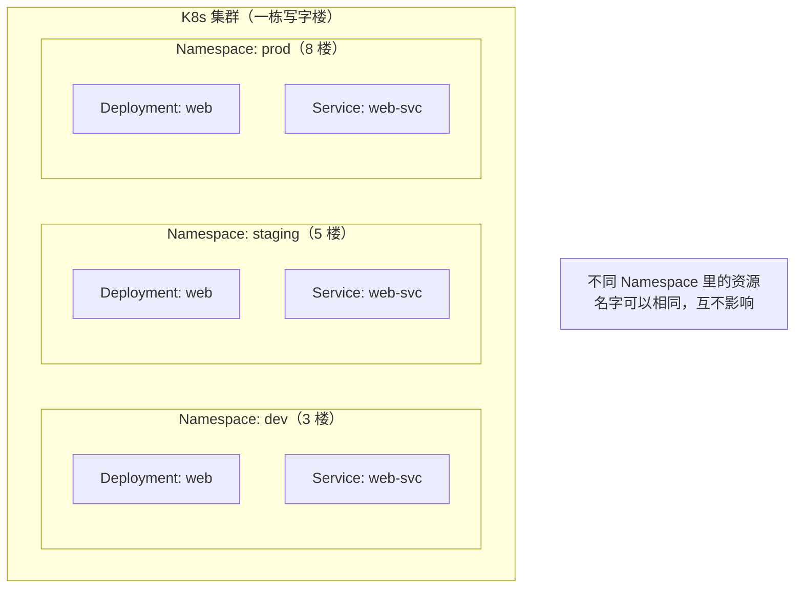
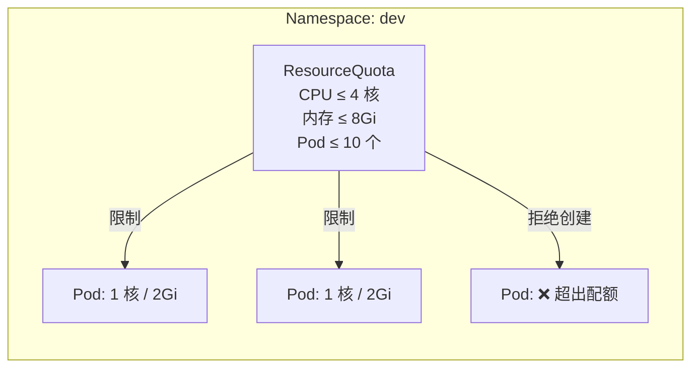
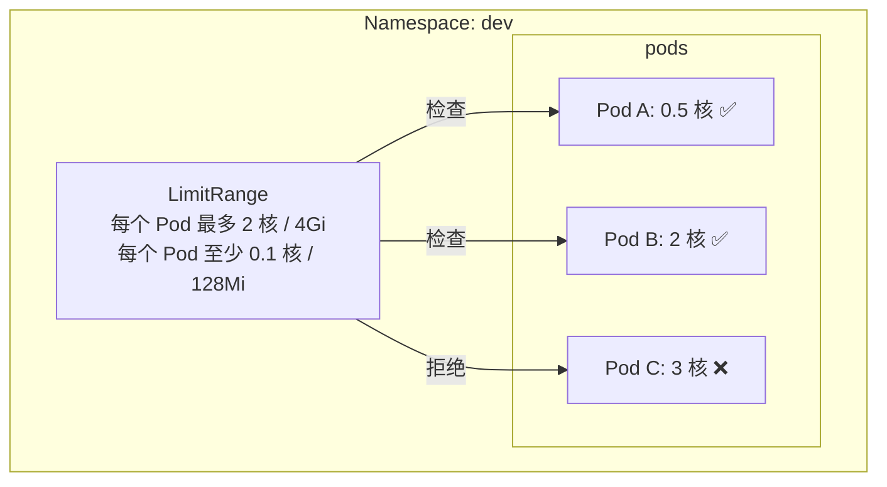

# Namespace 与资源配额

## 概念引入

想象一个大型写字楼。每层楼是一家公司，公司之间互不干扰——A 公司不会占 B 公司的会议室，B 公司的员工也不会跑进 A 公司的办公区。

**Namespace 就是 K8s 集群里的"楼层"。** 它把同一个集群划分成多个虚拟隔离区，每个区域有自己的资源、权限和命名空间。



### 为什么需要 Namespace？

| 场景 | 没有 Namespace | 有 Namespace |
|------|---------------|-------------|
| 开发/测试/生产隔离 | 全混在一起，误操作风险大 | 每个环境独立，互不干扰 |
| 团队资源分配 | 一个团队可能占光所有资源 | 用配额限制每个团队的资源上限 |
| 权限管理 | 所有人能操作所有资源 | 每个团队只能操作自己的 Namespace |

## 原理讲解

### 默认 Namespace

K8s 创建集群时自带几个 Namespace：

```bash
kubectl get namespace
```

| Namespace | 用途 |
|-----------|------|
| `default` | 不指定 Namespace 时，资源默认创建在这里 |
| `kube-system` | K8s 系统组件（kube-proxy、CoreDNS 等） |
| `kube-public` | 公开可读的资源（如集群信息 ConfigMap） |
| `kube-node-lease` | 节点心跳数据 |

> 💡 **最佳实践**：永远不要把你的应用部署到 `kube-system`，也不要什么都塞在 `default` 里。为每个项目或环境创建专用 Namespace。

### ResourceQuota：限制楼层的资源配额

如果每层楼的用电不限量，一家公司开 100 台服务器，整栋楼就跳闸了。**ResourceQuota 就是每层楼的"用电限额"。**



ResourceQuota 可以限制：
- **计算资源**：CPU、内存的总量
- **对象数量**：Pod、Service、ConfigMap 的最大数量
- **存储**：PVC 的总容量

### LimitRange：限制单个 Pod 的资源

ResourceQuota 管的是"整层楼的总额"，但不管单个 Pod 用多少。**LimitRange 管的是"每个房间的用电上限"**——确保没有单个 Pod 占光整个 Namespace 的配额。



### ResourceQuota vs LimitRange

| 维度 | ResourceQuota | LimitRange |
|------|--------------|------------|
| 管什么 | 整个 Namespace 的总量 | 单个 Pod/容器的上下限 |
| 类比 | 楼层总用电额度 | 每个房间的用电上限 |
| 典型用途 | 限制团队总资源 | 防止单个 Pod 占光配额 |
| 可以一起用 | ✅ 推荐组合使用 | ✅ 推荐组合使用 |

## 动手实验

> 配套实验位于 `docs/labs/beginner/namespace/`

### 步骤 1：创建 Namespace

```bash
kubectl create namespace dev
kubectl create namespace staging

# 查看
kubectl get namespace
```

### 步骤 2：在 Namespace 中部署应用

```bash
# 同一个名字，不同 Namespace，互不冲突
kubectl create deployment web --image=nginx:1.27 -n dev
kubectl create deployment web --image=nginx:1.27 -n staging

# 查看两个 Namespace 的 Pod
kubectl get pods -n dev
kubectl get pods -n staging

# 跨 Namespace 查看所有 Pod
kubectl get pods --all-namespaces | grep web
```

### 步骤 3：设置 ResourceQuota

```bash
kubectl apply -f - <<EOF
apiVersion: v1
kind: ResourceQuota
metadata:
  name: dev-quota
  namespace: dev
spec:
  hard:
    requests.cpu: "2"
    requests.memory: 4Gi
    limits.cpu: "4"
    limits.memory: 8Gi
    pods: "5"
EOF

# 查看配额使用情况
kubectl describe resourcequota dev-quota -n dev
```

### 步骤 4：测试配额限制

```bash
# 创建 5 个 Pod（配额上限）
for i in $(seq 1 5); do
  kubectl run test-$i --image=busybox --restart=Never \
    --requests='cpu=100m,memory=128Mi' -n dev
done

# 第 6 个会被拒绝
kubectl run test-6 --image=busybox --restart=Never \
  --requests='cpu=100m,memory=128Mi' -n dev
# 预期：Error from server (Forbidden): pods "test-6" is forbidden: exceeded quota
```

### 步骤 5：设置 LimitRange

```bash
kubectl apply -f - <<EOF
apiVersion: v1
kind: LimitRange
metadata:
  name: dev-limits
  namespace: dev
spec:
  limits:
  - default:        # 默认 limit
      cpu: 500m
      memory: 256Mi
    defaultRequest:  # 默认 request
      cpu: 100m
      memory: 128Mi
    max:             # 单个 Pod 上限
      cpu: "2"
      memory: 1Gi
    min:             # 单个 Pod 下限
      cpu: 50m
      memory: 64Mi
    type: Container
EOF

# 验证：创建不指定资源的 Pod，看 LimitRange 是否自动填充
kubectl run auto-limit --image=busybox --restart=Never -n dev
kubectl get pod auto-limit -n dev -o jsonpath='{.spec.containers[0].resources}'
```

### 步骤 6：清理

```bash
kubectl delete namespace dev staging
```

> 💡 删除 Namespace 会级联删除其中所有资源，慎用！

## 自检问题

1. **[基础]** Namespace 和集群是什么关系？删除 Namespace 会发生什么？

2. **[理解]** ResourceQuota 和 LimitRange 的区别是什么？只用 ResourceQuota 够不够？

3. **[应用]** 你的团队有 3 个项目（web、api、worker），每个项目需要 dev/staging/prod 三个环境。你会怎么规划 Namespace？

<details>
<summary>查看答案</summary>

1. Namespace 是集群内的**虚拟隔离区**，共享同一个集群的物理资源但逻辑上互不干扰。删除 Namespace 会**级联删除**其中所有资源（Pod、Service、ConfigMap 等），且不可恢复。

2. ResourceQuota 限制**整个 Namespace 的资源总量**（如总共 4 核 CPU），LimitRange 限制**单个容器的资源上下限**（如每个容器最多 2 核）。只用 ResourceQuota 不够——如果没有 LimitRange，一个 Pod 可能申请走整个 Namespace 的配额，导致其他 Pod 无法创建。推荐组合使用。

3. 推荐方案：9 个 Namespace（`web-dev`、`web-staging`、`web-prod`、`api-dev`...），每个 Namespace 设置 ResourceQuota 限制资源总量。生产环境的 Namespace 设置更严格的配额和 LimitRange，开发环境可以宽松一些。

</details>

## 下一步

现在你知道怎么隔离资源了。接下来，让你的应用学会"自我体检"：

→ [12. 探针与健康检查](./12-probes)
