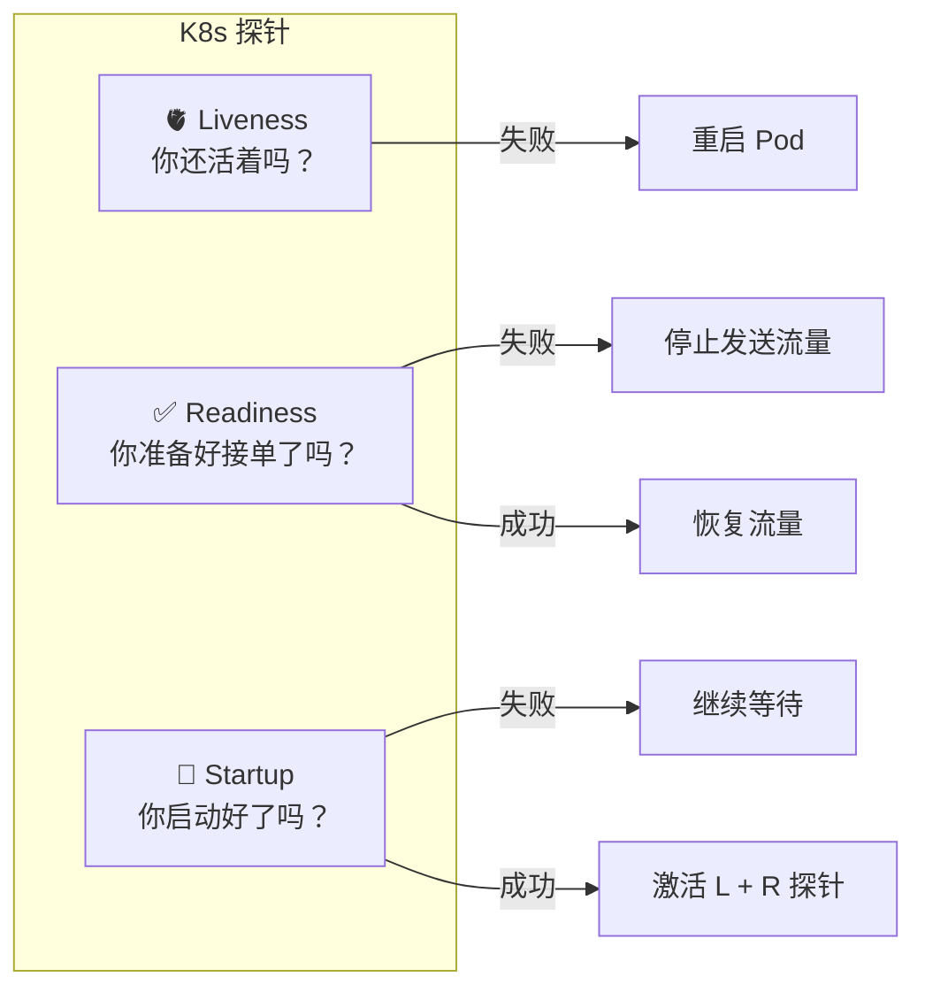
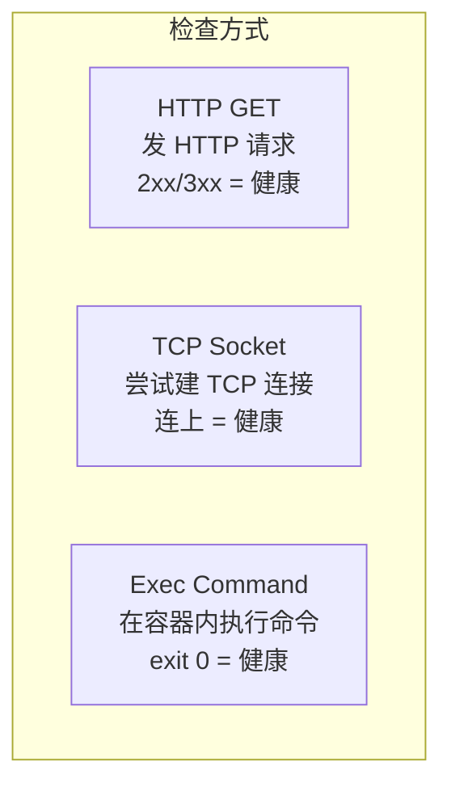
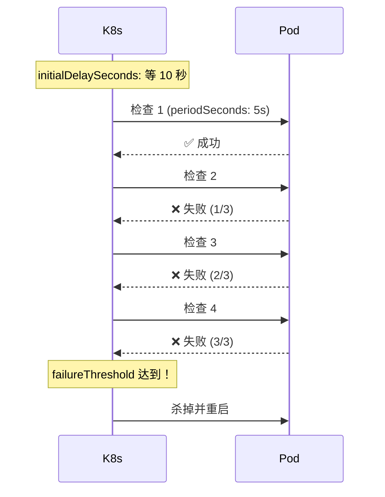

# 探针与健康检查

## 概念引入

你在一家餐厅当经理。你需要知道三件事：

1. **厨师还活着吗？** — 如果厨师晕倒了，你需要换人（重启 Pod）
2. **厨师准备好接单了吗？** — 厨师活着但还在热锅，这时候别给他派单（暂停流量）
3. **新厨师上手了吗？** — 新来的厨师需要培训时间，别在他还没学会的时候就说他不行（启动保护期）

**K8s 的探针就是这三件事。** 它们是 K8s 用来自动检查 Pod 健康状态的"体检工具"。



## 原理讲解

### 三种探针

| 探针 | 问什么 | 失败时 K8s 做什么 | 什么时候用 |
|------|--------|-------------------|-----------|
| **Liveness** | "你还活着吗？" | 杀掉 Pod 并重启 | 应用可能死锁、卡住 |
| **Readiness** | "你准备好接流量了吗？" | 从 Service 端点中移除 Pod | 应用启动需要加载数据 |
| **Startup** | "你启动好了吗？" | 等待，不杀也不加流量 | 慢启动应用（如 Java/Spring） |

### 探针的检查方式

K8s 支持三种方式来做健康检查：



| 方式 | 适用场景 | 示例 |
|------|---------|------|
| **HTTP GET** | Web 应用 | `GET /healthz`，返回 200 表示健康 |
| **TCP Socket** | 数据库、缓存 | 连接 3306 端口，连上表示健康 |
| **Exec** | 任意应用 | `cat /tmp/healthy`，文件存在表示健康 |

### 探针的关键参数

```yaml
livenessProbe:
  httpGet:
    path: /healthz
    port: 8080
  initialDelaySeconds: 10    # Pod 启动后等 10 秒再开始检查
  periodSeconds: 5            # 每 5 秒检查一次
  timeoutSeconds: 3           # 检查超时时间
  failureThreshold: 3         # 连续失败 3 次才算"不健康"
  successThreshold: 1         # 连续成功 1 次才算"恢复"
```



### Liveness vs Readiness：一个常见误区

> ⚠️ **不要把 Readiness 检查的逻辑放到 Liveness 里！**

**Liveness 失败 = 重启 Pod。** 如果你的 Liveness 探针检查数据库连接，当数据库临时不可用时，K8s 会重启所有 Pod——但这解决不了问题（数据库还是不可用），反而引发雪崩。

**Readiness 失败 = 暂停流量。** 同样的场景，Readiness 失败只会让 Pod 暂停接收请求，等数据库恢复后自动恢复。

| 检查内容 | 该用哪个 | 为什么 |
|---------|---------|--------|
| 应用进程是否存在 | Liveness | 进程死了需要重启 |
| 数据库连接是否正常 | Readiness | DB 不可用时暂停流量，不要重启 |
| 缓存是否加载完成 | Readiness | 加载期间不接流量 |
| 应用是否完成初始化 | Startup | 慢启动需要保护期 |

## 动手实验

> 配套实验位于 `docs/labs/beginner/probes/`

### 步骤 1：部署带健康检查的应用

```bash
cd docs/labs/beginner/probes
bash setup.sh
```

### 步骤 2：观察 Readiness 探针

```bash
# 查看 Pod 状态 — 注意 READY 列
kubectl get pods -l app=health-demo -w
```

你会看到 Pod 从 `0/1` 变成 `1/1`，说明 Readiness 探针通过了。

### 步骤 3：触发 Liveness 探针失败

```bash
# 模拟应用"死锁"：删除健康检查文件
kubectl exec health-demo -- rm /tmp/healthy

# 观察 Pod 重启
kubectl get pods -l app=health-demo -w
# 预期：RESTARTS 计数增加，Pod 经历 CrashLoopBackOff → Running
```

### 步骤 4：观察 Readiness 对 Service 的影响

```bash
# 触发 Readiness 失败
kubectl exec health-demo -- rm /tmp/ready

# Pod 还在运行，但 READY 变为 0/1
kubectl get pods -l app=health-demo
# 预期：READY 0/1，STATUS Running

# 查看 Service 端点 — Pod 被移除
kubectl get endpoints health-svc
# 预期：Endpoints 为空

# 恢复 Readiness
kubectl exec health-demo -- touch /tmp/ready

# Pod 重新出现在端点中
kubectl get endpoints health-svc
```

### 步骤 5：清理

```bash
bash teardown.sh
```

## 自检问题

1. **[基础]** Liveness 探针和 Readiness 探针失败时，K8s 分别做什么？

2. **[理解]** 为什么慢启动的应用（如 Java Spring Boot）需要 Startup 探针？没有它会怎样？

3. **[应用]** 你的 Web 应用依赖一个 Redis 缓存。你应该给哪些检查分别配置 Liveness 和 Readiness？

<details>
<summary>查看答案</summary>

1. **Liveness 失败**：K8s 杀掉 Pod 并根据 restartPolicy 决定是否重启。**Readiness 失败**：K8s 不会杀 Pod，但会从 Service 的 Endpoints 中移除它，不再给它发流量。等 Readiness 恢复后，Pod 自动重新加入 Endpoints。

2. Java/Spring Boot 启动可能需要 30-60 秒（加载类、初始化 Bean）。如果没有 Startup 探针，Liveness 探针会在应用还没启动完时就判定"失败"并反复重启，导致应用永远起不来。Startup 探针提供一个"启动保护期"——只有 Startup 探针通过后才激活 Liveness 和 Readiness。

3. **Liveness**：检查应用进程是否存活（如 `GET /healthz` 或检查文件是否存在）。**不要**把 Redis 连接放到 Liveness 里。**Readiness**：检查 Redis 连接是否正常。Redis 不可用时 Pod 暂停接收请求，避免用户看到错误。等 Redis 恢复后 Pod 自动恢复接流量。

</details>

## 下一步

你的应用会自我体检了。接下来学习如何给它"分配资源"，避免一个 Pod 占光整个集群：

→ [13. 资源请求与限制](./13-resource-limits)
