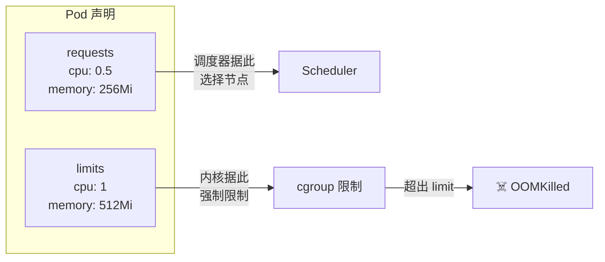
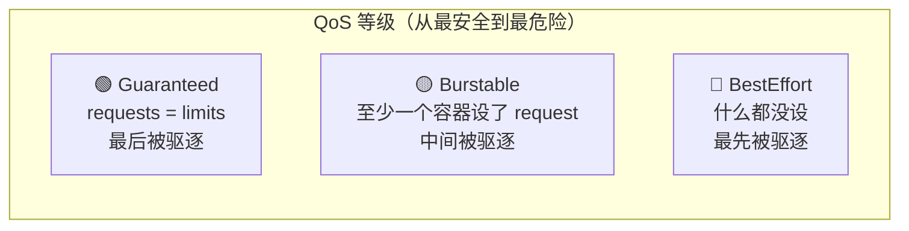
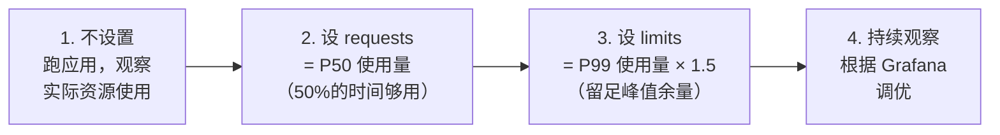

# 资源请求与限制

## 概念引入

想象你和室友合租房。你跟房东说："我最少需要一间卧室（request），最多用两间（limit）。" 房东根据你的 request 给你分配房间，但如果你偷偷用了三间，房东就会把你赶出去（OOMKilled）。

**K8s 的资源管理就是这个逻辑：**

- **requests**：你对调度器说"我至少需要这么多资源"——调度器据此选择节点
- **limits**：你对内核说"我最多用这么多"——超了就被杀



## 原理讲解

### requests vs limits

| 维度 | requests | limits |
|------|---------|--------|
| 谁用 | Scheduler（调度器） | kubelet + 内核 cgroup |
| 作用 | 调度时保证节点有足够资源 | 运行时限制容器不能超过的上限 |
| 超出后果 | Pod 无法调度（Pending） | 容器被 OOMKilled 或 CPU 被 throttle |
| 可以超卖 | ✅ 节点上所有 Pod 的 requests 总和可以 > 节点容量（超卖） | ❌ limits 是硬上限 |

### 三种 QoS 等级

K8s 根据 Pod 的 requests 和 limits 设置，自动给 Pod 分配 **QoS（Quality of Service）等级**。当节点资源不足时，K8s 按 QoS 从低到高驱逐 Pod：



| QoS 等级 | 条件 | 驱逐优先级 | 建议场景 |
|---------|------|-----------|---------|
| **Guaranteed** | 所有容器都设了 requests = limits | 最低（最后被驱逐） | 核心业务（数据库、API） |
| **Burstable** | 至少一个容器设了 requests 或 limits | 中间 | 普通 Web 应用 |
| **BestEffort** | 所有容器都没设 requests 和 limits | 最高（最先被驱逐） | 临时任务、测试 Pod |

> 💡 **最佳实践**：生产环境的所有 Pod 都应该设 requests 和 limits。不设就是 BestEffort，节点一紧张你的 Pod 就第一个被杀。

### OOMKilled：内存超限

当容器使用的内存**超过 limits** 时，Linux 内核的 OOM Killer 会杀掉容器中的进程。Pod 状态会显示 `OOMKilled`。

```yaml
# 这个 Pod 声明了 128Mi 的内存 limit
# 如果应用试图用 200Mi，就会被 OOMKilled
resources:
  requests:
    memory: 64Mi
  limits:
    memory: 128Mi    # 硬上限：超过即杀
```

### CPU Throttle：CPU 超限

CPU 和内存不同——**CPU 超 limits 不会被杀，而是被限速（throttle）**。就像高速公路上限速，你不会被抓，但跑不快了。

```yaml
resources:
  limits:
    cpu: 500m    # 最多用 0.5 核，超过会被限速
```

### 怎么设置合理的 requests 和 limits？



## 动手实验

> 配套实验位于 `docs/labs/beginner/resource-limits/`

### 步骤 1：部署不同 QoS 的 Pod

```bash
cd docs/labs/beginner/resource-limits
bash setup.sh
```

### 步骤 2：查看 QoS 等级

```bash
# 查看三个 Pod 的 QoS
kubectl get pods -o custom-columns=\
NAME:.metadata.name,\
QOS:.status.qosClass,\
CPU_REQ:.spec.containers[0].resources.requests.cpu,\
MEM_REQ:.spec.containers[0].resources.requests.memory,\
CPU_LIM:.spec.containers[0].resources.limits.cpu,\
MEM_LIM:.spec.containers[0].resources.limits.memory
```

预期输出：

```
NAME          QOS          CPU_REQ   MEM_REQ   CPU_LIM   MEM_LIM
guaranteed    Guaranteed   100m      128Mi     100m      128Mi
burstable     Burstable    50m       64Mi      200m      256Mi
besteffort    BestEffort   <none>    <none>    <none>    <none>
```

### 步骤 3：触发 OOMKilled

```bash
# 这个 Pod 的内存 limit 是 50Mi，我们让它吃超过 50Mi 的内存
kubectl exec oom-demo -- sh -c 'dd if=/dev/zero of=/dev/null bs=60M count=1'

# 等几秒，查看 Pod 状态
kubectl get pod oom-demo
# 预期：RESTARTS 增加，Last State 显示 OOMKilled

# 查看 OOMKilled 详情
kubectl describe pod oom-demo | grep -A5 "Last State"
```

### 步骤 4：观察 CPU Throttle

```bash
# CPU 超限不会 OOMKilled，而是被限速
# 查看 CPU limit 为 100m 的 Pod
kubectl top pod cpu-throttle-demo
# CPU 使用不会超过 100m（0.1 核）
```

### 步骤 5：清理

```bash
bash teardown.sh
```

## 自检问题

1. **[基础]** requests 和 limits 的区别是什么？各在什么阶段起作用？

2. **[理解]** 一个 Pod 的 requests 设为 100m CPU，limits 设为 500m CPU。当这个 Pod 实际只用 50m CPU 时，节点上多出来的 CPU 资源能被其他 Pod 用吗？

3. **[应用]** 你的 Java 应用启动时需要 512Mi 内存，运行时峰值约 800Mi。你会怎么设 requests 和 limits？

<details>
<summary>查看答案</summary>

1. **requests** 在**调度阶段**起作用——调度器根据 requests 选择有足够资源的节点。**limits** 在**运行阶段**起作用——通过 cgroup 限制容器的资源上限。内存超 limits 会被 OOMKilled，CPU 超 limits 会被 throttle（限速但不杀）。

2. **可以。** CPU 资源是**可压缩资源**，当 Pod 实际用量低于 requests 时，空闲的 CPU 可以被同一节点上的其他 Pod 使用。但如果所有 Pod 同时需要 CPU，调度器保证每个 Pod 至少能拿到 requests 声明的量。内存是**不可压缩资源**，不能动态分享。

3. `requests.memory: 512Mi`（启动最少需要的量），`limits.memory: 1200Mi`（峰值 800Mi × 1.5 余量）。这样 QoS 是 Burstable，启动时调度器确保节点有 512Mi 可用，运行时容器最多用 1200Mi，给 GC 和峰值留足空间。

</details>

## 下一步

你的应用有了资源保障。接下来学习怎么管理"谁有权限做什么"：

→ [14. RBAC 权限管理](./14-rbac)
