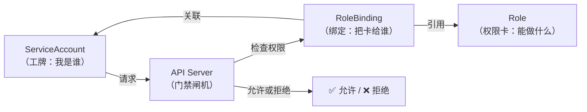
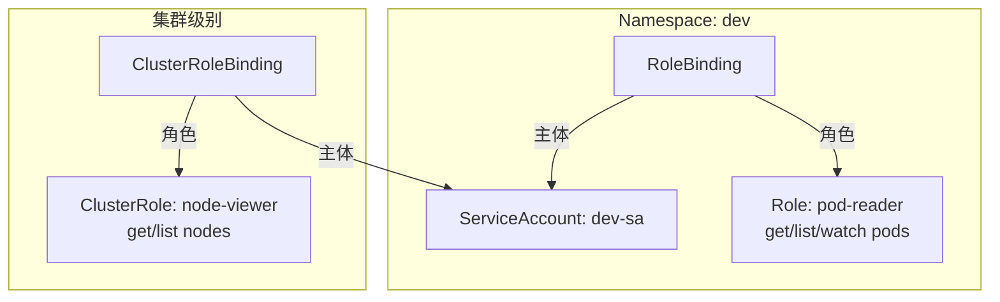

# RBAC 权限管理

## 概念引入

想象一家公司的门禁系统：

- **工牌**（ServiceAccount）：标识你是谁
- **权限卡**（Role）：规定你能做什么（如"只能看 3 楼的会议室"）
- **门禁绑定**（RoleBinding）：把权限卡绑定到你的工牌上
- **全楼通行证**（ClusterRole）：跨楼层（跨 Namespace）的权限

**K8s 的 RBAC（Role-Based Access Control）就是这套门禁系统。** 它控制"谁能对哪些资源做什么操作"。



## 原理讲解

### 四个核心概念

| 概念 | 作用 | 范围 | 类比 |
|------|------|------|------|
| **ServiceAccount** | 标识身份 | Namespace 级别 | 工牌 |
| **Role** | 定义权限（能做什么） | Namespace 级别 | 楼层权限卡 |
| **ClusterRole** | 定义权限（能做什么） | 全集群 | 全楼通行证 |
| **RoleBinding** | 把 Role 绑定给 SA | Namespace 级别 | 把卡发给某人的工牌 |
| **ClusterRoleBinding** | 把 ClusterRole 绑定给 SA | 全集群 | 发全楼通行证 |



### RBAC 的三个权限动词

| 动词 | 含义 | 示例 |
|------|------|------|
| `get` | 获取单个资源 | `kubectl get pod nginx` |
| `list` | 列出资源列表 | `kubectl get pods` |
| `watch` | 监听资源变化 | `kubectl get pods -w` |
| `create` | 创建资源 | `kubectl create pod` |
| `update` | 修改资源 | `kubectl edit pod` |
| `patch` | 部分修改 | `kubectl patch pod` |
| `delete` | 删除资源 | `kubectl delete pod` |

### 最小权限原则

> ⚠️ **只给需要的权限，不多不少。**

| 场景 | ❌ 过度授权 | ✅ 最小权限 |
|------|-----------|-----------|
| 应用只需要读 ConfigMap | `verbs: ["*"]` | `verbs: ["get", "list"]` |
| 只在 dev Namespace 操作 | ClusterRoleBinding | RoleBinding |
| 只需要操作特定 Pod | `resources: ["pods"]` 无 resourceName | 加 `resourceNames: ["my-pod"]` |

### 默认 ServiceAccount

每个 Namespace 自动有一个 `default` ServiceAccount。如果你不指定，Pod 就用它。但这个 SA 几乎没有权限——这是安全设计。

```bash
# 查看默认 SA
kubectl get serviceaccount -n default
kubectl describe serviceaccount default
```

## 动手实验

> 配套实验位于 `docs/labs/beginner/rbac/`

### 步骤 1：创建 ServiceAccount 和权限

```bash
cd docs/labs/beginner/rbac
bash setup.sh
```

### 步骤 2：用受限身份访问 API

```bash
# 用只读 SA 的 token 访问 API
TOKEN=$(kubectl create token readonly-sa -n dev)

# ✅ 可以读 Pod
kubectl --token=$TOKEN get pods -n dev

# ❌ 不能创建 Pod
kubectl --token=$TOKEN run test --image=nginx -n dev
# 预期：Error from server (Forbidden)

# ❌ 不能删除 Pod
kubectl --token=$TOKEN delete pod -n dev --all
# 预期：Error from server (Forbidden)
```

### 步骤 3：查看 ClusterRole 和 ClusterRoleBinding

```bash
# 查看集群内置的 ClusterRole
kubectl get clusterrole | head -20

# 查看 cluster-admin（超级管理员）绑定了谁
kubectl get clusterrolebinding | grep cluster-admin
```

### 步骤 4：清理

```bash
bash teardown.sh
```

## 自检问题

1. **[基础]** Role 和 ClusterRole 的区别是什么？什么时候用哪个？

2. **[理解]** 为什么不推荐把所有权限都绑定到 default ServiceAccount 上？

3. **[应用]** 你的 CI/CD 流水线需要能创建 Deployment 和 Service，但不能删除 Namespace。你会怎么配置 RBAC？

<details>
<summary>查看答案</summary>

1. **Role** 只在单个 Namespace 内有效，定义该 Namespace 内的权限。**ClusterRole** 在全集群范围有效，可以访问所有 Namespace 的资源以及集群级资源（如 Node、PV）。当你的权限只涉及一个 Namespace 时用 Role，需要跨 Namespace 或访问集群级资源时用 ClusterRole。

2. default SA 被该 Namespace 内所有不指定 SA 的 Pod 共享。如果给 default SA 过大权限，意味着所有 Pod 都拥有这些权限——一个被入侵的 Pod 就能操作其他 Pod 的资源。应该为每个应用创建专用 SA，只给最小权限。

3. 创建一个 CI/CD 专用 ServiceAccount，创建 Role 允许 `create/update/patch` deployments 和 services，但**不包含** `delete` namespaces。用 RoleBinding 绑定。如果 CI/CD 需要跨多个 Namespace 部署，则用 ClusterRole + ClusterRoleBinding，但资源列表只包含 deployments 和 services。

</details>

## 下一步

你已经掌握了 K8s 的四种核心控制器（Deployment/ReplicaSet/Service + RBAC）。接下来认识两种特殊的工作负载控制器：

→ [15. DaemonSet 与 StatefulSet](./15-daemonset-statefulset)
