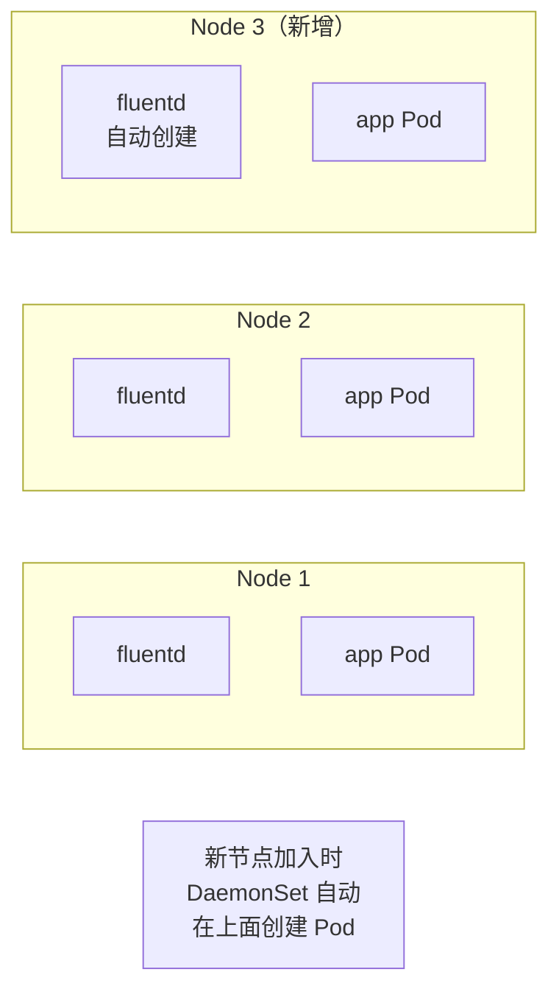
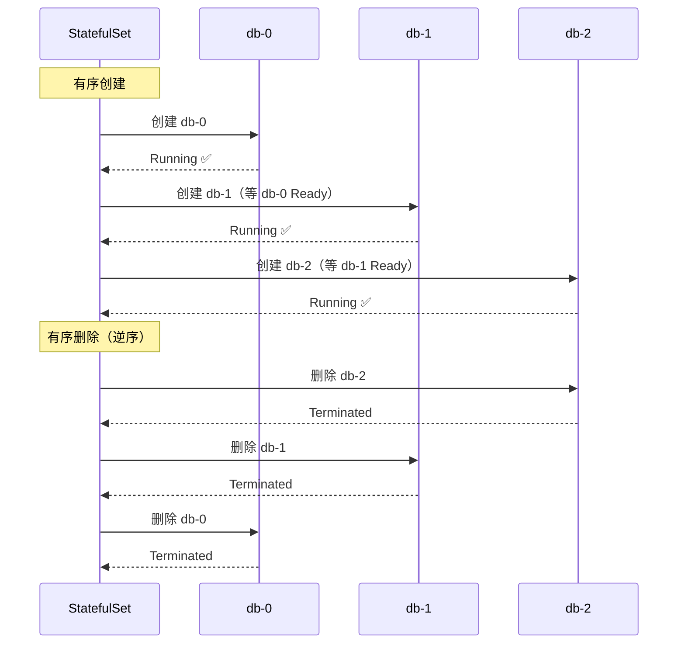

# DaemonSet 与 StatefulSet

## 概念引入

你已经认识了 Deployment——它是"无差别管理一群 Pod"的控制器。但有些场景 Deployment 搞不定：

- **每个节点都要跑一个日志收集器** → 需要"每层楼都有一个清洁工"
- **数据库集群需要固定的身份标识** → 需要"每个人有固定的工号和工位"

这就是 DaemonSet 和 StatefulSet 的用武之地。

```mermaid
flowchart TB
    subgraph Deployment["Deployment（无状态）"]
        direction LR
        D1["Pod A"] ~~~ D2["Pod B"] ~~~ D3["Pod C"]
    end
    Note1["Pod 可互换\n名字随机\n没有固定身份"]

    subgraph DaemonSet["DaemonSet（节点守护）"]
        direction LR
        DS1["Pod: Node 1"] ~~~ DS2["Pod: Node 2"] ~~~ DS3["Pod: Node 3"]
    end
    Note2["每个节点恰好一个\n自动跟随节点增减"]

    subgraph StatefulSet["StatefulSet（有状态）"]
        direction LR
        SS1["Pod: db-0"] ~~~ SS2["Pod: db-1"] ~~~ SS3["Pod: db-2"]
    end
    Note3["固定名字 + 固定存储\n有序创建 + 有序删除"]
```



## 原理讲解

### 三种控制器对比

| 维度 | Deployment | DaemonSet | StatefulSet |
|------|-----------|-----------|-------------|
| **Pod 身份** | 随机名，可互换 | 每个节点一个 | 固定名（app-0, app-1...），不可互换 |
| **创建顺序** | 并行创建所有 Pod | 每个节点各创建一个 | **有序**：0 → 1 → 2... |
| **删除顺序** | 并行删除 | 随节点删除 | **逆序**：... → 2 → 1 → 0 |
| **存储** | 共享或无 | 通常无状态 | 每个 Pod 独立 PVC |
| **典型用途** | Web 应用、API | 日志收集、监控 agent | 数据库、消息队列 |

### DaemonSet：每个节点一个



常见用途：
- **日志收集**：Fluentd / Filebeat（收集每个节点的容器日志）
- **监控 agent**：Node Exporter（采集每个节点的硬件指标）
- **网络插件**：Calico / Cilium（每个节点的网络代理）
- **存储守护**：Ceph / GlusterFS 节点组件

### StatefulSet：固定身份 + 有序部署

StatefulSet 给每个 Pod 三个"不变"：

1. **固定的名字**：`app-0`、`app-1`、`app-2`（不是随机哈希）
2. **固定的网络标识**：`app-0.app-svc.default.svc.cluster.local`
3. **固定的存储**：每个 Pod 绑定独立的 PVC，重启后数据还在



### Headless Service

StatefulSet 通常配合 **Headless Service**（`clusterIP: None`）使用。它不给 Service 分配 IP，而是让 DNS 直接返回每个 Pod 的 IP：

```bash
# 普通 Service：DNS 返回 Service IP
nslookup my-svc
# → 10.96.0.100

# Headless Service：DNS 返回所有 Pod 的 IP
nslookup my-headless-svc
# → 10.244.0.5, 10.244.0.6, 10.244.0.7

# 还可以按 Pod 名直接解析
nslookup app-0.my-headless-svc
# → 10.244.0.5（永远是 app-0 的 IP）
```

## 动手实验

> 配套实验位于 `docs/labs/beginner/daemonset-statefulset/`

### 步骤 1：部署 DaemonSet

```bash
cd docs/labs/beginner/daemonset-statefulset
bash setup.sh
```

### 步骤 2：观察 DaemonSet 的节点分布

```bash
# 查看 DaemonSet Pod — 每个节点一个
kubectl get pods -l app=node-agent -o wide

# 预期：Kind 集群有 3 个节点，就有 3 个 Pod
```

### 步骤 3：部署 StatefulSet

```bash
# 查看 StatefulSet
kubectl get statefulset

# 观察有序创建（Pod 按 0, 1 的顺序创建）
kubectl get pods -l app=web-stateful -w
```

### 步骤 4：验证 StatefulSet 的固定身份

```bash
# 查看 Pod 名 — 固定编号
kubectl get pods -l app=web-stateful
# 预期：web-stateful-0, web-stateful-1

# 验证网络标识（Headless Service）
kubectl run dns-test --image=busybox --rm -it --restart=Never -- \
  nslookup web-stateful-0.web-stateful-svc

# 删除一个 Pod，观察它用相同名字重新创建
kubectl delete pod web-stateful-0
kubectl get pods -l app=web-stateful -w
# 预期：web-stateful-0 被删除后以相同名字重建
```

### 步骤 5：清理

```bash
bash teardown.sh
```

## 自检问题

1. **[基础]** DaemonSet 和 Deployment 的核心区别是什么？新节点加入集群时，DaemonSet 会做什么？

2. **[理解]** StatefulSet 的"有序创建"有什么好处？为什么数据库集群需要这个特性？

3. **[应用]** 你要部署一个 3 节点的 Redis 集群（1 主 2 从），应该用 Deployment、DaemonSet 还是 StatefulSet？为什么？

<details>
<summary>查看答案</summary>

1. **Deployment** 管理一组可互换的 Pod，Pod 数量由 replicas 决定，与节点数无关。**DaemonSet** 确保每个节点上恰好运行一个 Pod，不需要设置 replicas。新节点加入集群时，DaemonSet 自动在新节点上创建 Pod；节点移除时，Pod 随之删除。

2. 数据库集群通常有主从关系。有序创建确保主节点（pod-0）先启动并就绪，然后从节点（pod-1、pod-2）按顺序加入，这样从节点启动时能直接连接到已有的主节点进行数据同步。如果所有 Pod 同时启动，从节点可能找不到主节点，导致集群初始化失败。

3. 用 **StatefulSet**。原因：(1) Redis 集群的每个节点有固定角色（主/从），需要固定身份标识；(2) 每个节点需要独立的持久化存储（PVC）；(3) 有序创建确保主节点先启动；(4) 节点重启后保持相同名字和存储，数据不丢失。Deployment 的 Pod 名字随机且可互换，不适合有状态场景。

</details>

## 下一步

你已经掌握了 K8s 的四种控制器。接下来学习两种"一次性"工作负载：

→ [16. Job 与 CronJob](./16-job-cronjob)
