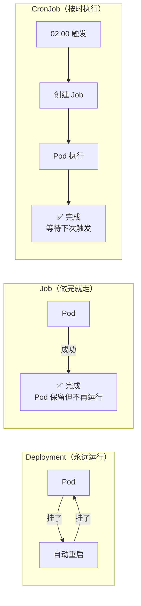
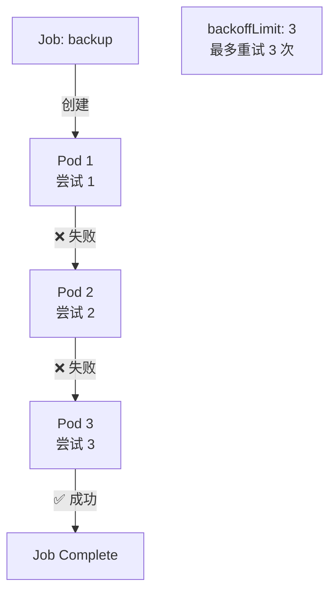
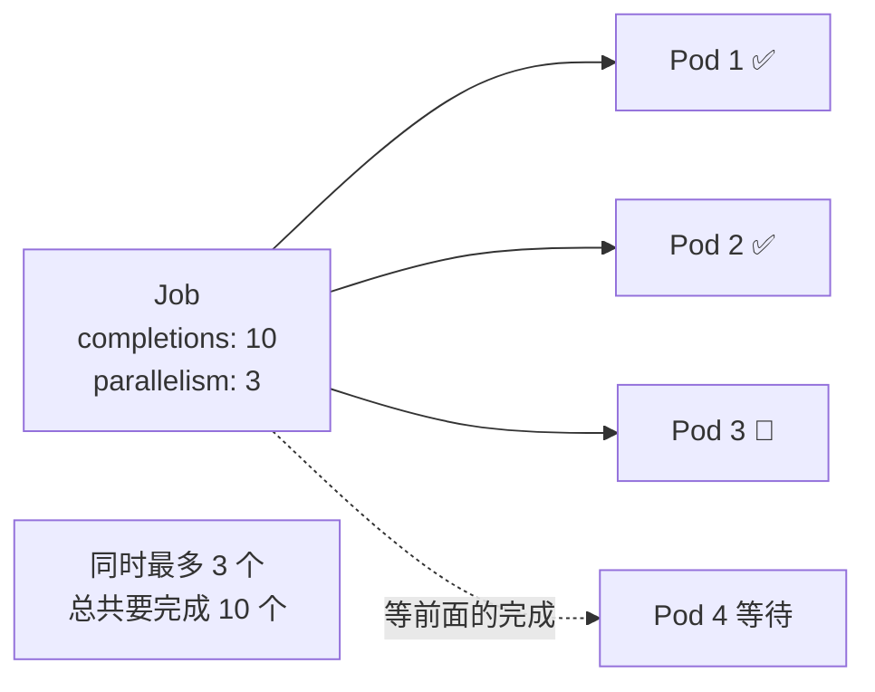

# Job 与 CronJob

## 概念引入

前面的 Deployment、DaemonSet、StatefulSet 都有一个共同特点：**它们让 Pod 一直运行**。就像餐厅的服务员，永远在岗。

但有些工作不是"一直在岗"，而是"做完就走"：

- 数据库迁移脚本（跑一次就完成）
- 每天凌晨的数据库备份
- 批量处理 1000 张图片

**Job 就是"做完就走的工人"，CronJob 就是"按时间表来的工人"。**



## 原理讲解

### Job：一次性任务

Job 确保一个 Pod **成功运行到完成**。如果 Pod 失败了，Job 会根据 `backoffLimit` 重试。

```yaml
apiVersion: batch/v1
kind: Job
metadata:
  name: data-migration
spec:
  completions: 1       # 需要成功完成 1 次
  parallelism: 1       # 同时运行 1 个 Pod
  backoffLimit: 3      # 最多重试 3 次
  template:
    spec:
      containers:
      - name: migrate
        image: my-app:v2
        command: ["python", "migrate.py"]
      restartPolicy: Never   # Job 的 Pod 必须用 Never 或 OnFailure
```

| 参数 | 含义 |
|------|------|
| `completions` | 需要成功完成几次（默认 1） |
| `parallelism` | 同时跑几个 Pod（默认 1） |
| `backoffLimit` | 失败后最多重试几次（默认 6） |
| `activeDeadlineSeconds` | 超时时间（超过就停止） |



### 并行 Job

设置 `parallelism` 可以同时跑多个 Pod 来加速批处理：

```yaml
spec:
  completions: 10     # 总共要完成 10 个任务
  parallelism: 3      # 同时最多跑 3 个
```



### CronJob：定时任务

CronJob 按照 **cron 表达式**定期创建 Job。就像 crontab，但跑在 K8s 上。

```yaml
apiVersion: batch/v1
kind: CronJob
metadata:
  name: db-backup
spec:
  schedule: "0 2 * * *"        # 每天凌晨 2 点
  concurrencyPolicy: Forbid   # 上次没跑完不启动新的
  successfulJobsHistoryLimit: 3  # 保留最近 3 次成功的 Job
  failedJobsHistoryLimit: 1      # 保留最近 1 次失败的 Job
  jobTemplate:
    spec:
      template:
        spec:
          containers:
          - name: backup
            image: postgres:16
            command: ["pg_dump", "-h", "db-svc", "mydb"]
          restartPolicy: OnFailure
```

| 参数 | 含义 |
|------|------|
| `schedule` | cron 表达式（分 时 日 月 周） |
| `concurrencyPolicy` | `Allow`（允许并行）/ `Forbid`（禁止）/ `Replace`（替换） |
| `successfulJobsHistoryLimit` | 保留几次成功的 Job 记录 |
| `suspend` | 暂停（设为 true 停止触发） |

### Cron 表达式速查

```
┌───────────── 分钟 (0 - 59)
│ ┌───────────── 小时 (0 - 23)
│ │ ┌───────────── 日 (1 - 31)
│ │ │ ┌───────────── 月 (1 - 12)
│ │ │ │ ┌───────────── 星期 (0 - 6, 0=周日)
│ │ │ │ │
* * * * *
```

| 表达式 | 含义 |
|--------|------|
| `0 2 * * *` | 每天凌晨 2:00 |
| `*/5 * * * *` | 每 5 分钟 |
| `0 */2 * * *` | 每 2 小时 |
| `0 9 * * 1-5` | 工作日每天 9:00 |

## 动手实验

> 配套实验位于 `docs/labs/beginner/job-cronjob/`

### 步骤 1：部署 Job 和 CronJob

```bash
cd docs/labs/beginner/job-cronjob
bash setup.sh
```

### 步骤 2：观察 Job 执行

```bash
# 查看 Job 状态
kubectl get jobs
kubectl get pods -l job-name=pi-calc

# 查看 Job 输出日志
kubectl logs -l job-name=pi-calc
```

### 步骤 3：测试 Job 重试

```bash
# 查看会失败的 Job（故意退出码 1）
kubectl get pods -l job-name=fail-job

# 观察重试行为（backoffLimit: 2，所以会看到 3 个 Pod）
kubectl get pods -l job-name=fail-job --watch
```

### 步骤 4：观察 CronJob

```bash
# 查看 CronJob
kubectl get cronjobs

# CronJob 每分钟触发一次（*/1 * * * *），等 1-2 分钟观察
kubectl get jobs --watch
# 预期：每隔约 1 分钟出现一个新 Job
```

### 步骤 5：清理

```bash
bash teardown.sh
```

## 自检问题

1. **[基础]** Job 和 Deployment 的核心区别是什么？Deployment 能替代 Job 吗？

2. **[理解]** CronJob 的 `concurrencyPolicy: Forbid` 是什么含义？什么场景下需要用它？

3. **[应用]** 你需要每天凌晨 3 点备份数据库，备份脚本可能跑 30 分钟。如果某天备份卡住了超过 24 小时，你希望怎么处理？

<details>
<summary>查看答案</summary>

1. **Deployment** 让 Pod 永远运行——Pod 挂了会自动重启，即使"成功退出"也会被重启。**Job** 让 Pod 运行到成功完成就停止——Pod 成功退出后不会重启，只保留记录。Deployment 不能替代 Job，因为 Deployment 的 Pod 成功退出后也会被重启（restartPolicy: Always），不适合"做完就走"的场景。

2. `Forbid` 表示如果上一次触发的 Job 还没完成，就不启动新的 Job。适用于耗时不确定的任务——比如数据库备份可能跑很久，如果每小时触发一次而备份跑了 90 分钟，不设 Forbid 就会有两个备份同时跑，可能导致资源争抢或数据不一致。

3. 创建 CronJob 设置 `schedule: "0 3 * * *"`, `concurrencyPolicy: Forbid`（避免同时跑两个备份），`activeDeadlineSeconds: 7200`（2 小时超时，防止永远卡住），`backoffLimit: 1`（失败重试一次）。配合告警：如果 Job 失败超过阈值就通知运维。

</details>

## 下一步

你的工作负载控制器知识已经齐全了。接下来学习 K8s 生态的"包管理器"：

→ [17. Helm 包管理](./17-helm)
