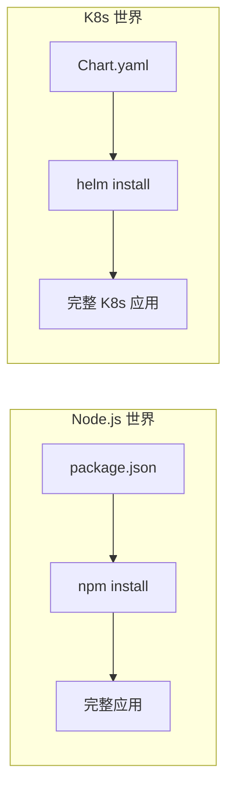
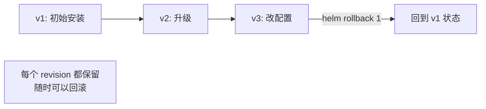

# Helm 包管理

## 概念引入

安装一个应用需要多少 YAML？一个 WordPress 至少需要：Deployment、Service、PVC、ConfigMap、Secret、Ingress……手写 6 个文件，每个几十行，还要处理它们之间的依赖关系。

**Helm 就是 K8s 的"包管理器"**，类似 Linux 的 apt/yum，或 Node.js 的 npm。一条命令就能安装整个应用，所有 YAML 都打包好了。



## 原理讲解

### 三个核心概念

| 概念 | 含义 | 类比 |
|------|------|------|
| **Chart** | 一个 Helm 包，包含所有 K8s 资源定义 | npm 的 package |
| **Release** | Chart 的一次安装实例 | npm install 后的 node_modules |
| **Repository** | 存放 Chart 的仓库 | npm registry (npmjs.com) |

### Chart 的结构

```
my-chart/
├── Chart.yaml          # Chart 的元数据（名字、版本、描述）
├── values.yaml         # 默认配置值（用户可以覆盖）
├── templates/          # K8s 资源模板
│   ├── deployment.yaml # Deployment 模板（Go 模板语法）
│   ├── service.yaml    # Service 模板
│   └── ingress.yaml    # Ingress 模板
└── charts/             # 依赖的子 Chart
```

### 模板 + Values = 可定制

Helm 的强大之处在于**模板化**。同一个 Chart，通过传不同的 values，可以部署到不同环境：

```yaml
# values.yaml（默认值）
replicaCount: 1
image:
  repository: nginx
  tag: "1.27"

# values-prod.yaml（生产环境覆盖）
replicaCount: 3
image:
  tag: "1.27-alpine"
resources:
  limits:
    cpu: 500m
    memory: 256Mi
```

```bash
# 开发环境：用默认值
helm install web my-chart

# 生产环境：用自定义值
helm install web my-chart -f values-prod.yaml

# 也可以直接覆盖单个值
helm install web my-chart --set replicaCount=3
```

### 常用命令

```bash
# 搜索 Chart
helm search hub wordpress         # 在 Artifact Hub 搜索
helm repo add bitnami https://charts.bitnami.com/bitnami
helm search repo wordpress        # 在已添加的仓库搜索

# 安装
helm install my-wp bitnami/wordpress          # 从仓库安装
helm install my-app ./my-chart/               # 从本地目录安装

# 管理
helm list                           # 查看所有 Release
helm status my-wp                   # 查看 Release 状态
helm upgrade my-wp bitnami/wordpress  # 升级
helm rollback my-wp 1               # 回滚到版本 1
helm uninstall my-wp                # 卸载

# 调试
helm template my-chart/             # 预览渲染后的 YAML（不安装）
helm install my-app my-chart/ --dry-run  # 模拟安装
```

### Helm 的版本管理

每次 `helm upgrade` 都会创建一个新的版本（revision）。你可以随时回滚：



## 动手实验

> 配套实验位于 `docs/labs/beginner/helm/`

### 步骤 1：安装 Helm 并添加仓库

```bash
cd docs/labs/beginner/helm
bash setup.sh
```

### 步骤 2：搜索和安装 Chart

```bash
# 搜索 nginx Chart
helm search repo nginx

# 安装 nginx（使用 bitnami 仓库）
helm install my-nginx bitnami/nginx

# 查看 Release
helm list

# 查看安装的资源
kubectl get all -l app.kubernetes.io/instance=my-nginx
```

### 步骤 3：自定义 Values

```bash
# 预览渲染后的 YAML（不实际安装）
helm template bitnami/nginx --set replicaCount=3

# 用自定义值安装
helm install custom-nginx bitnami/nginx \
  --set replicaCount=2 \
  --set service.type=NodePort

# 对比两个 Release 的差异
helm get values my-nginx
helm get values custom-nginx
```

### 步骤 4：升级和回滚

```bash
# 升级到 3 个副本
helm upgrade my-nginx bitnami/nginx --set replicaCount=3

# 查看历史
helm history my-nginx

# 回滚到版本 1
helm rollback my-nginx 1

# 确认回滚成功
kubectl get pods -l app.kubernetes.io/instance=my-nginx
```

### 步骤 5：清理

```bash
bash teardown.sh
```

## 自检问题

1. **[基础]** Chart、Release、Repository 分别是什么？

2. **[理解]** `helm template` 和 `helm install --dry-run` 的区别是什么？什么时候用哪个？

3. **[应用]** 你的团队需要把同一个微服务部署到 dev/staging/prod 三个环境。用 Helm 怎么管理，避免维护三份几乎相同的 YAML？

<details>
<summary>查看答案</summary>

1. **Chart** 是一个 Helm 包，包含一组 K8s 资源模板和默认配置。**Release** 是 Chart 被安装后的实例——同一个 Chart 可以安装多次，每次产生一个独立的 Release。**Repository** 是存放和分发 Chart 的仓库，类似 npm registry。

2. `helm template` 在本地渲染模板并输出 YAML，**不连接集群**，适合快速预览模板结果或 CI 中做 lint 检查。`helm install --dry-run` 会连接集群模拟安装（包括资源验证），但不实际创建资源，适合验证 Chart 在当前集群上是否能成功安装。调试模板语法用 `template`，验证安装可行性用 `--dry-run`。

3. 创建一个 Chart，然后用三个 values 文件：`values-dev.yaml`（1 副本，低资源）、`values-staging.yaml`（2 副本）、`values-prod.yaml`（3 副本，高资源，启用 HPA）。部署时 `helm install app my-chart -f values-{env}.yaml`。这样只维护一份模板，环境差异通过 values 管理。

</details>

## 下一步

你掌握了 K8s 的包管理器。接下来学习怎么"看到"集群里发生了什么：

→ [18. 日志与监控](./18-logging-monitoring)
