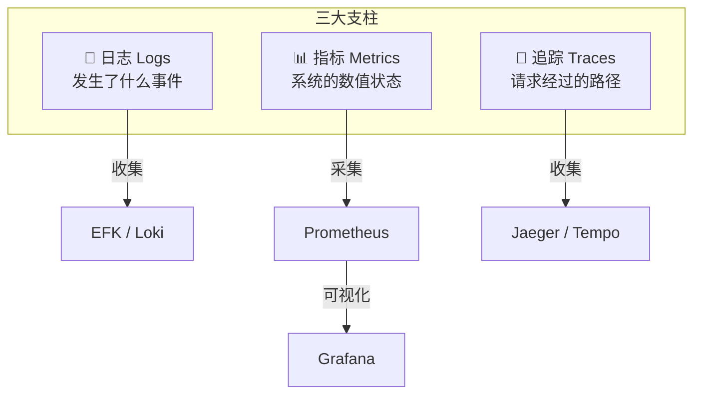
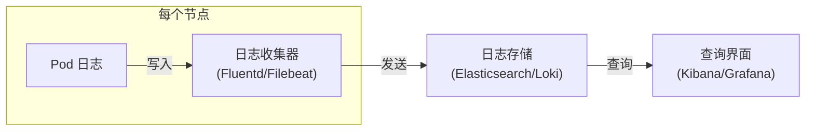
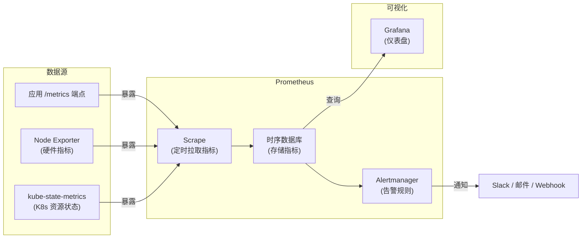

# 日志与监控

## 概念引入

你的 K8s 集群就像一个大型工厂——几十个 Pod 在运转，但你看不见里面发生了什么。你需要两样东西：

- **日志**（Logs）：每台机器的"工作日记"——记下了做了什么、出了什么错
- **监控**（Metrics）：工厂的"仪表盘"——CPU 多少、内存多少、请求量多少

**可观测性三大支柱**：日志（Logs）、指标（Metrics）、链路追踪（Traces）。本文聚焦前两个。



## 原理讲解

### kubectl logs：最基础的日志工具

```bash
# 查看 Pod 日志
kubectl logs my-pod

# 实时跟踪（类似 tail -f）
kubectl logs -f my-pod

# 查看之前崩溃的日志（上一次容器的日志）
kubectl logs my-pod --previous

# 查看指定容器的日志（多容器 Pod）
kubectl logs my-pod -c sidecar

# 按时间筛选
kubectl logs my-pod --since=1h
kubectl logs my-pod --since-time="2024-01-01T00:00:00Z"
```

> ⚠️ **kubectl logs 的局限**：只能看当前容器的日志，Pod 被删除后日志也没了。生产环境需要集中式日志系统。

### 集中式日志架构



| 方案 | 组件 | 特点 |
|------|------|------|
| **EFK** | Elasticsearch + Fluentd + Kibana | 功能强大，资源占用大 |
| **Loki + Promtail** | Loki + Promtail + Grafana | 轻量，与 Grafana 集成好 |

### Metrics Server：集群指标采集

K8s 自带的 Metrics Server 采集每个 Pod 和 Node 的 CPU/内存使用量：

```bash
# 查看 Node 资源使用
kubectl top nodes

# 查看 Pod 资源使用
kubectl top pods
kubectl top pods --sort-by=cpu       # 按 CPU 排序
kubectl top pods -n kube-system      # 指定 Namespace
```

> 💡 Metrics Server 是 HPA（自动扩缩容）的数据来源。没有它，HPA 无法工作。

### Prometheus：指标采集与告警

Prometheus 是 K8s 生态的事实标准监控系统：



**核心概念**：
- **Scrape**：Prometheus 主动拉取（pull）目标的 `/metrics` 端点
- **时间序列**：每个指标是 (指标名, 标签, 时间戳, 值) 的四元组
- **PromQL**：Prometheus 查询语言，如 `rate(http_requests_total[5m])`
- **告警规则**：如 `CPU > 80% 持续 5 分钟 → 发送告警`

### 四个黄金信号

Google SRE 提出的监控四个黄金信号：

| 信号 | 含义 | 示例指标 |
|------|------|---------|
| **延迟 (Latency)** | 请求处理时间 | `http_request_duration_seconds` |
| **流量 (Traffic)** | 系统负载量 | `http_requests_total` |
| **错误率 (Errors)** | 请求失败的比例 | `http_requests_total{code="500"}` |
| **饱和度 (Saturation)** | 资源使用率 | `container_memory_usage_bytes` |

## 动手实验

> 配套实验位于 `docs/labs/beginner/logging-monitoring/`

### 步骤 1：安装 Metrics Server

```bash
cd docs/labs/beginner/logging-monitoring
bash setup.sh
```

### 步骤 2：查看集群指标

```bash
# 查看节点资源使用
kubectl top nodes

# 查看 Pod 资源使用
kubectl top pods --all-namespaces --sort-by=memory | head -10

# 查看特定 Deployment 的资源使用
kubectl top pods -l app=log-generator
```

### 步骤 3：查看日志

```bash
# 查看日志生成器 Pod 的日志
kubectl logs -l app=log-generator -f
# Ctrl+C 停止跟踪

# 查看最近 1 分钟的日志
kubectl logs -l app=log-generator --since=1m

# 多容器 Pod 查看指定容器
kubectl logs multi-container-pod -c app
kubectl logs multi-container-pod -c sidecar
```

### 步骤 4：清理

```bash
bash teardown.sh
```

## 自检问题

1. **[基础]** `kubectl logs --previous` 是做什么的？什么场景下用它？

2. **[理解]** Prometheus 是"推"模型还是"拉"模型？这个设计有什么好处？

3. **[应用]** 你的 Web 服务 QPS 突然从 100 飙升到 5000，你会看哪些指标来定位问题？

<details>
<summary>查看答案</summary>

1. `--previous` 查看**上一次容器实例**的日志。当 Pod 因 OOMKilled 或 CrashLoopBackOff 重启时，当前容器的日志是新的（重启后的），而 `--previous` 能看到崩溃前的日志，帮助定位崩溃原因。

2. Prometheus 使用**拉（pull）模型**——Prometheus 主动去目标的 `/metrics` 端点抓取指标。好处：(1) 目标挂了 Prometheus 立刻知道（拉不到 = 有问题）；(2) 不需要目标主动配置推送目标；(3) 更容易做服务发现，Prometheus 通过 K8s API 自动发现新的监控目标。

3. 依次看四个黄金信号：(1) **流量**：确认 QPS 确实飙升；(2) **延迟**：看 P50/P99 延迟是否升高，判断是否过载；(3) **错误率**：看 5xx 比例是否升高，判断是否影响用户；(4) **饱和度**：看 CPU/内存使用率，判断是否需要扩容。同时检查日志中的错误信息，定位具体原因。

</details>

## 下一步

你会"看"集群了。接下来学习当集群出问题时的系统化排查方法：

→ [19. 排障方法论](./19-troubleshooting)
