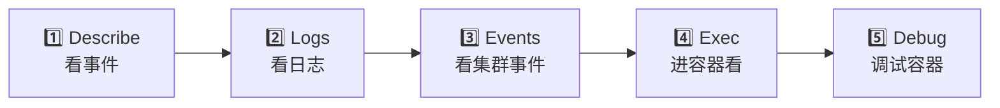

# 排障方法论

## 概念引入

你的 Pod 启动不了。新手反应："怎么办？"老手反应："打开排查清单。"

排障不是靠运气，而是靠**系统化流程**。就像医生看病：先望闻问切，再化验拍片，最后诊断治疗。

**K8s 排障五步法**：



## 原理讲解

### 第一步：kubectl describe — 看事件

**这是排障的第一步，也是最重要的一步。** 80% 的问题靠 describe 就能定位。

```bash
kubectl describe pod my-pod
```

重点看底部的 **Events** 部分：

| 事件 | 含义 | 排查方向 |
|------|------|---------|
| `Pulling image` → `Pulled` | 镜像拉取成功 | ✅ 正常 |
| `Failed to pull image` | 镜像拉取失败 | 检查镜像名、tag、仓库认证 |
| `Scheduled` | 调度成功 | ✅ 正常 |
| `0/N nodes are available` | 调度失败 | 看原因：资源不足？污点？亲和性？ |
| `Created container` | 容器创建成功 | ✅ 正常 |
| `Back-off restarting` | 容器反复重启 | 看日志找崩溃原因 |
| `Liveness probe failed` | 健康检查失败 | 检查探针配置和应用状态 |

### 第二步：kubectl logs — 看应用日志

```bash
# 当前容器的日志
kubectl logs my-pod

# 上一次崩溃的日志（Pod 重启后）
kubectl logs my-pod --previous

# 多容器 Pod 指定容器
kubectl logs my-pod -c sidecar

# 只看最近的日志
kubectl logs my-pod --tail=50
```

### 第三步：kubectl get events — 看集群事件

```bash
# 最近的事件
kubectl get events --sort-by='.lastTimestamp'

# 只看某个 Namespace 的事件
kubectl get events -n dev --sort-by='.lastTimestamp'

# 只看 Warning 级别
kubectl get events --field-selector type=Warning
```

### 第四步：kubectl exec — 进容器排查

```bash
# 进入容器 shell
kubectl exec -it my-pod -- sh

# 在容器内检查
cat /etc/resolv.conf     # DNS 配置
curl localhost:8080       # 内部服务是否正常
env                       # 环境变量是否正确
ls -la /data              # 挂载卷是否正常
```

> 💡 如果容器的镜像没有 shell（如 distroless），用 `kubectl debug` 注入一个调试容器。

### 第五步：kubectl debug — 调试容器

```bash
# 注入调试容器（基于 busybox）
kubectl debug my-pod -it --image=busybox:1.36

# 节点级调试
kubectl debug node/my-node -it --image=ubuntu
```

### 常见故障速查表

| 状态 | 原因 | 排查命令 |
|------|------|---------|
| `Pending` | 调度失败（资源不足/污点/亲和性） | `kubectl describe pod` 看 Events |
| `ImagePullBackOff` | 镜像不存在或认证失败 | 检查镜像名和 imagePullSecrets |
| `CrashLoopBackOff` | 应用启动后崩溃 | `kubectl logs --previous` |
| `OOMKilled` | 内存超 limit | `kubectl describe pod` 看 Last State |
| `Evicted` | 节点资源不足，Pod 被驱逐 | `kubectl describe node` 看 Conditions |
| `ContainerCreating` | 等 PV、拉镜像、配网络 | `kubectl describe pod` 看 Events |
| `Running` 但不健康 | Readiness 探针失败 | `kubectl describe pod` 看 Readiness |

## 动手实验

> 配套实验位于 `docs/labs/beginner/troubleshooting/`

本实验预设 3 个故障场景，你需要用上面的方法论逐一排查。

### 场景 1：Pod 一直 Pending

```bash
cd docs/labs/beginner/troubleshooting
bash setup.sh

# 你的任务：找出 pending-pod 为什么调度不上去
kubectl get pods
kubectl describe pod pending-pod
```

<details>
<summary>💡 提示</summary>

看 Events 里的 `0/N nodes are available` 信息。原因和 `resource` 有关。

</details>

### 场景 2：Pod 反复重启

```bash
# 你的任务：找出 crash-pod 为什么一直 CrashLoopBackOff
kubectl get pods
kubectl logs crash-pod --previous
```

<details>
<summary>💡 提示</summary>

看日志最后一行。应用缺少一个关键的 `环境变量`。

</details>

### 场景 3：镜像拉不下来

```bash
# 你的任务：找出 image-pull-pod 为什么 ImagePullBackOff
kubectl describe pod image-pull-pod
```

<details>
<summary>💡 提示</summary>

仔细看 Events 里的错误信息。镜像名写 `错` 了。

</details>

### 清理

```bash
bash teardown.sh
```

## 自检问题

1. **[基础]** K8s 排障五步法的顺序是什么？为什么 describe 是第一步？

2. **[理解]** `CrashLoopBackOff` 和 `OOMKilled` 的根因有什么区别？排查方法有什么不同？

3. **[应用]** 你的 Pod 状态是 `Running`，但 Service 访问不通。你会按什么顺序排查？

<details>
<summary>查看答案</summary>

1. 五步法：describe → logs → events → exec → debug。describe 是第一步因为它能直接看到 K8s 调度器、kubelet 对 Pod 做了什么操作以及失败原因，覆盖了大多数基础设施层面的问题（调度、镜像、探针、挂载），不需要进入容器内部。

2. **CrashLoopBackOff** 是应用启动后主动退出（exit code ≠ 0），根因通常在应用层面（配置错误、依赖不可用、代码 bug），排查用 `kubectl logs --previous` 看应用日志。**OOMKilled** 是容器内存使用超过 limits 被内核杀掉，根因是资源配置不合理或内存泄漏，排查用 `kubectl describe pod` 看 Last State 的 Exit Code 137，然后检查 limits 设置和应用内存使用。

3. 按顺序排查：(1) `kubectl describe pod` — Pod 是否 Ready（Readiness 探针）；(2) `kubectl get endpoints <svc>` — Service 是否关联了 Pod；(3) `kubectl exec` 进 Pod 内部 curl 服务端口 — 应用是否在监听；(4) 检查 Service selector 是否匹配 Pod labels；(5) 检查 NetworkPolicy 是否阻止了流量。

</details>

## 下一步

你的 K8s 基础功已经齐全了！最后一篇，学习 K8s 网络的最新演进：

→ [20. Gateway API](./20-gateway-api)
