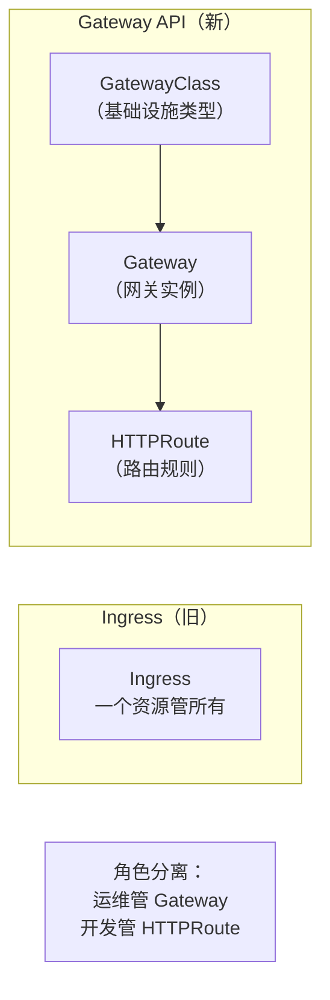
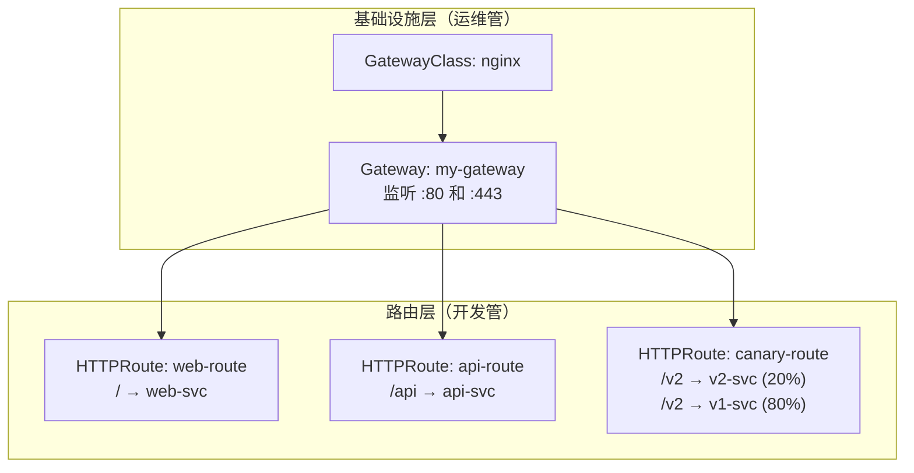

# Gateway API

## 概念引入

在文章 09 中，你学了 Ingress——K8s 的"大门保安"，负责根据域名和路径把流量分发到不同 Service。但 Ingress 有几个痛点：

- **表达能力弱**：只支持 HTTP 的 host + path 匹配，想做 header 匹配、权重分流？不行
- **配置不标准**：每个 Ingress Controller 用不同的 annotation，换个 Controller 就要重写配置
- **角色不分离**：运维管网关基础设施，开发管路由规则，但 Ingress 把两者混在一个资源里

**Gateway API 就是为了解决这些问题而生的新一代标准。**



## 原理讲解

### Gateway API 的三个核心资源

| 资源 | 谁管 | 作用 | 类比 |
|------|------|------|------|
| **GatewayClass** | 基础设施提供商 | 定义网关类型（如 nginx、envoy） | "我要买什么型号的门" |
| **Gateway** | 集群运维 | 创建网关实例，定义监听器和端口 | "把门装在哪里，开几个口" |
| **HTTPRoute** | 应用开发者 | 定义路由规则（路径、header、权重） | "进哪个门走哪条路" |



### Ingress vs Gateway API 对比

| 维度 | Ingress | Gateway API |
|------|---------|-------------|
| 标准化 | ❌ 各 Controller 用不同 annotation | ✅ 统一标准，跨 Controller 兼容 |
| 路由能力 | 仅 host + path | host + path + header + query + method |
| 流量分割 | ❌ 不支持 | ✅ 权重分流（金丝雀发布） |
| 角色分离 | ❌ 一个资源 | ✅ 三层分离（Class/Gateway/Route） |
| 协议支持 | HTTP/HTTPS | HTTP/HTTPS/TCP/TLS/gRPC |
| 状态 | 稳定但功能受限 | GA（正式可用），持续演进 |

### HTTPRoute 的强大能力

```yaml
apiVersion: gateway.networking.k8s.io/v1
kind: HTTPRoute
metadata:
  name: advanced-route
spec:
  parentRefs:
  - name: my-gateway
    sectionName: http
  hostnames:
  - "app.example.com"
  rules:
  # 规则 1：按 header 路由
  - matches:
    - headers:
      - name: x-version
        value: "v2"
    backendRefs:
    - name: v2-svc
      port: 80

  # 规则 2：按权重分流（金丝雀发布）
  - matches:
    - path:
        value: /api
    backendRefs:
    - name: api-v1
      port: 80
      weight: 90       # 90% 流量到 v1
    - name: api-v2
      port: 80
      weight: 10       # 10% 流量到 v2

  # 规则 3：请求重定向
  - matches:
    - path:
        value: /old-path
    filters:
    - type: RequestRedirect
      requestRedirect:
        path:
          type: ReplaceFullPath
          replaceFullPath: /new-path
```

### 迁移路径

大多数 Ingress Controller（Nginx Ingress、Traefik、Kong）已经支持 Gateway API。迁移步骤：

1. 安装支持 Gateway API 的 Controller
2. 创建 GatewayClass 和 Gateway
3. 把 Ingress 规则逐一转换为 HTTPRoute
4. 验证无误后删除旧 Ingress

## 动手实验

> 配套实验位于 `docs/labs/beginner/gateway-api/`

本实验用 Gateway API 重新实现文章 09 中 Ingress 的路由规则。

### 步骤 1：安装 Gateway API CRD 和 Controller

```bash
cd docs/labs/beginner/gateway-api
bash setup.sh
```

### 步骤 2：创建 Gateway

```bash
kubectl apply -f - <<EOF
apiVersion: gateway.networking.k8s.io/v1
kind: Gateway
metadata:
  name: my-gateway
spec:
  gatewayClassName: nginx
  listeners:
  - name: http
    port: 80
    protocol: HTTP
EOF

kubectl get gateway
kubectl describe gateway my-gateway
```

### 步骤 3：创建 HTTPRoute（等价于 09 的 Ingress）

```bash
kubectl apply -f - <<EOF
apiVersion: gateway.networking.k8s.io/v1
kind: HTTPRoute
metadata:
  name: app-route
spec:
  parentRefs:
  - name: my-gateway
  rules:
  - matches:
    - path:
        type: PathPrefix
        value: /api
    backendRefs:
    - name: api
      port: 5678
  - matches:
    - path:
        type: PathPrefix
        value: /
    backendRefs:
    - name: web
      port: 80
EOF

kubectl get httproute
```

### 步骤 4：验证路由

```bash
# 访问根路径 → web
curl localhost

# 访问 /api → api
curl localhost/api
```

### 步骤 5：体验流量分割

```bash
# 创建 v1 和 v2 两个服务
kubectl create deployment api-v1 --image=hashicorp/http-echo -- -text="v1"
kubectl expose deployment api-v1 --port=80
kubectl create deployment api-v2 --image=hashicorp/http-echo -- -text="v2"
kubectl expose deployment api-v2 --port=80

# 创建权重分流路由
kubectl apply -f - <<EOF
apiVersion: gateway.networking.k8s.io/v1
kind: HTTPRoute
metadata:
  name: canary-route
spec:
  parentRefs:
  - name: my-gateway
  rules:
  - matches:
    - path:
        type: PathPrefix
        value: /canary
    backendRefs:
    - name: api-v1
      port: 80
      weight: 80
    - name: api-v2
      port: 80
      weight: 20
EOF

# 多次请求，观察 80/20 分流
for i in $(seq 1 10); do curl -s localhost/canary; done
```

### 步骤 6：清理

```bash
bash teardown.sh
```

## 自检问题

1. **[基础]** Gateway API 的三层结构（GatewayClass / Gateway / HTTPRoute）分别由谁管理？

2. **[理解]** Ingress 的 annotation 有什么问题？Gateway API 怎么解决的？

3. **[应用]** 你的团队要做一个灰度发布（10% 流量到新版本），用 Ingress 和 Gateway API 分别怎么实现？

<details>
<summary>查看答案</summary>

1. **GatewayClass** 由基础设施提供商定义（如 Nginx 提供 nginx GatewayClass）。**Gateway** 由集群运维管理——决定在哪里创建网关实例、监听哪些端口。**HTTPRoute** 由应用开发者管理——定义具体的路由规则。这种分离让运维和开发各司其职，互不干扰。

2. Ingress 的 annotation 不是标准 API，不同 Controller（Nginx Ingress、Traefik、Kong）用不同的 annotation 实现相同功能（如 `nginx.ingress.kubernetes.io/rewrite-target` vs `traefik.ingress.kubernetes.io/rewrite-target`）。换 Controller 就要改 annotation。Gateway API 是 K8s 官方标准 API，所有兼容的 Controller 都支持相同的 HTTPRoute 语法，换 Controller 不需要改路由配置。

3. **Ingress**：需要用 Controller 特定的 annotation 实现分流（如 Nginx Ingress 的 `canary` 注解），不可移植。**Gateway API**：直接在 HTTPRoute 的 backendRefs 中设置 `weight: 90` 和 `weight: 10`，标准 API，任何兼容的 Controller 都支持。

</details>

## 下一步

Gateway API 是 Ingress 的未来。你的基础功已经扎实了，接下来进入进阶实战阶段：

→ [21. Init Container 与 Sidecar](./21-init-container-sidecar)
