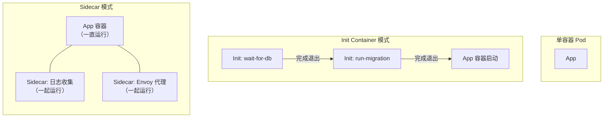
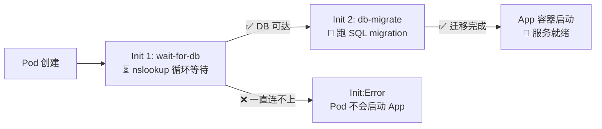
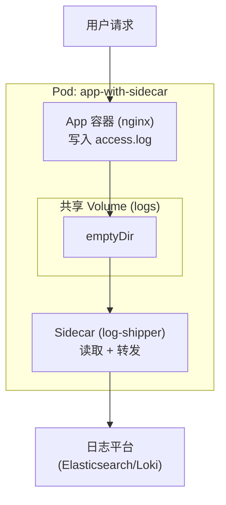

# Init Container 与 Sidecar

## 概念引入

到目前为止，你创建的 Pod 都只有一个容器。单容器就像"一人工作室"——简单，但能力有限。

**生产环境中，Pod 里经常跑多个容器**，主要有两种模式：

- **Init Container**：运行完就退出，完成后再启动主容器（像"装修队"——装完就走，业主再入住）
- **Sidecar**：和主容器一起运行，提供辅助功能（像"保安"——24 小时和你一起，提供保护）



## 原理讲解

### Init Container：按顺序执行的前置任务

Init Container 的关键特性：

| 特性 | 说明 |
|------|------|
| **顺序执行** | 多个 Init Container 按定义顺序依次执行，前一个完成才启动下一个 |
| **必须成功** | Init Container 必须成功退出（exit 0），否则 Pod 一直处于 `Init:Error` 状态 |
| **独立镜像** | 可以用和主容器完全不同的镜像（主容器用 Node.js，Init 用 busybox 就够了） |
| **独立资源** | Init Container 有自己的 volume 挂载和资源请求 |

```yaml
apiVersion: v1
kind: Pod
metadata:
  name: app-with-init
spec:
  initContainers:
  # Init 1: 等待数据库就绪
  - name: wait-for-db
    image: busybox:1.36
    command: ['sh', '-c', 'until nslookup db-svc; do echo "waiting..."; sleep 2; done']

  # Init 2: 执行数据库迁移
  - name: db-migrate
    image: myapp:latest
    command: ['npm', 'run', 'migrate']

  containers:
  - name: app
    image: myapp:latest
    ports:
    - containerPort: 3000
```



### Sidecar：辅助服务的容器

Sidecar 和主容器**同时运行**，通过共享资源（volume、network）协作：

```yaml
apiVersion: v1
kind: Pod
metadata:
  name: app-with-sidecar
spec:
  volumes:
  - name: logs
    emptyDir: {}

  containers:
  # 主容器：写日志
  - name: app
    image: nginx:1.27
    volumeMounts:
    - name: logs
      mountPath: /var/log/nginx

  # Sidecar：收集并转发日志
  - name: log-shipper
    image: busybox:1.36
    command: ['sh', '-c', 'tail -f /logs/access.log']
    volumeMounts:
    - name: logs
      mountPath: /logs
```



### Init Container vs Sidecar vs 多容器对比

| 维度 | Init Container | Sidecar | 普通多容器 |
|------|---------------|---------|-----------|
| 运行时机 | 主容器之前 | 和主容器同时 | 和主容器同时 |
| 退出行为 | 必须成功退出 | 一直运行 | 一直运行 |
| 典型用途 | 等依赖、初始化、迁移 | 日志收集、代理、监控 | 紧密耦合的服务 |
| 生命周期 | 执行完就结束 | 和 Pod 同生命周期 | 和 Pod 同生命周期 |

### 经典场景

| 场景 | 用什么 | 为什么 |
|------|--------|--------|
| 等数据库就绪再启动 | Init Container | 阻塞式等待，不需要一直跑 |
| 运行数据库 migration | Init Container | 跑完一次就行 |
| 从 Vault 拉取密钥 | Init Container | 启动前拉一次就够了 |
| 收集应用日志 | Sidecar | 需要持续读取 |
| 代理/服务网格（Envoy） | Sidecar | 代理所有进出流量 |
| 健康检查上报 | Sidecar | 持续向监控系统汇报 |

## 动手实验

> 配套实验位于 `docs/labs/beginner/init-container-sidecar/`

本实验模拟：Init Container 等待依赖就绪 → Sidecar 持续收集日志。

### 步骤 1：部署实验环境

```bash
cd docs/labs/beginner/init-container-sidecar
bash setup.sh
```

### 步骤 2：观察 Init Container 执行顺序

```bash
# 观察 Pod 状态变化
kubectl get pods -w
# 你会看到：Pending → Init:0/2 → Init:1/2 → Init:2/2 → PodInitializing → Running

# 查看 Init Container 日志
kubectl logs app-with-init-sidecar -c wait-for-svc
kubectl logs app-with-init-sidecar -c init-config
```

### 步骤 3：验证 Sidecar 日志收集

```bash
# 主容器产生一些访问日志
kubectl exec app-with-init-sidecar -c app -- curl -s localhost

# 查看 Sidecar 收集到的日志
kubectl logs app-with-init-sidecar -c log-collector
```

### 步骤 4：清理

```bash
bash teardown.sh
```

## 自检问题

1. **[基础]** Init Container 和普通 Container 的启动顺序有什么区别？如果 Init Container 失败了 Pod 会怎样？

2. **[理解]** 以下场景分别适合 Init Container 还是 Sidecar？① 数据库建表 ② 实时日志收集 ③ 从外部拉取配置文件到共享卷 ④ 代理所有出站流量

3. **[应用]** 你的应用需要等 Redis 启动后才能运行，还需要在启动前执行数据预热脚本。Pod 里应该有几个 Init Container？几个普通 Container？

<details>
<summary>查看答案</summary>

1. **Init Container 先于普通 Container 执行**，且多个 Init Container 按定义顺序依次执行。只有所有 Init Container 都成功退出后，普通 Container 才会启动。如果 Init Container 失败（exit != 0），Pod 会一直处于 `Init:Error` 状态并不断重试，主容器永远不会启动。

2. ① Init Container（跑一次建表脚本就行）② Sidecar（需要持续 tail + 转发）③ Init Container（拉一次挂到共享卷即可）④ Sidecar（作为代理持续运行）。

3. 需要 **2 个 Init Container + 1 个普通 Container**。Init 1：`wait-for-redis`（nslookup 循环等 Redis 就绪）。Init 2：`data-warmup`（执行预热脚本）。普通 Container：你的应用本身。预热脚本因为依赖 Redis，所以需要放在 `wait-for-redis` 之后。

</details>

## 下一步

你已经掌握了多容器 Pod 的两种核心模式。接下来，学习如何用网络策略保护你的服务：

→ [22. NetworkPolicy 实战](./22-networkpolicy)
