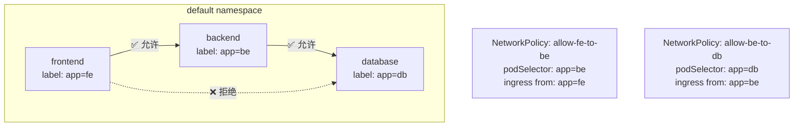
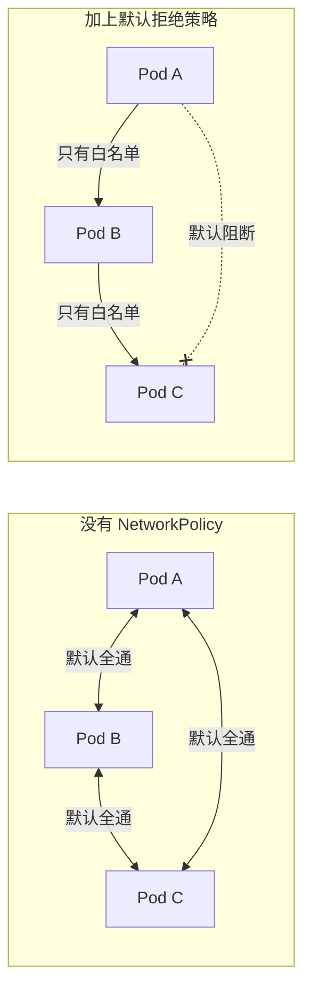

# NetworkPolicy 实战

## 概念引入

回顾文章 09，你学了 K8s 的网络是怎么"通"的——Pod 之间、Pod 和 Service 之间默认都可以互相访问。

但生产环境中，**"默认全通"是安全风险**：

```
🚨 没有 NetworkPolicy：
   frontend → backend ✅
   backend → database ✅
   frontend → database ✅  ← 危险！前端不应直接访问数据库
   外部攻击者 → database ✅  ← 更危险！

✅ 有 NetworkPolicy：
   frontend → backend ✅（允许）
   backend → database ✅（允许）
   frontend → database ❌（拒绝！）
   其他一切通信 → ❌ （默认拒绝）
```

**NetworkPolicy 就是 K8s 的"防火墙规则"**——定义 Pod 之间谁能访问谁。



## 原理讲解

### NetworkPolicy 的核心字段

```yaml
apiVersion: networking.k8s.io/v1
kind: NetworkPolicy
metadata:
  name: allow-backend-from-frontend
spec:
  podSelector:          # 这个策略应用在哪些 Pod 上
    matchLabels:
      app: backend

  policyTypes:          # 控制入站和/或出站
  - Ingress             # 控制"谁可以访问我"
  - Egress               # 控制"我可以访问谁"

  ingress:
  - from:               # 允许哪些来源的流量进入
    - podSelector:
        matchLabels:
          app: frontend  # 允许 frontend Pod 的流量
    - namespaceSelector: # 也支持按 namespace 过滤
        matchLabels:
          team: dev
    - ipBlock:           # 也支持按 IP 段控制
        cidr: 10.0.0.0/8

    ports:               # 允许的端口和协议
    - protocol: TCP
      port: 8080
```

| 字段 | 作用 | 示例 |
|------|------|------|
| `podSelector` | 规则针对哪些 Pod | `app: backend` |
| `policyTypes` | Ingress（入站）/ Egress（出站） | 两者都要控就都写 |
| `ingress.from` | 哪些来源可以进入 | podSelector / namespaceSelector / ipBlock |
| `egress.to` | 可以访问哪些目标 | 同上 |
| `ports` | 允许的端口 + 协议 | TCP 8080 |

### 默认拒绝 vs 默认允许



**默认拒绝所有入站流量**（基础安全策略）：

```yaml
apiVersion: networking.k8s.io/v1
kind: NetworkPolicy
metadata:
  name: deny-all-ingress
spec:
  podSelector: {}       # 空的 podSelector = 选中所有 Pod
  policyTypes:
  - Ingress
  # 没有 ingress 规则 = 没有任何允许 = 拒绝全部入站
```

### 三层隔离模型

```
┌─────────────────────────────────────────┐
│                 默认全部拒绝               │
│  ┌─────────────────────────────────┐    │
│  │        逐条开放（白名单）          │    │
│  │  ┌───────────────────────────┐  │    │
│  │  │  按需放行特定端口+来源      │  │    │
│  │  │  frontend → backend:8080  │  │    │
│  │  │  backend → database:5432  │  │    │
│  │  └───────────────────────────┘  │    │
│  └─────────────────────────────────┘    │
└─────────────────────────────────────────┘
```

### 关键注意事项

| 注意 | 说明 |
|------|------|
| **需要 CNI 支持** | 不是所有网络插件都支持 NetworkPolicy（Calico、Cilium、Weave 支持；Flannel 默认不支持） |
| **Kind 默认支持** | Kind 自带 kindnet，不是完全支持；实验室中使用 Calico 或 Cilium 替换 |
| **namespaceSelector** | 可以和 podSelector 组合（AND 逻辑），实现跨 namespace 策略 |
| **规则是叠加的** | 多个 NetworkPolicy 选中同一个 Pod，效果是 **并集**（任一允许即放行） |
| **不影响 Service** | NetworkPolicy 管控 Pod 间流量，不影响 Service 本身 |

## 动手实验

> 配套实验位于 `docs/labs/beginner/networkpolicy/`

本实验创建 frontend → backend → database 三层架构，用 NetworkPolicy 实现分层隔离。

### 步骤 1：部署实验环境

```bash
cd docs/labs/beginner/networkpolicy
bash setup.sh
```

### 步骤 2：验证默认网络（全部互通）

```bash
# 从 frontend 访问 backend（预期成功）
kubectl exec deploy/frontend -- curl -s backend:8080

# 从 frontend 直接访问 database（预期成功——策略还没启用）
kubectl exec deploy/frontend -- wget -q -O- db:5432 && echo "可达" || echo "不可达"
```

### 步骤 3：应用 NetworkPolicy

```bash
kubectl apply -f manifests/network-policy.yaml

# 查看策略
kubectl get networkpolicy
kubectl describe networkpolicy allow-fe-to-be
```

### 步骤 4：验证隔离效果

```bash
# frontend → backend：仍然允许
kubectl exec deploy/frontend -- curl -s backend:8080
# ✅ 预期成功

# frontend → database：现在被拒绝！
kubectl exec deploy/frontend -- wget -q -O- db:5432 --timeout=5
# ❌ 预期超时或被拒绝

# backend → database：允许（策略允许）
kubectl exec deploy/backend -- wget -q -O- db:5432 --timeout=5 && echo "可达" || echo "不可达"
```

### 步骤 5：清理

```bash
bash teardown.sh
```

## 自检问题

1. **[基础]** K8s 中 Pod 之间默认的网络行为是什么？NetworkPolicy 改变了什么？

2. **[理解]** 一个 Pod 同时被两条 NetworkPolicy 选中：Policy A 允许来自 namespace `dev` 的流量，Policy B 允许来自 Pod `monitoring` 的流量。来自 `staging` namespace 的 `backend` Pod 能访问这个 Pod 吗？

3. **[应用]** 设计一个三层应用（web → api → db）的完整 NetworkPolicy 方案。要求：① 外网只能访问 web 的 80 端口；② web 只能访问 api 的 8080；③ api 只能访问 db 的 5432；④ 所有横向通信被禁止。

<details>
<summary>查看答案</summary>

1. **默认全通**：同一集群内的 Pod 之间可以互相访问（通过 Pod IP），没有任何限制。NetworkPolicy 把默认行为从"全通"变成"默认拒绝 + 白名单放行"——你必须显式声明谁可以访问谁，未被允许的流量全部丢弃。

2. **能访问**。多条 NetworkPolicy 的效果是**并集**（OR 逻辑）：Policy A 允许 `dev` namespace，但 `backend` Pod 不在 `dev` namespace 中，所以 Policy A 不放行。Policy B 允许 `monitoring` Pod，`backend` Pod 不匹配。两条都没有命中，所以 **不能访问**。需要补充一条规则允许 `staging` 中的 Pod。

3. 方案如下：

```yaml
# 1. 默认拒绝所有入站
apiVersion: networking.k8s.io/v1
kind: NetworkPolicy
metadata:
  name: deny-all
spec:
  podSelector: {}
  policyTypes: [Ingress]

# 2. 允许入站到 web:80（来自所有来源——外网通过 Ingress 访问）
apiVersion: networking.k8s.io/v1
kind: NetworkPolicy
metadata:
  name: allow-web
spec:
  podSelector: {matchLabels: {app: web}}
  policyTypes: [Ingress]
  ingress:
  - ports: [{protocol: TCP, port: 80}]

# 3. 允许 web → api:8080
apiVersion: networking.k8s.io/v1
kind: NetworkPolicy
metadata:
  name: allow-api
spec:
  podSelector: {matchLabels: {app: api}}
  policyTypes: [Ingress]
  ingress:
  - from: [{podSelector: {matchLabels: {app: web}}}]
    ports: [{protocol: TCP, port: 8080}]

# 4. 允许 api → db:5432
apiVersion: networking.k8s.io/v1
kind: NetworkPolicy
metadata:
  name: allow-db
spec:
  podSelector: {matchLabels: {app: db}}
  policyTypes: [Ingress]
  ingress:
  - from: [{podSelector: {matchLabels: {app: api}}}]
    ports: [{protocol: TCP, port: 5432}]
```

</details>

## 下一步

网络隔离搞定了。接下来学习 Ingress 的生产级用法——TLS、灰度发布、限流：

→ [23. Ingress 生产实战](./23-ingress-production)
