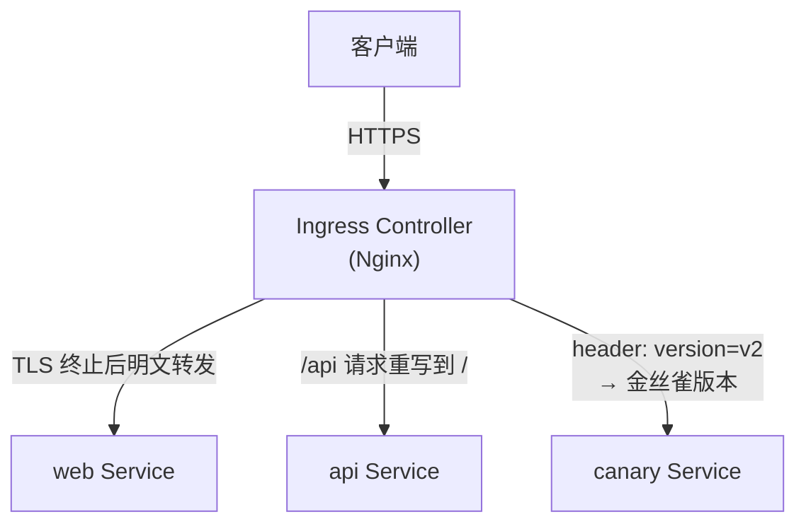
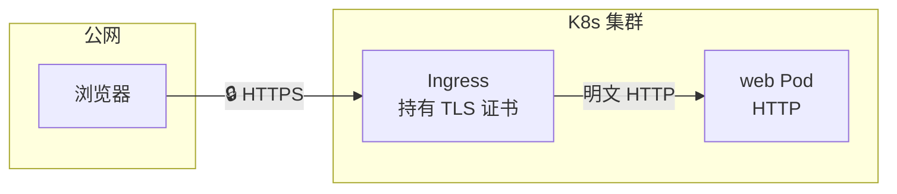
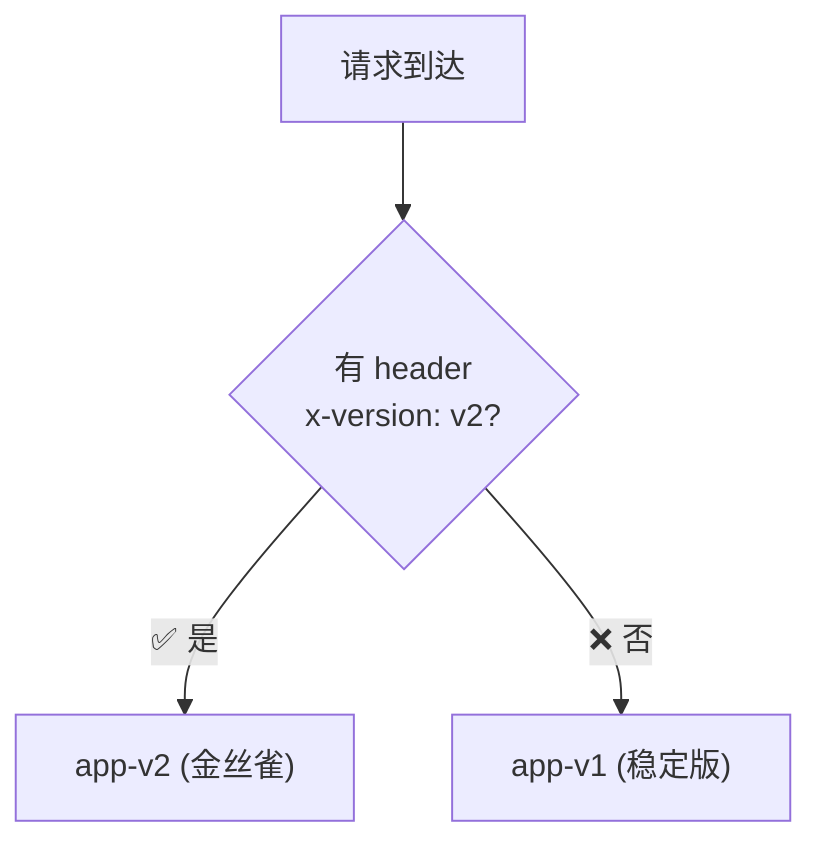

# Ingress 生产实战

## 概念引入

文章 09 里你学了一个最简单的 Ingress：按域名+路径把流量分到不同 Service。但生产环境远比这复杂：

```
基础 Ingress（#09）             生产 Ingress（本篇）
─────────────────              ─────────────────
http://app.com → web           https://app.com → web        ← TLS 加密
http://app.com/api → api       /api(/.*) → /$1              ← rewrite 重写
                               同一 Service 按 header 分流    ← 金丝雀灰度
                               每个 IP 每秒最多 10 请求        ← 限流保护
```

本文将同时展示**传统 Ingress 注解方式**和 **Gateway API 等效实现**，帮你理解两者的联系。



## 原理讲解

### TLS 终止

TLS 终止在 Ingress 层面完成——客户端到 Ingress 是 HTTPS，Ingress 到后端 Pod 是 HTTP：

```yaml
apiVersion: networking.k8s.io/v1
kind: Ingress
metadata:
  name: app-tls
spec:
  tls:
  - hosts:
    - app.example.com
    secretName: app-tls-secret    # 包含证书和私钥的 Secret
  rules:
  - host: app.example.com
    http:
      paths:
      - path: /
        pathType: Prefix
        backend:
          service:
            name: web
            port:
              number: 80
```



**证书管理**：生产中用 cert-manager 自动申请/续期 Let's Encrypt 证书：

```yaml
# cert-manager 自动管理证书（注解）
metadata:
  annotations:
    cert-manager.io/cluster-issuer: "letsencrypt-prod"
```

### Rewrite：路径重写

后端服务通常不关心路由路径——`/api/users` 对后端来说就是 `/users`：

```yaml
metadata:
  annotations:
    nginx.ingress.kubernetes.io/rewrite-target: /$2
spec:
  rules:
  - http:
      paths:
      - path: /api(/|$)(.*)    # 捕获组
        pathType: ImplementationSpecific
        backend:
          service:
            name: api-service
            port:
              number: 8080
```

```
请求路径                    →  到达后端的路径
─────────────────────────────────────────
/api/users                 →  /users
/api/orders/123            →  /orders/123
/                          →  /（不走 rewrite）
```

> **Gateway API 等效**：HTTPRoute 通过 `filters` 实现：
>
> ```yaml
> filters:
> - type: URLRewrite
>   urlRewrite:
>     path:
>       type: ReplacePrefixMatch
>       replacePrefixMatch: /
> ```

### 金丝雀灰度：基于 Header 分流

不切流量到新版本，仅让特定用户（带 header）看到新版本：

```yaml
# 主 Ingress（稳定版本——所有流量默认走这里）
apiVersion: networking.k8s.io/v1
kind: Ingress
metadata:
  name: app-stable
spec:
  rules:
  - host: app.example.com
    http:
      paths:
      - path: /
        pathType: Prefix
        backend:
          service:
            name: app-v1
            port:
              number: 80
---
# 金丝雀 Ingress（紧带特定 header 的请求走 v2）
apiVersion: networking.k8s.io/v1
kind: Ingress
metadata:
  name: app-canary
  annotations:
    nginx.ingress.kubernetes.io/canary: "true"
    nginx.ingress.kubernetes.io/canary-by-header: "x-version"
    nginx.ingress.kubernetes.io/canary-by-header-value: "v2"
spec:
  rules:
  - host: app.example.com
    http:
      paths:
      - path: /
        pathType: Prefix
        backend:
          service:
            name: app-v2
            port:
              number: 80
```



> **Gateway API 等效**：直接在 HTTPRoute 中使用 `weight`：
>
> ```yaml
> backendRefs:
> - name: app-v1
>   port: 80
>   weight: 90
> - name: app-v2
>   port: 80
>   weight: 10
> ```

### 限流：保护后端服务

```yaml
metadata:
  annotations:
    # 每秒每 IP 最多 10 次请求
    nginx.ingress.kubernetes.io/limit-rps: "10"
    # 突发允许 20 次
    nginx.ingress.kubernetes.io/limit-burst-multiplier: "2"
```

超过限制后返回 **503 Service Temporarily Unavailable**。

### Ingress 注解 vs Gateway API 对照表

| 功能 | Ingress 注解 | Gateway API |
|------|-------------|-------------|
| TLS | `spec.tls` + Secret | Gateway `listeners.tls` + HTTPRoute |
| Rewrite | `rewrite-target` annotation | HTTPRoute `filters.URLRewrite` |
| 金丝雀（header）| `canary-by-header` annotation | HTTPRoute `matches.headers` |
| 金丝雀（权重）| `canary-weight` annotation | HTTPRoute `backendRefs.weight` |
| 限流 | `limit-rps` annotation | 需 Controller 特定扩展 |

## 动手实验

> 配套实验位于 `docs/labs/beginner/ingress-production/`

### 步骤 1：部署实验环境

```bash
cd docs/labs/beginner/ingress-production
bash setup.sh
```

### 步骤 2：验证 TLS 终止

```bash
# 查看 TLS 配置
kubectl describe ingress app-tls

# 用 -k 忽略自签名证书验证
curl -k https://localhost/
```

### 步骤 3：验证 Rewrite

```bash
# 请求 /app/api/hello → 后端收到 /hello
curl http://localhost/app/api/hello
```

### 步骤 4：验证金丝雀灰度

```bash
# 不带 header → v1（稳定版）
curl http://localhost/
# 预期输出：Hello from v1

# 带 header → v2（金丝雀版本）
curl -H "x-version: v2" http://localhost/
# 预期输出：Hello from v2
```

### 步骤 5：验证限流

```bash
# 快速发送 20 个请求
for i in $(seq 1 20); do curl -s -o /dev/null -w "%{http_code}\n" http://localhost/; done
# 预期：前几个返回 200，后面的返回 503（限流）
```

### 步骤 6：清理

```bash
bash teardown.sh
```

## 自检问题

1. **[基础]** Ingress 上配置 TLS 后，流量从客户端到后端的加密范围是什么？

2. **[理解]** `rewrite-target: /$2` 中 `$2` 是什么意思？如果不加 rewrite 注解，`/api/users` 的请求到了后端路径是什么？

3. **[应用]** 你需要发布一个新版本，只想让 QA 团队验证。用什么方式做灰度最合适？为什么？

<details>
<summary>查看答案</summary>

1. TLS 的加密范围是**客户端到 Ingress Controller**（边缘终止 / Edge Termination）。Ingress 持有证书，解密 TLS 后以明文 HTTP 转发给后端 Pod。后端 Pod 不需要处理 TLS。这就是"TLS 终止"——加密在 Ingress 这里终止了。如果需要端到端加密（客户端 → Ingress → Pod 全程 HTTPS），可以配置 SSL Passthrough 或让后端也配置 TLS。

2. `$2` 是正则表达式的**第二个捕获组**。在 `path: /api(/|$)(.*)` 中，`(/|$)` 是 `$1`（匹配 `/` 或结尾），`(.*)` 是 `$2`（匹配路径剩余部分）。例如 `/api/users`：`$1` = `/`，`$2` = `users`，rewrite 后变成 `/users`。如果不加 rewrite 注解，`/api/users` 到达后端的路径就是 `/api/users`——后端需要在路由中处理 `/api` 前缀，不方便。

3. **基于 header 的金丝雀灰度**最合适。让 QA 团队在浏览器或测试工具中带上特定 header（如 `x-team: qa`），只有他们的请求路由到新版本，其他用户完全不受影响。这比基于权重的金丝雀更精确——QA 可以反复测试新版本，而不用担心把普通用户随机分流到可能不稳定版本。

</details>

## 下一步

Ingress 从开发到生产，你已经掌握了。接下来，学习如何在 Pod 层面加固安全：

→ [24. Pod 安全上下文](./24-pod-security)
