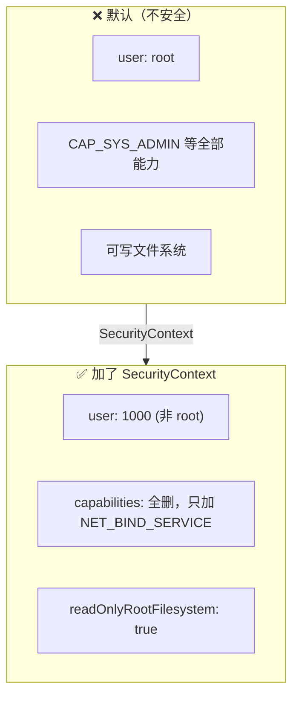
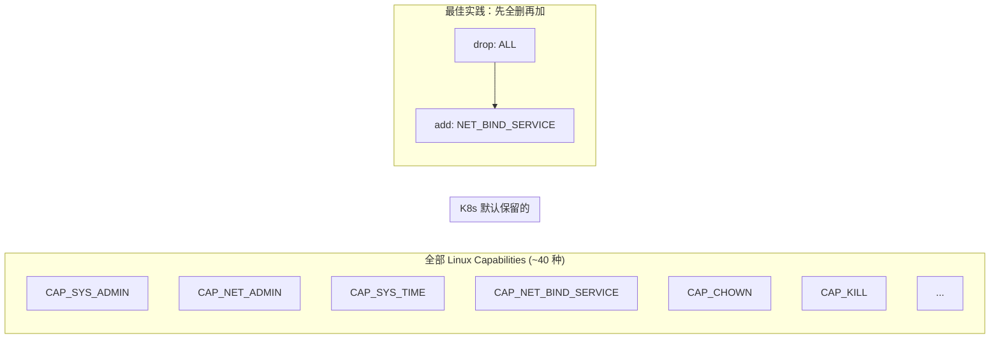

# Pod 安全上下文

## 概念引入

直接跑一个默认容器会发生什么？

```bash
kubectl exec my-pod -- whoami
# 输出：root  ← 默认就是 root！
```

**默认情况下，容器以 root 用户运行，拥有几乎所有 Linux 能力**。如果你的应用有漏洞被攻破，攻击者可以：
- 修改系统文件
- 安装后门工具
- 横向攻击其他 Pod

**SecurityContext 就是给容器"降权"的手段**——让容器以非 root 用户运行，只给必要的能力。



## 原理讲解

### SecurityContext 的两个级别

| 级别 | 作用域 | 配置位置 |
|------|--------|---------|
| **Pod 级别** | 整个 Pod 所有容器 | `spec.securityContext` |
| **容器级别** | 单个容器 | `spec.containers[].securityContext` |
| **冲突时** | 容器级覆盖 Pod 级 | 更具体的生效 |

### 核心字段

```yaml
apiVersion: v1
kind: Pod
metadata:
  name: secure-pod
spec:
  # Pod 级别安全上下文
  securityContext:
    runAsNonRoot: true      # 必须以非 root 用户运行
    runAsUser: 1000         # 指定 UID
    runAsGroup: 3000        # 指定 GID
    fsGroup: 2000           # volume 挂载后文件的属组

  containers:
  - name: app
    image: nginx:1.27
    # 容器级别安全上下文（覆盖 Pod 级别）
    securityContext:
      allowPrivilegeEscalation: false    # 禁止提权
      readOnlyRootFilesystem: true        # 根文件系统只读
      capabilities:
        drop: ["ALL"]                     # 先删掉所有能力
        add: ["NET_BIND_SERVICE"]        # 再加回必要的最小能力
      runAsNonRoot: true
```

### 关键字段详解

| 字段 | 作用 | 推荐值 |
|------|------|--------|
| `runAsNonRoot` | 强制以非 root 运行 | `true` |
| `runAsUser` | 指定运行用户 UID | ≥ 1000 |
| `privileged` | 特权模式 | **永远 false** |
| `allowPrivilegeEscalation` | 允许提权 | `false` |
| `readOnlyRootFilesystem` | 根文件系统只读 | `true`（需要写临时文件时注意挂 emptyDir） |
| `capabilities.drop` | 删除的 Linux 能力 | `["ALL"]` |
| `capabilities.add` | 额外添加的能力 | 按需加（如 `NET_BIND_SERVICE` 绑定低端口） |

### Capabilities：Linux 能力的精细化控制

Linux 的 root 权限被拆成了 ~40 个细粒度的"能力"（capabilities）。Docker/K8s 默认给容器**一部分**能力。



常见能力场景：

| 能力 | 何时需要 |
|------|---------|
| `NET_BIND_SERVICE` | 绑定 1024 以下的端口（如 80、443） |
| `NET_ADMIN` | 修改网络配置（iptables 等） |
| `SYS_ADMIN` | 挂载文件系统、修改内核参数（**危险**） |
| `SYS_TIME` | 设置系统时间 |

### Pod Security Standards（PSS）

除了手动配 SecurityContext，K8s 提供了三个开箱即用的安全策略级别：

```
┌──────────────────────────────────────┐
│  privileged  →  unrestricted ← 啥都不限制        │
│  baseline    →  常见攻击应对 ← 禁止特权容器等      │
│  restricted  →  最强限制     ← 必须非 root + 只读  │
└──────────────────────────────────────┘
```

在 Namespace 上打标签来启用：

```yaml
apiVersion: v1
kind: Namespace
metadata:
  name: production
  labels:
    pod-security.kubernetes.io/enforce: restricted
    pod-security.kubernetes.io/audit: restricted
    pod-security.kubernetes.io/warn: restricted
```

- `enforce`：违规就拒绝
- `audit`：违规记审计日志但不拒绝
- `warn`：违规发出警告

## 动手实验

> 配套实验位于 `docs/labs/beginner/pod-security/`

### 步骤 1：部署实验环境

```bash
cd docs/labs/beginner/pod-security
bash setup.sh
```

### 步骤 2：对比 root vs non-root

```bash
# 查看默认 Pod 的运行用户
kubectl exec default-pod -- whoami
# 输出：root

# 查看安全 Pod 的运行用户
kubectl exec secure-pod -- whoami
# 输出：whoami: unknown uid 1000 （1000 是故意设置的，不是 root）
```

### 步骤 3：验证只读文件系统

```bash
# 尝试在只读文件系统中写入
kubectl exec secure-pod -- touch /tmp/test
# 预期：touch: /tmp/test: Read-only file system  ← 拒绝写入！

# 对比：默认 Pod 可以写
kubectl exec default-pod -- touch /tmp/test
# 预期：成功（无输出）
```

### 步骤 4：验证 capabilities 裁剪

```bash
# 对比两个 Pod 的 capabilities
kubectl exec default-pod -- cat /proc/1/status | grep -i cap
kubectl exec secure-pod -- cat /proc/1/status | grep -i cap
# secure-pod 的 CapEff（有效能力集）明显更小
```

### 步骤 5：清理

```bash
bash teardown.sh
```

## 自检问题

1. **[基础]** 为什么默认以 root 运行容器不安全？`runAsNonRoot: true` 做了什么？

2. **[理解]** `capabilities.drop: ["ALL"]` 然后 `add: ["NET_BIND_SERVICE"]` 这种做法好在哪里？直接保留默认能力不行吗？

3. **[应用]** 你的 Node.js 应用需要：① 绑定 80 端口 ② 写日志到 `/var/log/app/` ③ 不能以 root 运行。写出对应的 SecurityContext 配置。

<details>
<summary>查看答案</summary>

1. 默认以 root 运行意味着：容器进程拥有 root 权限和大量 Linux 能力（capabilities）。如果应用存在漏洞（如命令注入、路径穿越），攻击者可以利用这些权限修改系统文件、安装后门、甚至通过容器逃逸影响宿主机。`runAsNonRoot: true` 强制容器必须以非 0 的 UID 运行——如果你用 root 镜像，Pod 会直接启动失败（`CreateContainerError`），从源头防止了以 root 运行。

2. 默认保留的能力（`CAP_CHOWN`, `CAP_KILL` 等约 15 种）对大多数应用来说是**多余的**——你的 Node.js 应用不需要 `CAP_KILL` 去杀别人的进程。最佳实践是"最小权限原则"：全删后只加你明确需要的。这大大缩小了攻击面——即使应用被攻破，攻击者也没有能力做更多破坏。

3.

```yaml
securityContext:
  runAsNonRoot: true
  runAsUser: 1000
  capabilities:
    drop: ["ALL"]
    add: ["NET_BIND_SERVICE"]  # 绑定 80 端口
# 日志目录需要写，所以根文件系统不能设为只读
# 或者更安全的做法：单独挂 emptyDir 到 /var/log/app/
```

</details>

## 下一步

Pod 安全加固了。接下来，学习如何保证节点维护时的应用可用性：

→ [25. Pod Disruption Budget](./25-pdb)
