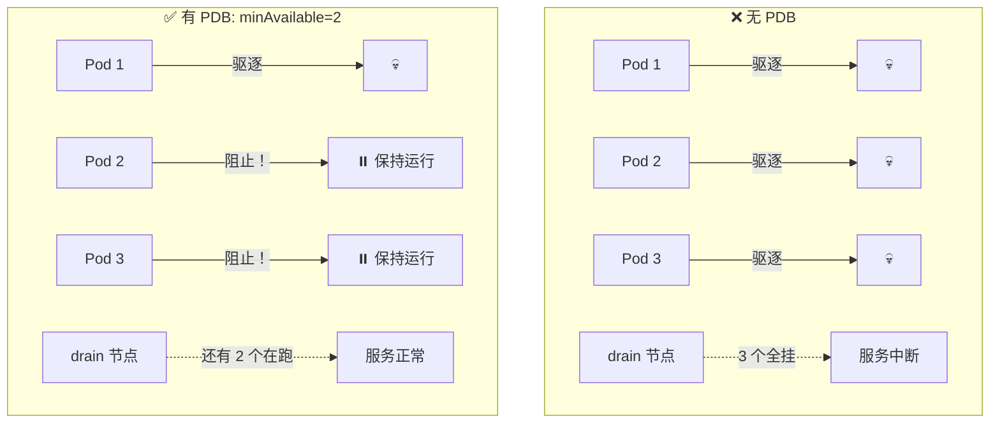
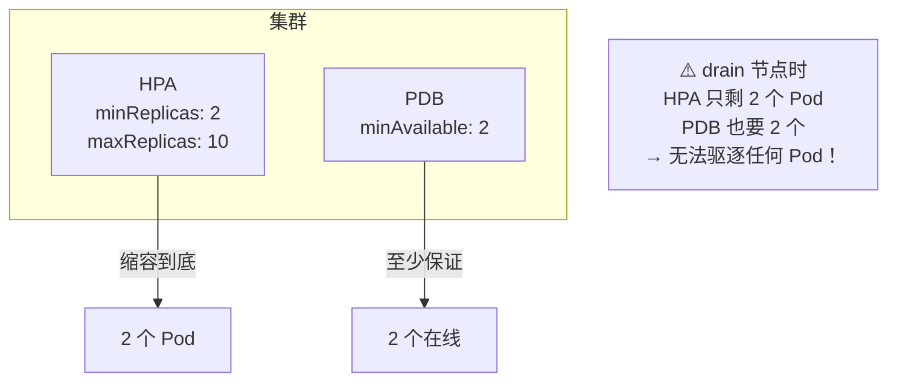

# Pod Disruption Budget

## 概念引入

你的应用有 3 个副本，某天管理员要升级节点：

```
❌ 没有 PDB：
   节点 drain → 3 个 Pod 同时被驱逐 → 应用全部下线！

✅ 有 PDB（minAvailable: 2）：
   节点 drain → 最多驱逐 1 个 → 至少 2 个始终在线 → 用户无感知
```

**Pod Disruption Budget（PDB）就是给应用设"最低在线人数"**——驱逐 Pod 时不能低于这个数。



## 原理讲解

### 两种计算方式

```yaml
apiVersion: policy/v1
kind: PodDisruptionBudget
metadata:
  name: app-pdb
spec:
  # 方式 1：最少保持可用几个
  minAvailable: 2

  # 方式 2（二选一）：最多允许几个不可用
  # maxUnavailable: 1

  selector:
    matchLabels:
      app: my-app
```

| 参数 | 含义 | 适合场景 |
|------|------|---------|
| `minAvailable` | 驱逐时**至少**保持可用的 Pod 数 | 你明确知道最少需要几个 |
| `maxUnavailable` | 驱逐时**最多**允许不可用的 Pod 数 | 你不管总数，只关心最多挂几个 |

**minAvailable: 2 和 maxUnavailable: 1 的区别**（3 副本为例）：

```
3 副本时两者等价（minAvailable=2 ↔ maxUnavailable=1）
但副本数变化时：
  - minAvailable=2：副本数扩到 5 → 可同时驱逐 3 个
  - maxUnavailable=1：副本数扩到 5 → 还是只能同时驱逐 1 个
```

### PDB 覆盖的场景

PDB 保护的是**自愿中断**（Voluntary Disruption），不是意外故障：

| 场景 | 自愿中断？ | PDB 管不管？ |
|------|-----------|-------------|
| `kubectl drain` | ✅ 是 | ✅ 管 |
| 集群自动缩容（CA） | ✅ 是 | ✅ 管 |
| 滚动更新（Deployment） | ✅ 是 | ✅ 管 |
| Pod 崩溃（OOMKilled） | ❌ 否（非自愿） | ❌ 不管 |
| 节点宕机 | ❌ 否（非自愿） | ❌ 不管 |
| 手动 `kubectl delete pod` | ✅ 是 | ⚠️ 不管（delete 绕过 PDB） |

> ⚠️ **重要**：`kubectl delete pod` 是直接删除，**不会检查 PDB**。只有 Eviction API（drain 背后用的）会检查 PDB。

### PDB 和 HPA 的配合



**建议**：`minAvailable` 要小于 HPA 的 `minReplicas`，否则缩容后 drain 会卡住。

### 常见配置推荐

| 副本数 | minAvailable | 说明 |
|--------|-------------|------|
| 1 | **不设 PDB** | 设了反而会阻止 drain（永远达不到 minAvailable） |
| 2 | 1 | 保证至少 1 个在线 |
| 3 | 2 | 保证多数在线 |
| 5+ | `replicas - 1` 或 `floor(replicas × 0.75)` | 保证大多数在线 |

## 动手实验

> 配套实验位于 `docs/labs/beginner/pdb/`

### 步骤 1：部署实验环境

```bash
cd docs/labs/beginner/pdb
bash setup.sh
```

### 步骤 2：查看 PDB 状态

```bash
kubectl get pdb
# 输出：NAME    MIN AVAILABLE   MAX UNAVAILABLE   ALLOWED DISRUPTIONS   AGE
#       pdb    2               N/A               1                     10s

kubectl describe pdb app-pdb
```

### 步骤 3：测试 drain 被 PDB 阻止

```bash
# 尝试驱逐（注意：Kind 单节点 drain 会卡住，以下为演示命令）
# kubectl drain <node-name> --delete-emptydir-data --ignore-daemonsets

# 观察驱逐行为——PDB 会阻止驱逐超过 1 个 Pod
kubectl get events --field-selector reason=DisruptionNotAllowed --watch
```

### 步骤 4：验证滚动更新也受 PDB 约束

```bash
# 触发滚动更新
kubectl rollout restart deployment/my-app

# 观察 Pod 替换过程——同时不可用的 Pod 不会超过 maxUnavailable
kubectl get pods -w
```

### 步骤 5：清理

```bash
bash teardown.sh
```

## 自检问题

1. **[基础]** PDB 是保证 Pod 不挂掉吗？它真正的保护范围是什么？

2. **[理解]** 如果 Deployment 的 strategy 是 `maxSurge: 2, maxUnavailable: 1`，PDB 设了 `maxUnavailable: 0`。RollingUpdate 会怎样？

3. **[应用]** 生产环境一个 10 副本的关键服务要升级节点。你希望 drain 过程中至少 8 个 Pod 始终在线。PDB 怎么写？副本数从 10 缩到 5（非高峰期）时会不会出问题？

<details>
<summary>查看答案</summary>

1. PDB **不保证** Pod 不挂掉。它只保护**自愿中断**（Voluntary Disruption）——包括 `kubectl drain`、集群自动缩容（Cluster Autoscaler）、滚动更新等受控驱逐操作。Pod 自身崩溃、节点宕机、OOMKilled 这些非自愿中断 PDB 完全不管。`kubectl delete pod` 直接绕过 PDB。

2. **PDB 会阻止 RollingUpdate 进行**。`maxUnavailable: 0` 表示不允许任何 Pod 不可用。但 RollingUpdate 本身是通过终止旧 Pod、创建新 Pod 来实现的——这期间旧 Pod 是不可用的。如果 PDB 坚持 0 个不可用，更新就卡住了。解决方案：PDB 的 `maxUnavailable` 至少要 ≥ Deployment 策略中的 `maxUnavailable`。

3.

```yaml
spec:
  minAvailable: 8
  selector:
    matchLabels:
      app: critical-service
```

10 副本 → drain 最多驱逐 2 个 → ✅ 至少 8 个在线。
如果缩到 5 副本 → 满打满算只能驱逐 0 个（5 < 8）→ ❌ drain 被永远阻止。解决方案：`minAvailable` 用百分比 `minAvailable: 75%`，副本数变小时自动调整（5 的 75% = 3.75 → 取整为 3，允许驱逐 2 个）。

</details>

## 下一步

应用高可用保证了。接下来，深入理解 Pod 如何获得身份、如何认证：

→ [26. Pod 身份与认证机制](./26-pod-identity)
