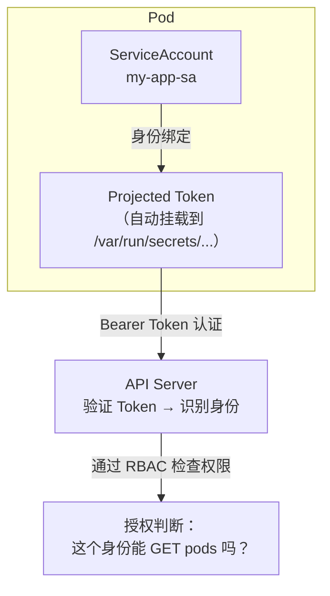
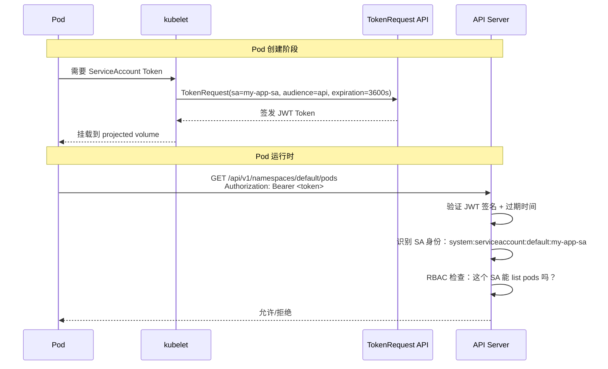

# Pod 身份与认证机制

## 概念引入

在文章 14 中你学了 RBAC——"谁能做什么"。但有个问题被跳过了：**API Server 怎么知道"你是谁"？**

```
RBAC（文章 14）         → 授权（Authorization）→ "你有权限做这个操作吗？"
Pod 身份（本篇）        → 认证（Authentication）→ "你是谁？你是合法的 Pod 吗？"
```

每个 Pod 从出生就携带一个"身份证"——**ServiceAccount Token**。Pod 用这个 Token 访问 API Server。



## 原理讲解

### Pod 的身份证：ServiceAccount Token

每个 Pod 创建时，K8s 自动做三件事：

1. 为 Pod 创建一个 **ServiceAccount Token**（通过 TokenRequest API）
2. 将 Token 以 **projected volume** 方式挂载到 Pod 内
3. Token 有**过期时间**，kubelet 会**自动续期**

```bash
# 进入任何 Pod 都能看到 Token
ls /var/run/secrets/kubernetes.io/serviceaccount/
# ca.crt  namespace  token  ← 三个文件
```

### Schema：从创建 Pod 到认证的全链路



### 新 Token vs 旧 Secret Token

| 特性 | 新版 Projected Token（1.21+） | 旧版 Secret Token |
|------|------------------------------|-------------------|
| 过期时间 | ✅ 有，1 小时（可配置） | ❌ 永不过期 |
| 自动轮换 | ✅ kubelet 自动续期 | ❌ 需手动重建 Secret |
| 绑定 Pod | ✅ Token 和 Pod 绑定 | ❌ 不绑定 |
| Audience | ✅ 支持（限制用途） | ❌ 不支持 |
| 安全性 | ⭐⭐⭐⭐⭐ | ⭐⭐ |

### 手动创建 SA 和 Token

```yaml
apiVersion: v1
kind: ServiceAccount
metadata:
  name: my-reader
  namespace: default
---
apiVersion: v1
kind: Pod
metadata:
  name: reader-pod
spec:
  serviceAccountName: my-reader  # 指定 SA（不指定则用 default）
  containers:
  - name: app
    image: nginx:1.27
```

```bash
# 手动创建一个 Token（用于本地调试）
kubectl create token my-reader

# 指定 audience 和过期时间
kubectl create token my-reader --audience=my-api --duration=2h
```

### Token 的 JWT 结构

Token 是一个 JWT（JSON Web Token），可以解码查看：

```bash
# 在 Pod 内解码 Token（BASE64 中间那部分）
cat /var/run/secrets/kubernetes.io/serviceaccount/token | cut -d. -f2 | base64 -d | python3 -m json.tool
```

```json
{
  "aud": ["https://kubernetes.default.svc"],
  "exp": 1753187200,
  "iat": 1753183600,
  "iss": "https://kubernetes.default.svc",
  "kubernetes.io": {
    "namespace": "default",
    "pod": {"name": "reader-pod", "uid": "abc123..."},
    "serviceaccount": {"name": "my-reader", "uid": "def456..."}
  },
  "sub": "system:serviceaccount:default:my-reader"
}
```

### 使用 Token 访问 API Server

```bash
# 在 Pod 内直接访问 API Server
TOKEN=$(cat /var/run/secrets/kubernetes.io/serviceaccount/token)
APISERVER=https://kubernetes.default.svc
curl -sk -H "Authorization: Bearer $TOKEN" $APISERVER/api/v1/namespaces/default/pods
```

## 动手实验

> 配套实验位于 `docs/labs/beginner/pod-identity/`

### 步骤 1：部署实验环境

```bash
cd docs/labs/beginner/pod-identity
bash setup.sh
```

### 步骤 2：查看 Pod 的默认身份

```bash
kubectl exec reader-pod -- cat /var/run/secrets/kubernetes.io/serviceaccount/token
kubectl exec reader-pod -- ls /var/run/secrets/kubernetes.io/serviceaccount/
```

### 步骤 3：用 SA Token 访问 API Server

```bash
kubectl exec reader-pod -- sh -c '
  TOKEN=$(cat /var/run/secrets/kubernetes.io/serviceaccount/token)
  APISERVER=https://kubernetes.default.svc
  curl -sk -H "Authorization: Bearer $TOKEN" $APISERVER/api/v1/namespaces/default/pods
'
# 根据 SA 的 RBAC 权限，可能会返回 pods 列表或被拒绝
```

### 步骤 4：解码查看 Token 内容

```bash
kubectl exec reader-pod -- sh -c '
  cat /var/run/secrets/kubernetes.io/serviceaccount/token | cut -d. -f2 | base64 -d 2>/dev/null | python3 -m json.tool 2>/dev/null || echo "需要 python3 解码"
'
```

### 步骤 5：创建自定义 Token 并测试权限区别

```bash
# 创建 Token（无任何 RBAC 权限的 SA）
TOKEN=$(kubectl create token test-sa --duration=1h)
# 用这个 Token 尝试访问
kubectl get pods --token="$TOKEN" 2>&1
# 预期：Error from server (Forbidden)
```

### 步骤 6：清理

```bash
bash teardown.sh
```

## 自检问题

1. **[基础]** 每个 Pod 默认能访问 API Server 吗？能做什么操作？

2. **[理解]** 为什么新版的 Projected Token 比旧的 Secret-based Token 更安全？

3. **[应用]** 你发现 Pod 里的恶意容器正在用 SA Token 调用 API Server。除了删 Pod，你能做什么来在架构层面减少这种风险？

<details>
<summary>查看答案</summary>

1. **能访问**。每个 Pod 默认挂载了 `default` ServiceAccount 的 Token。但 `default` SA 通常几乎没有任何 RBAC 权限——所以 Pod 能连上 API Server，但验证身份后几乎所有操作都被拒绝。可以通过 RBAC 授予特定权限（如文章 14 中的 readonly-sa）。

2. 旧 Secret Token **永不过期**、**不绑定 Pod**、**不支持 audience 限制**——如果 Token 泄露，攻击者可以永久使用它。新版 Projected Token：① 1 小时后自动过期（kubelet 自动续期），泄露的 Token 很快失效；② Token 绑定到特定 Pod（`kubernetes.io.pod.uid`），其他 Pod 无法使用；③ 支持 `audience` 字段——给外部的 Token 不能用于访问 API Server。

3. ① 遵循最小权限原则：不要给 default SA 任何 RBAC 权限；② 为每个应用创建专用 SA，只给必要的权限；③ 关闭不需要的 `automountServiceAccountToken`（`spec.automountServiceAccountToken: false`）；④ 使用 NetworkPolicy 限制 Pod 到 API Server 的流量；⑤ 启用审计日志监控异常的 API 调用。

</details>

## 下一步

Pod 的身份认证搞清楚了。接下来，学习如何扩展 K8s 的 API 定义你自己的资源类型：

→ [27. Custom Resource 入门](./27-custom-resource)
