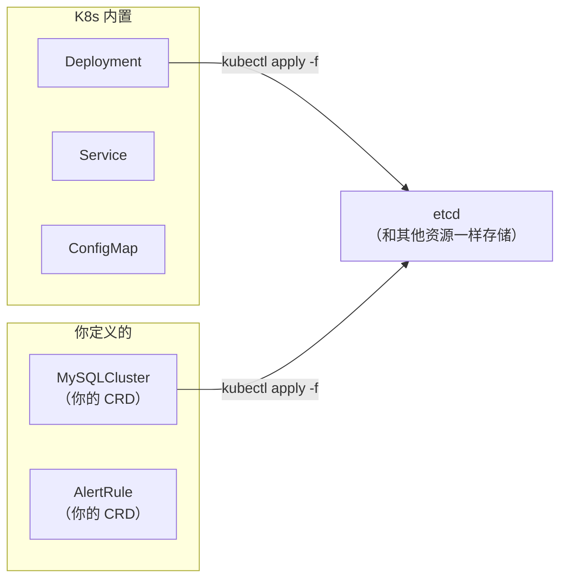
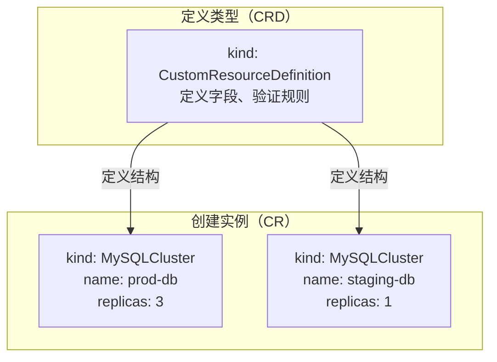
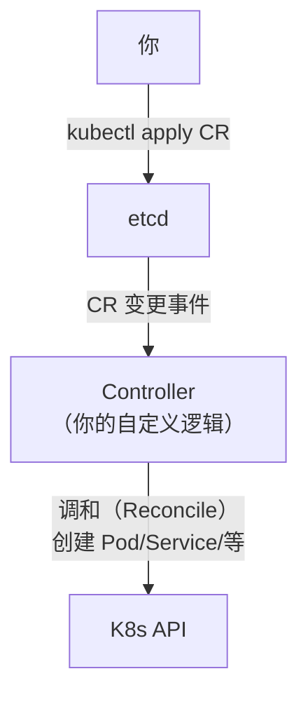

# Custom Resource 入门

## 概念引入

K8s 内置了 Deployment、Service、ConfigMap 等资源。但每个公司的业务需求千差万别——K8s 不可能内置所有资源类型。

**Custom Resource Definition (CRD) 让你自己定义新的资源类型**，然后像操作 Deployment 一样用 kubectl 管理它：

```
K8s 内置资源          你自定义的资源
─────────────        ──────────────────
Deployment           MySQLCluster
Service              TLSStore
ConfigMap            AlertRule
Pod                  DataPipeline
```



## 原理讲解

### CRD + CR = 自定义资源

两个概念需要区分：

| 概念 | 全称 | 作用 | 类比 |
|------|------|------|------|
| **CRD** | Custom Resource Definition | 定义**类型**（模板） | 数据库建表 `CREATE TABLE` |
| **CR** | Custom Resource | 类型的**实例**（数据） | 插入数据 `INSERT INTO` |



### 创建一个简单的 CRD

```yaml
apiVersion: apiextensions.k8s.io/v1
kind: CustomResourceDefinition
metadata:
  name: websiteinfos.example.com     # <plural>.<group>
spec:
  group: example.com                  # API 组
  versions:
  - name: v1
    served: true
    storage: true
    schema:
      openAPIV3Schema:
        type: object
        properties:
          spec:
            type: object
            properties:
              url:
                type: string
              maintainer:
                type: string
              replicas:
                type: integer
                minimum: 1
                maximum: 10
            required: ["url"]
  scope: Namespaced                    # 或 Cluster
  names:
    plural: websiteinfos              # kubectl get websiteinfos
    singular: websiteinfo             # kubectl get websiteinfo/xxx
    kind: WebsiteInfo                 # YAML 中 kind 的值
    shortNames:                       # kubectl get wi
    - wi
```

### CRD 关键配置

| 字段 | 含义 | 示例 |
|------|------|------|
| `group` | API 组（自定义的必须用非 k8s.io 域名） | `example.com` |
| `scope` | `Namespaced`（Namespace 隔离）或 `Cluster`（集群级） | `Namespaced` |
| `names.plural` | 复数名（用于 URL 路径） | `websiteinfos` |
| `names.kind` | 资源类型名（YAML 中的 kind） | `WebsiteInfo` |
| `versions` | 支持的 API 版本列表 | `v1`, `v1beta1` |
| `schema` | 用 OpenAPI v3 Schema 验证 CR 字段 | JSON Schema |

### 操作 CR

CRD 创建后，就可以像操作内置资源一样操作自定义资源：

```yaml
apiVersion: example.com/v1
kind: WebsiteInfo
metadata:
  name: my-blog
spec:
  url: "https://myblog.com"
  maintainer: "bg"
  replicas: 3
```

```bash
# 增删改查——和 Deployment 完全一样的命令
kubectl apply -f websiteinfo.yaml
kubectl get websiteinfos              # 或简写 kubectl get wi
kubectl get wi my-blog -o yaml
kubectl describe wi my-blog
kubectl delete wi my-blog
```

### CRD 有什么用？

光有 CRD 只是把数据存到 etcd。要让 CR 真正驱动自动化操作——你需要 **Controller**（控制器）：

```
CRD 只是数据模型        →  定义了"数据库表结构"
CRD + Controller = Operator → 你的自定义自动化平台
```



Operator 框架（如 kubebuilder, operator-sdk）帮你生成 CRD 和 Controller 脚手架，但本篇只讲 CRD——理解数据模型是后续 Operator 开发的基础。

## 动手实验

> 配套实验位于 `docs/labs/beginner/custom-resource/`

### 步骤 1：部署实验环境

```bash
cd docs/labs/beginner/custom-resource
bash setup.sh
```

### 步骤 2：创建 CRD

```bash
kubectl apply -f manifests/websiteinfo-crd.yaml
kubectl get crd
# 输出中包含 websiteinfos.example.com

# 查看 API 资源列表（你的 CRD 已在其中）
kubectl api-resources | grep example
```

### 步骤 3：创建自定义资源实例

```bash
kubectl apply -f manifests/my-website.yaml
kubectl get websiteinfos
kubectl get wi  # 简写也可以
```

### 步骤 4：体验 CRD 的验证能力

```bash
# 尝试创建一个无效的 CR（replicas: 100 超过了 maximum: 10）
kubectl apply -f manifests/invalid-website.yaml
# 预期：错误信息指出 replicas 超过了最大值
```

### 步骤 5：查看和删除

```bash
kubectl describe wi my-blog
kubectl get wi my-blog -o yaml
kubectl delete wi my-blog
```

### 步骤 6：清理

```bash
bash teardown.sh
```

## 自检问题

1. **[基础]** CRD 和 CR 的区别是什么？用数据库类比解释。

2. **[理解]** 如果只有一个 CRD 没有 Controller，它能做什么？不能做什么？

3. **[应用]** 你公司想用 K8s 管理 MySQL 集群——创建一个 `MySQLCluster` CR，设置 `replicas: 3`，主从自动配置，备份自动执行。哪些部分靠 CRD？哪些部分靠 Controller？

<details>
<summary>查看答案</summary>

1. **CRD = 建表语句（DDL）**，定义字段类型、约束、验证规则。**CR = 插入的数据行（DML）**，是符合 CRD 定义的实例。一个 CRD 可以有多个 CR 实例，就像一张表可以有多行数据。

2. 有 CRD 没有 Controller：你可以用 `kubectl apply/get/describe/delete` 操作 CR，数据被存储在 etcd 中，CRD 的 Schema 验证会生效（字段类型、必填等）。但它**不会驱动任何实际操作**——不会创建 Pod、不会配置网络、不会做任何自动化。就像一个数据库表，你可以插入数据，但没有程序来读取这些数据做事情。

3. **CRD 负责**：定义数据模型——MySQLCluster 的结构（spec: replicas, version, storagesize; status: readyReplicas, primaryNode）。**Controller 负责**：所有自动化逻辑——创建 StatefulSet、配置主从复制、执行定时备份、更新 status、处理故障切换。CRD = 你要什么，Controller = 怎么做到。两者结合就是 MySQL Operator。

</details>

## 下一步

你已经能扩展 K8s 的 API 了。接下来，学习一种不同于 Helm 的配置管理方式：

→ [28. Kustomize 配置管理](./28-kustomize)
