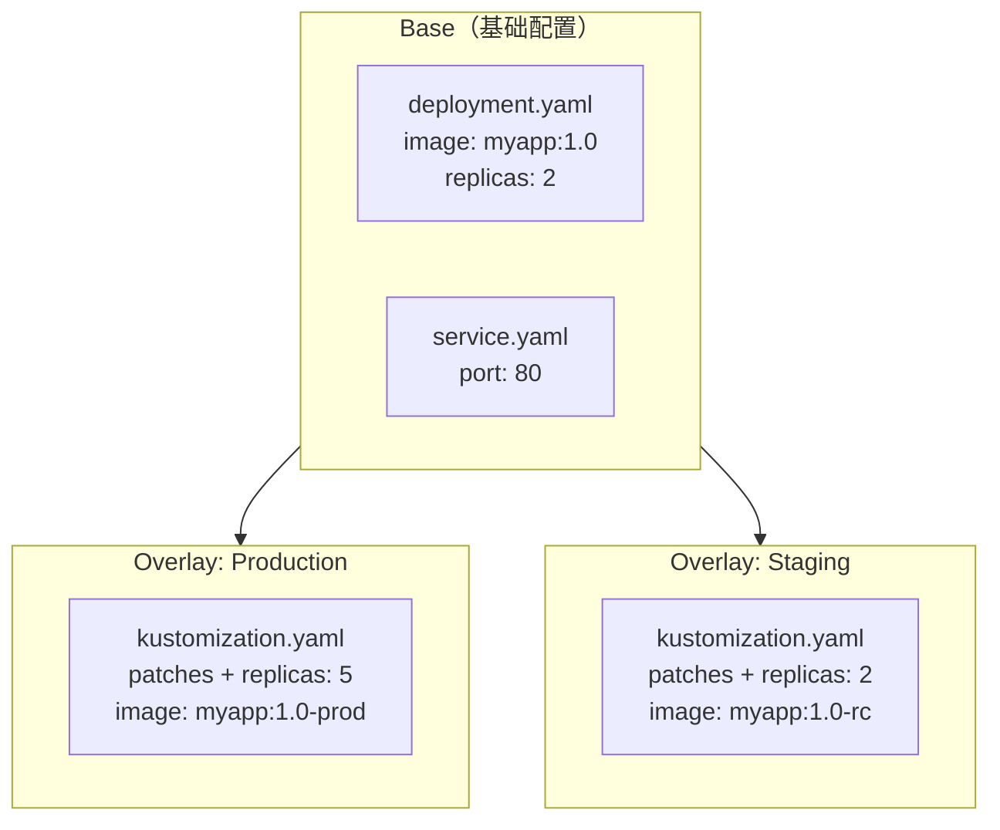
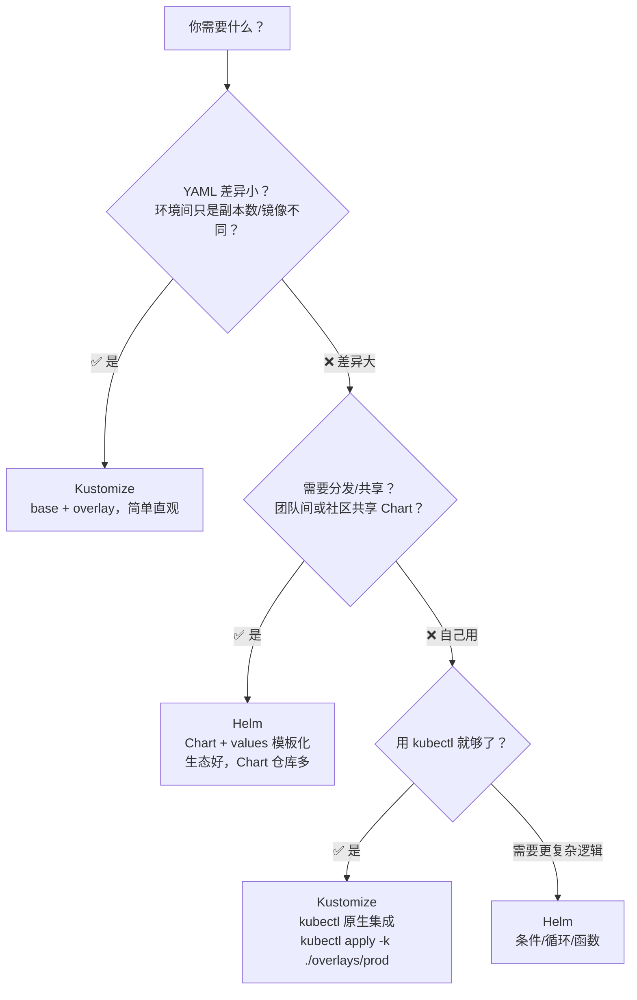

# Kustomize 配置管理

## 概念引入

文章 17 学了 Helm——用模板 + values 管理配置。但 Helm 有一个特点：你的 YAML 里全是 <code v-pre>{{ .Values.xxx }}</code>，不渲染出来就看不懂。

**Kustomize 走了另一条路——不写模板，只写补丁**。Base 是完整的工作配置，overlay 只写"和 base 不同的地方"：

```
Helm 方式                    Kustomize 方式
─────────                    ─────────────
base: 有 <code v-pre>{{ 占位符 }}</code> 的模板    base: 完整可用的 YAML
env:   values.yaml 填入值     env:  只写差异（patch）

你看模板时 → 🤔 "这到底渲染出来是啥？"
你看 base 时 → ✅ "这就是 staging 的完整配置，可以直接 kubectl apply"
```



## 原理讲解

### 目录结构

```
├── base/
│   ├── deployment.yaml      # 通用 Deployment
│   ├── service.yaml          # 通用 Service
│   └── kustomization.yaml    # 列出 base 包含哪些资源
│
└── overlays/
    ├── staging/
    │   ├── kustomization.yaml  # 引用 base + 补丁
    │   └── replica-count.yaml  # 只改副本数
    │
    └── production/
        ├── kustomization.yaml
        ├── replica-count.yaml
        └── image-tag.yaml
```

### kustomization.yaml 核心字段

**base/kustomization.yaml：**

```yaml
apiVersion: kustomize.config.k8s.io/v1beta1
kind: Kustomization

resources:
- deployment.yaml
- service.yaml
```

**overlays/production/kustomization.yaml：**

```yaml
apiVersion: kustomize.config.k8s.io/v1beta1
kind: Kustomization

# 引用 base
resources:
- ../../base

# 打标签
commonLabels:
  env: production

# 改镜像
images:
- name: myapp
  newTag: "1.0-prod"

# 改副本数（通过 patch）
patches:
- path: replica-count.yaml
```

**overlays/production/replica-count.yaml：**

```yaml
apiVersion: apps/v1
kind: Deployment
metadata:
  name: myapp
spec:
  replicas: 5
```

### 常用功能

| 功能 | 写法 | 效果 |
|------|------|------|
| **改镜像** | `images:` | 修改 Deployment 的 image tag |
| **打标签** | `commonLabels:` | 给所有资源统一加 label |
| **加注解** | `commonAnnotations:` | 给所有资源统一加 annotation |
| **补丁** | `patches:` | 只修改特定字段（JSON Patch 或 Strategic Merge） |
| **生成 ConfigMap** | `configMapGenerator:` | 从文件自动生成 ConfigMap（带 content hash，触发滚动更新） |
| **生成 Secret** | `secretGenerator:` | 从文件/字面量自动生成 Secret |
| **名前缀** | `namePrefix:` | 加前缀区分环境 |

### ConfigMap Generator 的杀手特性

```yaml
# overlays/production/kustomization.yaml
configMapGenerator:
- name: app-config
  files:
  - config.properties          # 从文件读取内容
  behavior: merge              # 合并到 base 已有的 ConfigMap
```

**自动 hash**：每次 config.properties 内容变化，Kustomize 会自动生成不同的 ConfigMap 名称（如 `app-config-7km8f29h4d`），Deployment 引用这个新名字 → 触发 Pod 滚动更新。**改了配置就自动更新**，不需要手动重启。

### Kustomize vs Helm 选型



| 特性 | Helm | Kustomize |
|------|------|-----------|
| 学习曲线 | 中等（Go template 语法） | 低（就是 YAML） |
| 原生集成 | `helm install` | `kubectl apply -k` |
| 模板能力 | ✅ 条件/循环/函数 | ❌ 无模板，只改字段 |
| 社区生态 | ✅ 大量第三方 Chart | ❌ 无中央仓库 |
| 可读性 | 模板不直观 | ✅ 随时可读 |
| 多环境 | values 文件切换 | overlay 目录 |

## 动手实验

> 配套实验位于 `docs/labs/beginner/kustomize/`

### 步骤 1：部署实验环境

```bash
cd docs/labs/beginner/kustomize
bash setup.sh
```

### 步骤 2：查看 base 和 overlay 的结构

```bash
# 查看目录结构
ls -R base/ overlays/

# 预览渲染结果（kustomize build 输出完整 YAML）
kubectl kustomize base/
kubectl kustomize overlays/staging/
kubectl kustomize overlays/production/
```

### 步骤 3：部署 staging 和 production 到不同 Namespace

```bash
# 部署到 staging namespace
kubectl apply -k overlays/staging/

# 部署到 production namespace
kubectl apply -k overlays/production/

# 对比两个环境的差异
kubectl get deploy -n staging -o wide
kubectl get deploy -n production -o wide
# 预期：production 副本数更多
```

### 步骤 4：验证 ConfigMap Generator 的自动 hash

```bash
# 查看生成的 ConfigMap 名称
kubectl get configmap -n production
# 输出类似 app-config-7km8f29h4d（带 hash）

# Deployment 自动引用了带 hash 的名字
kubectl get deploy -n production -o jsonpath='{.spec.template.spec.volumes[?(@.name=="config")].configMap.name}'
```

### 步骤 5：清理

```bash
bash teardown.sh
```

## 自检问题

1. **[基础]** Helm 用 <code v-pre>{{ .Values.replicas }}</code> 模板，Kustomize 用什么方式处理环境差异？

2. **[理解]** Kustomize 的 ConfigMap Generator 会给 ConfigMap 名字加 hash，这解决了什么问题？

3. **[应用]** 你的团队目前用 Helm 管理 3 个环境（dev/staging/prod），但每次看模板都很难直观理解。改成 Kustomize 后，目录结构怎么设计？

<details>
<summary>查看答案</summary>

1. Kustomize 用 **patch（补丁）** 方式。Base 目录是一份完整的、可以直接部署的 YAML。每个 overlay 只需要写 kustomization.yaml + 少量补丁文件，描述和 base 的差异（改镜像 tag、改副本数、加 label 等）。不写模板，不写占位符。

2. 解决了 **ConfigMap 更新后 Pod 不重启**的经典问题。ConfigMap 内容变了，Kustomize 生成新的 hash → ConfigMap 名字变了 → Deployment 的引用变了 → 触发 Pod 滚动更新。之前你需要手动改 Deployment 的 annotation 或重启 Pod，现在自动完成。

3.

```
app/
├── base/
│   ├── deployment.yaml
│   ├── service.yaml
│   └── kustomization.yaml
│
├── overlays/
│   ├── dev/
│   │   ├── kustomization.yaml      # replicas: 1, image: dev
│   │   └── debug-sidecar.yaml      # 仅 dev 加 debug 容器
│   │
│   ├── staging/
│   │   ├── kustomization.yaml      # replicas: 2, image: rc
│   │   └── ingress.yaml            # staging 专用域名
│   │
│   └── production/
│       ├── kustomization.yaml      # replicas: 5, image: prod
│       ├── resource-limits.yaml    # 生产资源配置
│       └── pdb.yaml                # 生产可用性保障
```

部署：`kubectl apply -k overlays/production/`

</details>

## 下一步

配置管理有两条路可选了。接下来，学习怎么运维 K8s 集群本身：

→ [29. 集群升级与维护](./29-cluster-upgrade)
