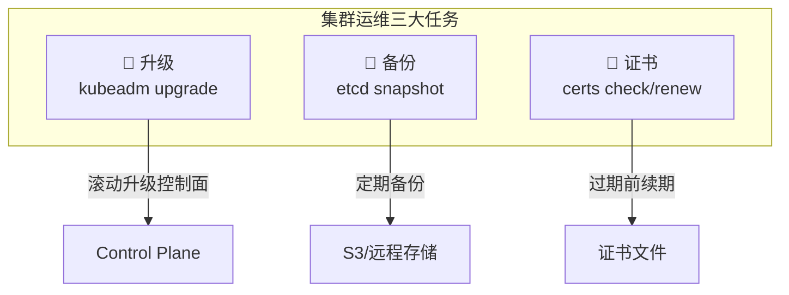
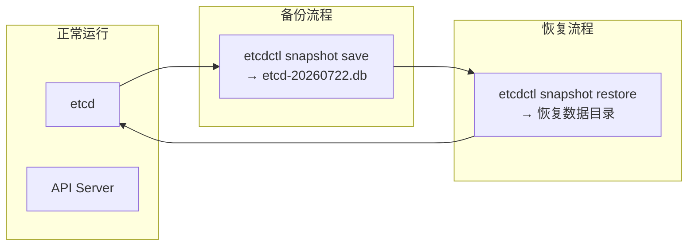
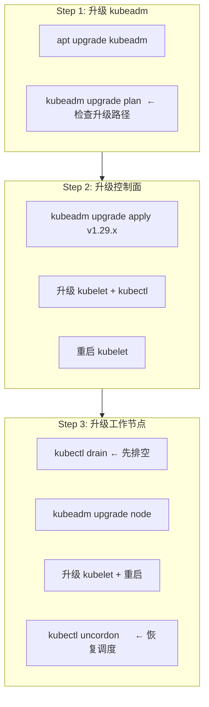
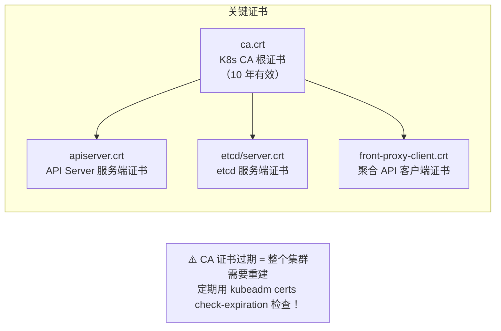

# 集群升级与维护

## 概念引入

集群不是装完就一劳永逸的。K8s 每 4 个月发一个新版本，每个版本维护约 14 个月。不升级意味着：

- 🔒 安全漏洞没人修
- 🐛 Bug 永远存在
- 🚫 新特性用不上

**集群运维的三大核心任务：**



## 原理讲解

### etcd 备份与恢复

etcd 是 K8s 的"大脑"——所有集群状态都存在里面。etcd 坏了 = 集群失忆 = 灾难。

```bash
# 安装 etcdctl
ETCD_VER=v3.5.17
curl -L https://github.com/etcd-io/etcd/releases/download/${ETCD_VER}/etcd-${ETCD_VER}-linux-amd64.tar.gz | tar xz
sudo mv etcd-${ETCD_VER}-linux-amd64/etcdctl /usr/local/bin/
```

```bash
# 创建快照（备份）
ETCDCTL_API=3 etcdctl snapshot save /backup/etcd-$(date +%Y%m%d).db \
  --cacert=/etc/kubernetes/pki/etcd/ca.crt \
  --cert=/etc/kubernetes/pki/etcd/server.crt \
  --key=/etc/kubernetes/pki/etcd/server.key

# 验证快照
ETCDCTL_API=3 etcdctl snapshot status /backup/etcd-20260722.db --write-out=table

# 恢复快照
ETCDCTL_API=3 etcdctl snapshot restore /backup/etcd-20260722.db \
  --data-dir=/var/lib/etcd-restore
# 然后修改 etcd manifest 的 data-dir 指向恢复的目录
```



| 建议 | 说明 |
|------|------|
| 备份频率 | **每日** 自动备份（CronJob 或 systemd timer） |
| 备份位置 | **异地存储**（S3/GCS/NFS），别和集群放在同一台机器 |
| 验证备份 | **每月** 做一次恢复演练 |
| 保留策略 | 保留最近 **30 天** 的备份 |

### kubeadm 集群升级

升级有严格的顺序和版本限制：

```
版本升级规则：
  - 不能跳版本！1.28 → 1.29 ✅   1.28 → 1.30 ❌
  - 控制面先升级，再升级节点
  - kubectl / kubelet 版本 ≤ kube-apiserver 版本
```



```bash
# 1. 查看当前版本
kubectl version --short

# 2. 查看升级计划
kubeadm upgrade plan

# 3. 执行控制面升级
kubeadm upgrade apply v1.29.6

# 4. 升级 kubelet 和 kubectl
apt install -y kubelet=1.29.6-* kubectl=1.29.6-*
systemctl daemon-reload && systemctl restart kubelet

# 5. 升级工作节点（在每个节点上）
kubectl drain worker-1 --ignore-daemonsets --delete-emptydir-data
# SSH 到 worker-1
kubeadm upgrade node
apt install -y kubelet=1.29.6-*
systemctl restart kubelet
kubectl uncordon worker-1
```

### 证书管理

K8s 控制面的所有组件都用证书做 TLS 通信。证书有有效期——过期了控制面就挂了。

```bash
# 检查所有证书的过期时间
kubeadm certs check-expiration
# 输出：
# [check-expiration]
# admin.conf                 Jul 22, 2027 15:00 UTC   364d
# apiserver                  Jul 22, 2027 15:00 UTC   364d
# apiserver-kubelet-client   Jul 22, 2027 15:00 UTC   364d
# ...

# 续期所有证书
kubeadm certs renew all

# 续期后重启控制面组件才能生效
#（kubeadm 自动处理 manifest 目录变化，kubelet 会重启静态 Pod）
```



### 节点维护：Cordon 与 Drain

| 命令 | 作用 | Pod 行为 |
|------|------|---------|
| `kubectl cordon` | 标记节点为**不可调度** | 已有 Pod 继续运行，新 Pod 不会调度过来 |
| `kubectl drain` | 排空节点 | **驱逐所有 Pod** + 标记不可调度 |
| `kubectl uncordon` | 恢复调度 | 允许新 Pod 调度过来 |

```bash
# 维护前
kubectl cordon worker-1          # 1. 先阻止新 Pod
kubectl drain worker-1           # 2. 再排空已有 Pod
        --ignore-daemonsets       #    DaemonSet 不管
        --delete-emptydir-data    #    允许删除 emptydir 数据
        --timeout=300s            #    最多等 5 分钟

# 维护完成后
kubectl uncordon worker-1         # 3. 恢复调度
```

## 动手实验

> 配套实验位于 `docs/labs/beginner/cluster-upgrade/`

Kind 用 Docker 容器模拟节点，升级流程有所不同。本实验模拟核心操作。

### 步骤 1：部署实验环境

```bash
cd docs/labs/beginner/cluster-upgrade
bash setup.sh
```

### 步骤 2：检查当前版本

```bash
kubectl version --short 2>/dev/null || kubectl version
kubectl get nodes -o wide
```

### 步骤 3：模拟 etcd 备份

```bash
# 在 Kind 环境中，进入 control-plane 容器执行备份
docker exec k8s-guide-lab-control-plane sh -c '
  ETCDCTL_API=3 etcdctl snapshot save /tmp/etcd-backup.db \
    --cacert=/etc/kubernetes/pki/etcd/ca.crt \
    --cert=/etc/kubernetes/pki/etcd/server.crt \
    --key=/etc/kubernetes/pki/etcd/server.key
'
docker exec k8s-guide-lab-control-plane etcdctl snapshot status /tmp/etcd-backup.db --write-out=table
```

### 步骤 4：检查证书过期时间

```bash
docker exec k8s-guide-lab-control-plane kubeadm certs check-expiration
```

### 步骤 5：模拟节点 Cordon + Uncordon

```bash
# 获取节点名
NODE=$(kubectl get nodes -o jsonpath='{.items[0].metadata.name}')

# Cordon（不可调度）
kubectl cordon $NODE
kubectl get nodes  # 观察 STATUS 列出现 SchedulingDisabled

# 尝试创建新 Pod（会被挂起）
kubectl run test-schedule --image=busybox:1.36 --restart=Never -- sleep 10
kubectl get pods -w  # 观察 test-schedule 处于 Pending

# Uncordon（恢复调度）
kubectl uncordon $NODE
kubectl get pods  # test-schedule 应该被调度并完成
```

### 步骤 6：清理

```bash
bash teardown.sh
```

## 自检问题

1. **[基础]** `kubectl cordon` 和 `kubectl drain` 有什么区别？什么时候用哪个？

2. **[理解]** K8s 为什么不允许跳版本升级（如 1.28 → 1.30）？etcd 备份为什么必须异地存储？

3. **[应用]** 你管理一个 3 节点生产集群（K8s 1.28），需要升级到 1.29。写出完整的升级步骤和执行顺序。

<details>
<summary>查看答案</summary>

1. **Cordon** 只是标记节点不可调度，**不影响已有 Pod**。**Drain** 会驱逐所有 Pod 然后标记不可调度。Cordon 用在"我想让这个节点慢慢闲置"（比如怀疑硬件有问题但不确定），Drain 用在"我现在就要把节点拿去做维护"（比如升级内核、换硬盘）。

2. **不允许跳版本**是因为 API 废弃（deprecation）策略——K8s API 的 Beta 版本在 3 个版本后移除。如果你从 1.25 跳到 1.29，中间可能有些 API 版本已被移除，你的老 YAML 直接报错找不到。逐版本升级可以让你在每个版本检测 API 废弃警告并修复。**etcd 备份必须异地**因为如果备份和集群在同一台机器/磁盘上，硬件故障（磁盘坏、机房断电）会同时毁掉集群和备份。

3. 完整步骤：

```bash
# 准备工作
# 1. etcd 备份
etcdctl snapshot save /backup/pre-upgrade-1.29.db
# 2. 确认所有节点状态正常
kubectl get nodes && kubectl get pods -A | grep -v Running

# 控制面节点
# 3. 升级 kubeadm
apt install -y kubeadm=1.29.6-*
# 4. 查看升级计划
kubeadm upgrade plan
# 5. 执行升级
kubeadm upgrade apply v1.29.6
# 6. 升级 kubelet
apt install -y kubelet=1.29.6-* kubectl=1.29.6-*
systemctl restart kubelet

# 工作节点（逐个操作）
# 7. drain
kubectl drain worker-1 --ignore-daemonsets --delete-emptydir-data
# 8. 在 worker-1 上升级 kubeadm + kubelet
# 9. uncordon
kubectl uncordon worker-1
# 10. 重复 7-9 直到所有工作节点升级完毕

# 验证
kubectl version && kubectl get nodes
```

</details>

## 下一步

运维技能齐了。最后一篇——把 29 篇的知识全部串起来，部署一个完整的微服务应用：

→ [30. 综合实战：微服务部署](./30-microservice-deploy)
