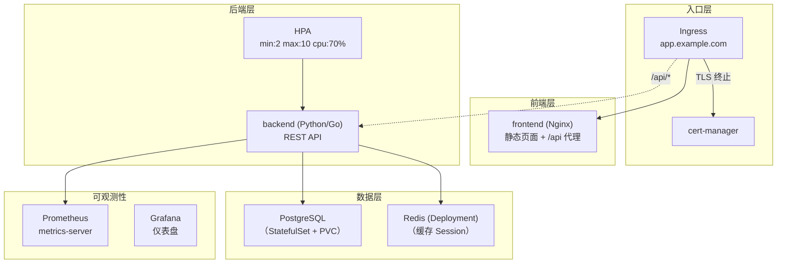
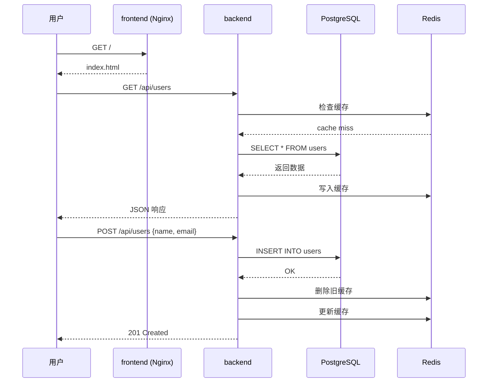

# 综合实战：微服务部署

## 概念引入

恭喜你走到了最后一篇！前面 29 篇文章覆盖了从 Pod 到集群运维的全部知识。但知识散落在各处，就像一个工具箱——每个工具你都认识，但不知道怎么组合起来做一个完整项目。

**这篇综合实战，把工具箱里的工具全部拿出来，组装一个真正的微服务应用。**

### 目标架构



### 涉及的知识点

| 文章 | 知识 | 在本项目中怎么用 |
|------|------|-----------------|
| #04 Deployment | 管理无状态 Pod | frontend + backend + redis |
| #05 ReplicaSet | Deployment 背后的控制器 | HPA 调整副本时自动管理 |
| #06 Service | Pod 间通信 | backend-svc, redis-svc, pg-svc |
| #07 ConfigMap/Secret | 配置分离 | backend 配置 + DB 密码 |
| #08 扩缩容 | HPA | backend 的 CPU 自动扩缩 |
| #10 存储 | PVC | PostgreSQL 持久化数据 |
| #11 Namespace | 环境隔离 | prod namespace |
| #12 探针 | 健康检查 | backend 的 liveness + readiness |
| #13 资源限制 | QoS | 每个组件的 requests/limits |
| #14 RBAC | 权限管理 | 只读 SA（监控用） |
| #15 StatefulSet | 有状态应用 | PostgreSQL |
| #18 监控 | 可观测性 | metrics-server + kubectl top |
| #21 Init/Sidecar | 多容器 | backend 等 DB 就绪 |
| #22 NetworkPolicy | 网络隔离 | 限制 DB 只能被 backend 访问 |
| #23 Ingress | TLS + 路由 | HTTPS + / → FE, /api → BE |
| #25 PDB | 可用性 | backend 的 minAvailable=2 |

## 原理讲解

### 系统分层

```
┌────────────────────────────────────────────┐
│             Ingress 入口层                  │
│  • TLS 证书（自签名，本地模拟）              │
│  • /      → frontend                       │
│  • /api/* → backend                        │
├────────────────────────────────────────────┤
│             应用层                          │
│  frontend:  Nginx 静态页面                  │
│  backend:   Python/Go REST API             │
│  ├─ GET  /api/health     健康检查           │
│  ├─ GET  /api/users      用户列表           │
│  └─ POST /api/users      创建用户           │
├────────────────────────────────────────────┤
│             数据层                          │
│  PostgreSQL: 用户数据（StatefulSet + PVC）   │
│  Redis:     Session 缓存（Deployment）       │
├────────────────────────────────────────────┤
│             可观测性                        │
│  metrics-server: 资源指标（给 HPA 用）       │
│  kubectl top: 快速查看资源使用               │
└────────────────────────────────────────────┘
```

### 数据流



### 完整配置清单

```yaml
# 01-namespace.yaml
apiVersion: v1
kind: Namespace
metadata:
  name: prod
---
# 02-secrets.yaml
apiVersion: v1
kind: Secret
metadata:
  name: pg-secret
  namespace: prod
type: Opaque
stringData:
  POSTGRES_USER: app
  POSTGRES_PASSWORD: demo123
  POSTGRES_DB: myapp
---
# 03-postgres.yaml （StatefulSet + Service + PVC）
# 04-redis.yaml （Deployment + Service）
# 05-backend-config.yaml （ConfigMap）
# 06-backend.yaml （Deployment + Service + HPA + PDB + 探针）
# 07-frontend.yaml （Deployment + Service + ConfigMap for nginx.conf）
# 08-ingress.yaml （TLS + 路由规则）
# 09-networkpolicy.yaml （分层隔离）
# 10-hpa.yaml （backend 自动扩缩）
```

## 动手实验

> 配套实验位于 `docs/labs/beginner/microservice-deploy/`

一键部署整个微服务栈：

### 步骤 1：启动集群和部署全部组件

```bash
cd docs/labs/beginner/microservice-deploy
bash setup.sh
```

### 步骤 2：检查所有组件状态

```bash
# 全都在 prod namespace 下
kubectl get all -n prod

# 预期看到：
# - 2 frontend Pods + Service
# - 2 backend Pods + Service + HPA + PDB
# - 1 PostgreSQL Pod (StatefulSet) + Service
# - 1 Redis Pod + Service
# - 1 Ingress
# - NetworkPolicy 等
```

### 步骤 3：端到端测试

```bash
# 通过 Ingress 访问前端
curl -k https://localhost/
# 预期：返回 index.html

# 通过 Ingress 访问后端 API
curl -k https://localhost/api/health
# 预期：{"status": "ok"}

# 创建用户
curl -k -X POST https://localhost/api/users \
  -H "Content-Type: application/json" \
  -d '{"name": "test", "email": "test@example.com"}'

# 查询用户
curl -k https://localhost/api/users
# 预期：返回刚创建的用户列表
```

### 步骤 4：验证 HPA 自动扩缩

```bash
# 查看当前 HPA 状态
kubectl get hpa -n prod

# 生成负载
for i in $(seq 1 100); do
  curl -k -s https://localhost/api/users &
done
wait

# 查看 HPA 是否触发扩容
kubectl get hpa -n prod --watch
```

### 步骤 5：验证 NetworkPolicy 隔离

```bash
# 尝试从 frontend 直接访问 PostgreSQL（应该被拒绝）
kubectl exec -n prod deploy/frontend -- wget -q -O- pg-svc:5432 --timeout=3 && echo "⚠️ 可以访问" || echo "✅ 被拒绝（符合预期）"

# backend 访问 PostgreSQL（应该成功）
kubectl exec -n prod deploy/backend -- wget -q -O- pg-svc:5432 --timeout=3 && echo "✅ 可以访问" || echo "❌ 被拒绝"
```

### 步骤 6：验证 PDB

```bash
kubectl get pdb -n prod
kubectl describe pdb backend-pdb -n prod
# 观察 ALLOWED DISRUPTIONS 字段
```

### 步骤 7：清理

```bash
bash teardown.sh
```

## 自检问题

1. **[基础]** 这个项目中，为什么 PostgreSQL 用 StatefulSet 而 Redis 用 Deployment？

2. **[理解]** 如果 backend 被 HPA 缩容到 1 个 Pod，PDB 的 `minAvailable: 2` 会发生什么？

3. **[应用]** 你要给这个项目加上生产级别的要求：① 所有 Service 之间通信加密 ② 用户上传的文件存储 ③ 前端 CDN 加速。分别对应哪些 K8s 技术？

<details>
<summary>查看答案</summary>

1. **PostgreSQL** 需要稳定的网络标识（`pg-0.prod.svc`）、有序的启动/停止、独立的持久化存储——这些都是 StatefulSet 的能力。如果 pg-0 挂了重建，PVC 不变、hostname 不变，数据不丢。**Redis 做缓存**（非持久化），丢了无所谓重建就行——Deployment 就够了（更快更简单）。如果 Redis 也用做持久化存储，那也建议用 StatefulSet。

2. **PDB 会阻止缩容！** HPA 想缩到 1 个，但 PDB 要求 `minAvailable: 2`。这时缩容被阻止，即使 CPU 利用率已经很低。这就是 PDB 和 HPA 的常见冲突——**PDB 的 minAvailable 必须 ≤ HPA 的 minReplicas**。解法：① 降低 PDB 到 `minAvailable: 1` ② 调整 HPA 的 `minReplicas: 2` ③ 用百分比 `minAvailable: 50%`（1 × 50% = 1，取整）。

3. ① **Service Mesh（如 Istio/Linkerd）** 实现 mTLS——启用后 sidecar proxy 自动加密所有 Service 间通信，应用代码零改动。② 创建一个 **PVC（PersistentVolumeClaim）** 挂载到 backend Pod，文件写入这个卷——类似项目中 PostgreSQL 的 PVC 用法。③ 前端静态文件打包到镜像后，**Ingress 配置缓存 header**（`Cache-Control: max-age=31536000`）+ 外部 CDN（如 Cloudflare）回源到 Ingress。

</details>

## 毕业总结

🎉 **恭喜你完成了 K8s Guide 初学者轨道的全部 30 篇课程！**

### 你学到的技能树

```
📦 基础入门 (01-10)        🔧 生产化 (11-20)        🚀 进阶实战 (21-30)
─────────────────         ────────────────        ──────────────────
• K8s 是什么              • 多租户隔离              • 多容器模式
• 本地 Kind 集群           • 健康检查                • 网络策略隔离
• Pod 管理                • 资源管控                • Ingress 生产实战
• Deployment 部署          • RBAC 权限               • Pod 安全加固
• ReplicaSet 控制器        • 有状态 + 守护进程        • 高可用保障
• Service 服务发现         • 批处理 + 定时任务        • Pod 身份认证
• 配置管理                • Helm 包管理             • K8s 扩展模型
• 扩缩容 + 滚动发布        • 日志 + 监控             • Kustomize 配置
• 网络基础                • 排障方法论               • 集群升级运维
• 存储基础                • Gateway API            • 完整微服务部署
```

### 下一步建议

- 🔍 **[求职者轨道](./graduation)**：深入系统全景图 → 领域深潜 → 面试题库
- 📝 **CKA/CKAD 认证**：初学者轨道覆盖了考试 ~70% 的知识点
- 🛠️ **实战练手**：用本项目的综合实战架构，换成你熟悉的语言栈重新实现一遍

→ [🎓 毕业啦](./graduation)
