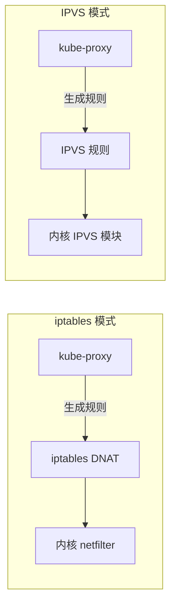
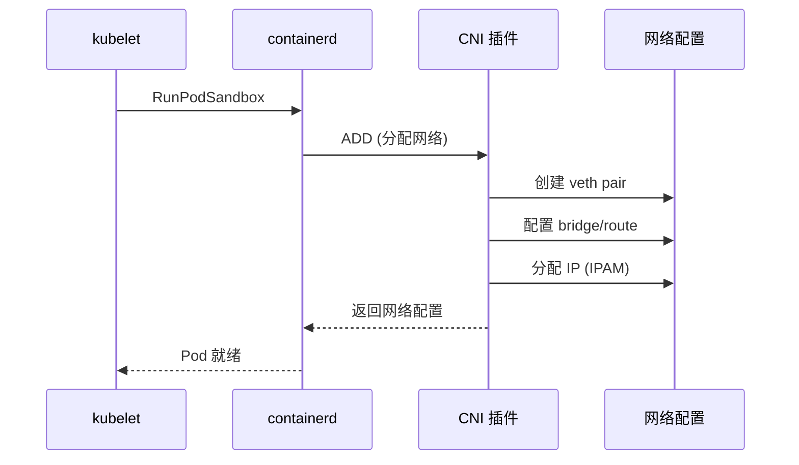
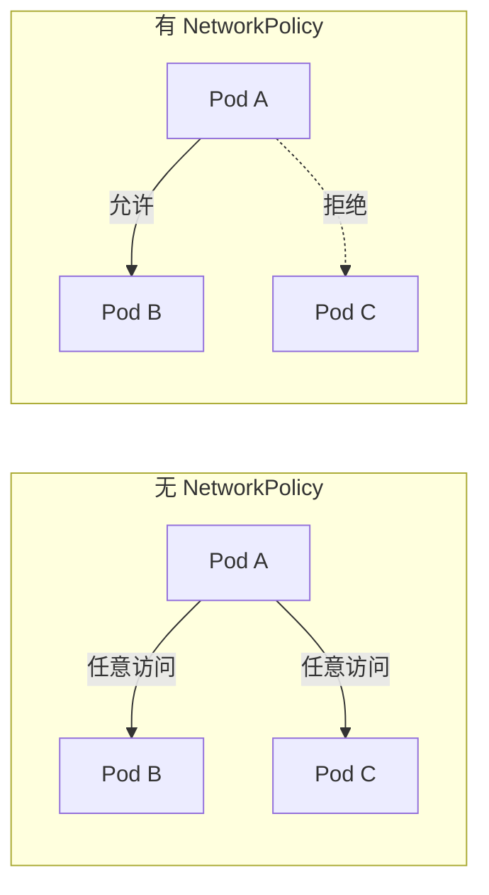
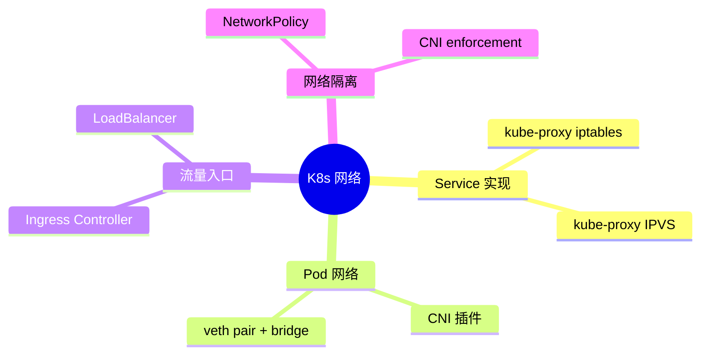

# 网络概念速览

## 前提假设

你已经知道如何用 Service 暴露应用（[初学者轨道 09](/beginner/09-networking-basics)）。本文从**实现层面**重新理解 K8s 网络。

## kube-proxy 模式对比



| 维度 | iptables 模式 | IPVS 模式 |
|------|--------------|-----------|
| 规则存储 | iptables 链 | IPVS 内核表 |
| 查找复杂度 | O(n) 顺序遍历 | O(1) 哈希查找 |
| 大规模表现 | Service 多时性能下降 | 稳定，适合 1000+ Service |
| 负载均衡算法 | 仅随机 | 轮询/最少连接/加权等多种 |
| 内核要求 | 任意 | 需要 ipvs 内核模块 |

**面试要点**：大规模集群（500+ Service）应使用 IPVS 模式。

## CNI 概念

### 为什么需要 CNI？

K8s 不内置网络实现，而是定义了 CNI（Container Network Interface）标准。每个 Pod 创建时，kubelet 通过 CRI 调用容器运行时，容器运行时调用 CNI 插件来配置网络。



### 主流 CNI 插件

| 插件 | datapath | NetworkPolicy | 特点 |
|------|----------|---------------|------|
| Flannel | VXLAN overlay | 不支持 | 简单，适合小集群 |
| Calico | BGP routing / iptables | 支持 | 性能好，企业级 |
| Cilium | eBPF | 支持 | 最新，可观测性强 |

**面试要点**：能说出 Flannel/Calico/Cilium 的区别和选型理由。

## NetworkPolicy

### 是什么？

NetworkPolicy 是 K8s 的网络防火墙——控制 Pod 之间、Pod 与外部之间的网络流量。



### 默认行为

没有 NetworkPolicy 时：**所有 Pod 可以互相访问（全开放）**。

一旦给某个 Pod 创建了入站（ingress）NetworkPolicy，该 Pod **只接受 Policy 允许的流量**，其他全部拒绝。

### 示例

```yaml
apiVersion: networking.k8s.io/v1
kind: NetworkPolicy
metadata:
  name: allow-web
spec:
  podSelector:
    matchLabels:
      app: web
  policyTypes:
  - Ingress
  ingress:
  - from:
    - podSelector:
        matchLabels:
          app: frontend
    ports:
    - port: 80
```

这条规则的含义：只允许 `app: frontend` 的 Pod 访问 `app: web` 的 Pod 的 80 端口。

### NetworkPolicy 的实现

NetworkPolicy 本身也是"声明"——具体的执行由 CNI 插件实现：

| CNI 插件 | enforcement 方式 | 大规模性能 |
|----------|-----------------|-----------|
| Calico | iptables 规则 | O(n) 规则数，大规模下降 |
| Cilium | eBPF map | O(1) 查表，大规模稳定 |

**面试要点**：大规模集群下 NetworkPolicy 性能是关键考量，eBPF 方案优于 iptables。

## 知识地图



## 深入阅读

准备好深入了吗？

→ [🌐 CNI 深潜](../deep-dive/cni-deep-dive) — 从 CNI 合约到 eBPF，源码级深度

## 面试锦囊

**Q: kube-proxy 的 iptables 和 IPVS 模式有什么区别？**

> iptables 模式规则 O(n) 遍历，Service 多时性能下降。IPVS 模式用内核哈希表 O(1) 查找，支持多种负载均衡算法，适合大规模集群。

**Q: 什么是 CNI？为什么 K8s 不内置网络？**

> CNI 是容器网络的标准接口。K8s 不内置网络实现，而是定义标准让第三方插件（Flannel/Calico/Cilium）来实现。这是 Unix 哲学的体现——做好核心编排，网络交给专业组件。

**Q: NetworkPolicy 的执行靠什么？**

> NetworkPolicy 只是声明，具体由 CNI 插件执行。Calico 用 iptables 规则，Cilium 用 eBPF map。大规模下 eBPF 性能更好。
