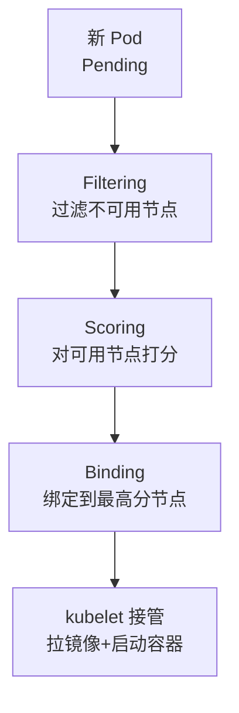
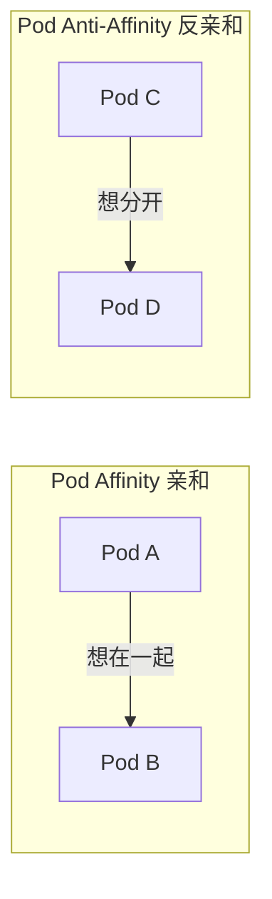
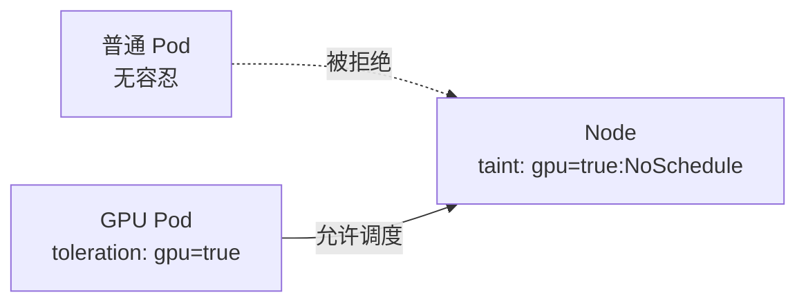
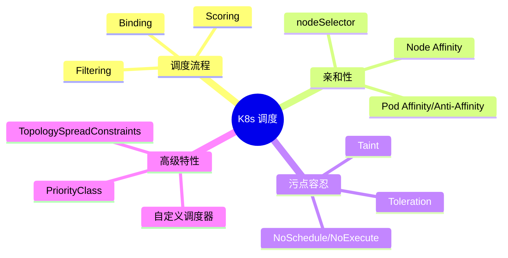

# 调度概念速览

## 前提假设

你已经知道 Deployment 如何管理 Pod（[初学者轨道 08](/beginner/08-scaling-rollout)）。本文从**调度器视角**理解 Pod 如何被分配到节点。

## 调度流程



### Filtering 阶段

排除不满足条件的节点，使用的 predicates 包括：

| 过滤器 | 作用 |
|--------|------|
| NodeResourcesFit | 节点资源是否充足 |
| NodeAffinity | 节点亲和性是否匹配 |
| TaintToleration | 节点污点是否被容忍 |
| PodTopologySpread | 拓扑分布约束 |
| NodeUnschedulable | 节点是否标记为不可调度 |

### Scoring 阶段

对通过 filter 的节点打分（0-100），使用的 priorities 包括：

| 打分器 | 作用 |
|--------|------|
| LeastRequestedPriority | 资源使用率越低的节点分越高 |
| BalancedResourceAllocation | CPU 和内存使用率越均衡分越高 |
| InterPodAffinityPriority | 满足 Pod 亲和性偏好的节点分更高 |

## 亲和性（Affinity）

### nodeSelector（简单版）

```yaml
spec:
  nodeSelector:
    disk: ssd    # 只调度到有 disk=ssd 标签的节点
```

### Node Affinity（高级版）

```yaml
spec:
  affinity:
    nodeAffinity:
      requiredDuringSchedulingIgnoredDuringExecution:
        nodeSelectorTerms:
        - matchExpressions:
          - key: zone
            operator: In
            values: ["us-east-1a", "us-east-1b"]
```

两种类型：

| 类型 | 含义 |
|------|------|
| **required** | 硬约束，不满足就不调度 |
| **preferred** | 软约束，尽量满足，不满足也调度 |

### Pod Affinity / Anti-Affinity

控制 Pod 之间的调度关系：



典型场景：

- **亲和**：前端 Pod 和缓存 Pod 调度到同一节点（减少网络延迟）
- **反亲和**：同一应用的多个副本分散到不同节点（提高可用性）

```yaml
# 反亲和示例：Pod 分散到不同节点
affinity:
  podAntiAffinity:
    requiredDuringSchedulingIgnoredDuringExecution:
    - labelSelector:
        matchLabels:
          app: web
      topologyKey: kubernetes.io/hostname
```

## 污点与容忍

### 概念

- **Taint（污点）**：节点上的标记，表示"这个节点不欢迎普通 Pod"
- **Toleration（容忍）**：Pod 上的标记，表示"我能容忍这种污点"



### 污点效果

| 效果 | 含义 |
|------|------|
| NoSchedule | 新 Pod 不调度上来（已有的不受影响） |
| PreferNoSchedule | 尽量不调度上来（软约束） |
| NoExecute | 新 Pod 不调度上来，已有的也会被驱逐 |

### 典型用途

```bash
# 给 GPU 节点加污点
kubectl taint nodes gpu-node-1 gpu=true:NoSchedule

# 只有声明了对应 toleration 的 Pod 才能调度上去
```

## 知识地图



## 面试锦囊

**Q: K8s 调度器怎么选择节点？**

> 两步走：先 Filtering 排除不满足条件的节点（资源不足、亲和性不匹配、污点不容忍），再 Scoring 对剩余节点打分（资源均衡度、亲和性偏好），选最高分的节点绑定。

**Q: nodeSelector 和 Node Affinity 的区别？**

> nodeSelector 是简单的标签匹配（key=value），Node Affinity 支持更复杂的表达式（In/NotIn/Exists）和软约束（preferred）。Node Affinity 是 nodeSelector 的超集。

**Q: 如何让一个 Pod 独占一个节点？**

> 给节点加污点（NoSchedule），然后给 Pod 加对应的容忍。这样其他普通 Pod 无法调度上去，实现了"独占"效果。
