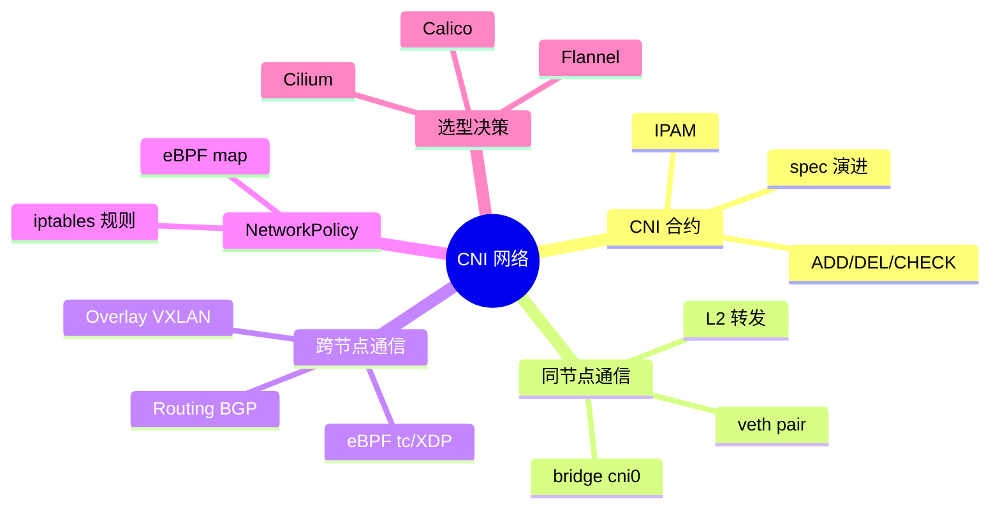
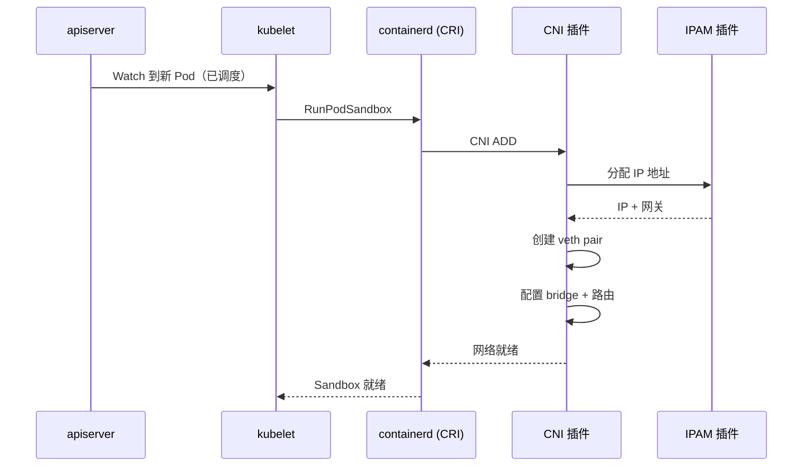
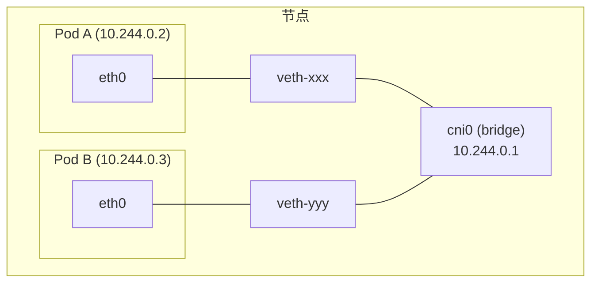
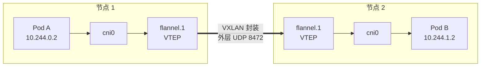
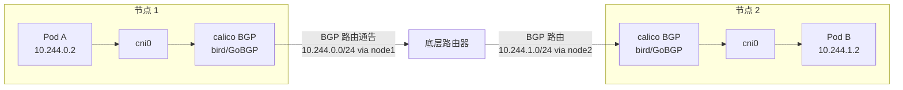
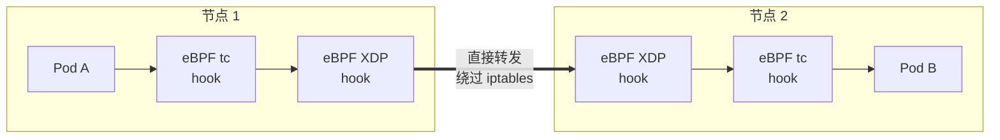
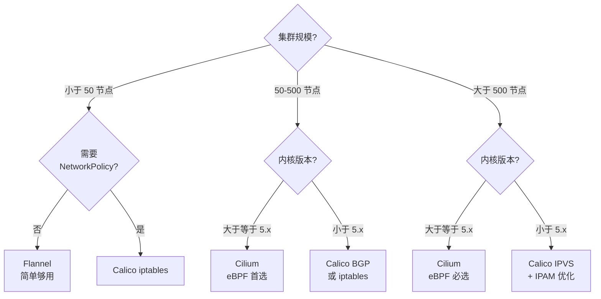

# 🌐 CNI 深潜：一个数据包的跨节点之旅

> **前提假设**：你已经会 `kubectl expose`，知道 ClusterIP 是什么，了解 NetworkPolicy 的基本概念（参见[网络概念速览](/interview/breadth/networking-review)）。
>
> 本文将从**实现层面**剖析 K8s 网络，带你从 CNI 合约一路深入到 eBPF datapath。

## 架构总览



## 第 1 层：CNI 合约

### 调用链

一个 Pod 创建时，网络配置的完整调用链：



### CNI 操作

CNI 规范定义了三个核心操作：

| 操作 | 触发时机 | 作用 |
|------|----------|------|
| **ADD** | Pod 创建 | 创建网络命名空间、veth pair、分配 IP |
| **DEL** | Pod 删除 | 清理网络设备、释放 IP |
| **CHECK** | 定期健康检查 | 验证网络配置是否完好 |

### CNI Spec 演进

| 版本 | 关键变化 |
|------|----------|
| 0.3.x | 引入 DNS 字段 |
| 0.4.0 | 加入 CHECK 操作 |
| 1.0.0 | 稳定 API，移除废弃字段 |

### CNI 配置文件

kubelet 启动时读取 `/etc/cni/net.d/` 目录下的配置文件：

```json
{
  "cniVersion": "1.0.0",
  "name": "kindnet",
  "type": "ptp",
  "ipMasq": false,
  "ipam": {
    "type": "host-local",
    "ranges": [["10.244.0.0/24"]]
  }
}
```

关键字段：`type` 指定使用哪个 CNI 插件二进制文件（在 `/opt/cni/bin/` 下）。

## 第 2 层：同节点通信

### veth pair + bridge

同一节点上的两个 Pod 怎么通信？答案是 **veth pair + Linux bridge**：



**数据包路径**（Pod A → Pod B，同节点）：

```text
Pod A eth0 → veth pair → cni0 bridge → veth pair → Pod B eth0
           (L2 转发，不过主机协议栈)
```

关键特征：

- 同节点通信是 **L2 层转发**（类似交换机）
- 不经过主机的 iptables/IPVS
- 延迟极低（微秒级）

### 动手验证

在 Kind 集群中抓包观察：

```bash
# 进入 Kind 节点容器
docker exec -it kind-control-plane bash

# 在 cni0 bridge 上抓包
tcpdump -i cni0 -n icmp
```

然后在另一个终端 ping 测试：

```bash
# 从 Pod A ping Pod B
kubectl exec pod-a -- ping pod-b-ip
```

你会在 tcpdump 中看到 ARP 解析和 ICMP 数据包经过 cni0 bridge。

## 第 3 层：跨节点通信 — 三条路线

同节点靠 bridge，跨节点怎么办？这是 CNI 插件的核心差异点。

### 路线 A：Overlay（VXLAN）



**数据包变换**：

```text
原始包：  [src: 10.244.0.2] → [dst: 10.244.1.2]   (内层)
封装后：  [src: node1-ip]   → [dst: node2-ip]     (外层)
          UDP:8472 / VXLAN Header / 原始包
```

代表：Flannel VXLAN、Calico VXLAN

| 优势 | 代价 |
|------|------|
| 简单，不依赖底层网络 | 封装/解封装开销（约 10% CPU） |
| Pod IP 与节点网络隔离 | MTU 缩减 50 字节（VXLAN header） |
| 适合任何 L2/L3 底层网络 | 无法在外部直接路由到 Pod IP |

### 路线 B：Routing（BGP）



**关键机制**：每个节点通过 BGP 协议向邻居通告"我的 Pod CIDR 走我"，底层路由器学会路由表，数据包直接 L3 路由，无封装。

代表：Calico BGP、Cilium native routing

| 优势 | 代价 |
|------|------|
| 无封装开销，性能好 | 需要底层网络支持 L3 路由 |
| MTU 不缩减 | 配置相对复杂 |
| Pod IP 可路由 | 公有云需额外配置 BGP（如 Direct Connect），overlay 方案通常更简单 |

### 路线 C：eBPF



eBPF（Extended Berkeley Packet Filter）允许在内核中运行沙箱程序，无需内核模块：

| 挂载点 | 位置 | 性能 |
|--------|------|------|
| **tc**（Traffic Control） | 内核网络栈中间 | 高 |
| **XDP**（eXpress Data Path） | 网卡驱动层（最早） | 最高（线速处理） |

代表：Cilium、Calico eBPF dataplane

| 优势 | 代价 |
|------|------|
| 最快（绕过整个 iptables 链） | 内核版本要求高（>=4.19，推荐 5.x+） |
| 可观测性最好（Hubble） | 调试门槛高 |
| NetworkPolicy O(1) 性能 | Cilium 资源占用较大 |

### 三条路线对比

| 维度 | Overlay (VXLAN) | Routing (BGP) | eBPF |
|------|-----------------|---------------|------|
| 性能 | 中（封装开销） | 高（无封装） | 最高（内核态转发） |
| 复杂度 | 低 | 中 | 高 |
| 网络要求 | 任意 | 需要 L3 路由 | 内核 >= 4.19 |
| NetworkPolicy | 依赖 iptables | 依赖 iptables | eBPF map（O(1)） |
| 可观测性 | 弱 | 弱 | 强（Hubble） |
| 典型插件 | Flannel | Calico BGP | Cilium |

## 第 4 层：NetworkPolicy 的 enforcement

NetworkPolicy 本身只是声明，具体的执行（enforcement）由 CNI 插件实现。

### iptables 方式（Calico）

```text
每条 NetworkPolicy 规则 → 一组 iptables 规则

-A cali-fw -m comment --comment "allow from frontend" \
  -m set --match-set cali4-s-frontend src \
  -j ACCEPT
```

问题：规则数 = O(policies × pods)，大规模集群下：

```text
1000 个 Pod × 100 条 Policy = 10 万条 iptables 规则
→ 每次 iptables 更新需要秒级时间
→ 规则遍历 O(n) 导致包处理延迟增加
```

### eBPF 方式（Cilium）

```text
NetworkPolicy 编译为 eBPF map（哈希表）

map key: {src_ip, dst_ip, dst_port, protocol}
map value: ALLOW / DENY
```

优势：

```text
1000 个 Pod × 100 条 Policy = 10 万条 eBPF map 条目
→ map 更新是 O(1) 原子操作
→ 包处理时 O(1) 查表，延迟不变
```

### 性能对比

| 场景 | iptables | eBPF |
|------|----------|------|
| 100 条 Policy 规则更新延迟 | 约 100ms | 约 1ms |
| 10000 条 Policy 规则更新延迟 | 约 10s | 约 10ms |
| 数据包处理延迟（有 Policy） | 随规则数线性增长 | 恒定 |

## 第 5 层：选型决策框架



### 实际选型参考

| 场景 | 推荐方案 | 理由 |
|------|----------|------|
| Kind 本地开发 | kindnet（默认） | 开箱即用 |
| 小型生产集群 | Calico BGP | 成熟稳定 |
| 大型生产集群 | Cilium | 性能 + 可观测性 |
| 公有云（AWS/GCP） | Cilium / Calico VXLAN | 云网络通常是 overlay |
| 需要 Service Mesh | Cilium | 原生支持透明代理 |

## 第 6 层：面试锦囊

### 必考题

**Q1: 讲讲 CNI 的工作原理**

> CNI 是容器网络标准接口。kubelet 创建 Pod 时通过 CRI 调用容器运行时，运行时调用 CNI 插件执行 ADD 操作：创建 veth pair、配置 bridge/路由、通过 IPAM 分配 IP。Pod 删除时调用 DEL 清理网络。

**Q2: Flannel 和 Calico 的区别？**

> Flannel 用 VXLAN overlay 封装，简单但不支持 NetworkPolicy。Calico 用 BGP routing（或 iptables），支持 NetworkPolicy，性能更好。大型集群推荐 Calico 或 Cilium。

**Q3: eBPF 在 K8s 网络中的应用？**

> Cilium 用 eBPF 替代 iptables 做 datapath 和 NetworkPolicy enforcement。eBPF 程序挂载在 tc/XDP 层，绕过整个 netfilter 链，实现 O(1) 的包处理和策略查表。Hubble 利用 eBPF 提供网络可观测性。

**Q4: 大规模集群网络性能瓶颈在哪？**

> 两个瓶颈：kube-proxy 的 Service 规则（iptables O(n) 问题，用 IPVS 解决）和 NetworkPolicy 规则数（iptables O(n)，用 eBPF O(1) 解决）。500+ Service 的集群应考虑 IPVS + Cilium。

**Q5: Pod 间通信延迟高怎么排查？**

> 分层排查：1) 确认同节点还是跨节点 2) 同节点查 cni0 bridge（tcpdump -i cni0） 3) 跨节点查封装方式（VXLAN 有额外开销） 4) 检查 iptables 规则数（iptables-save | wc -l） 5) 检查 conntrack 表（conntrack -C）。

### 场景设计题

> **题目**：公司有 3 个 K8s 集群（开发/测试/生产），如何设计跨集群网络方案？

**关键考量**：

1. **网络模型选择**：开发/测试用 Flannel（简单），生产用 Cilium（性能+可观测）
2. **跨集群通信**：Submariner 或 Cilium Cluster Mesh
3. **NetworkPolicy 统一管理**：Cilium 的 GlobalNetworkPolicy
4. **IP 地址规划**：每个集群不同 Pod CIDR，避免冲突
5. **DNS 跨集群解析**：CoreDNS 的 forward 插件或 Submariner Lighthouse

### 加分项

- 能聊 Cilium Hubble 的可观测性（流量可视化、依赖关系图）
- 能画出 eBPF 的 XDP vs tc 挂载点差异（XDP 在网卡驱动层，tc 在内核网络栈）
- 知道 conntrack 表溢出问题及解决方案（`net.netfilter.nf_conntrack_max`）
- 了解 Gateway API 作为 Ingress 的演进方向
