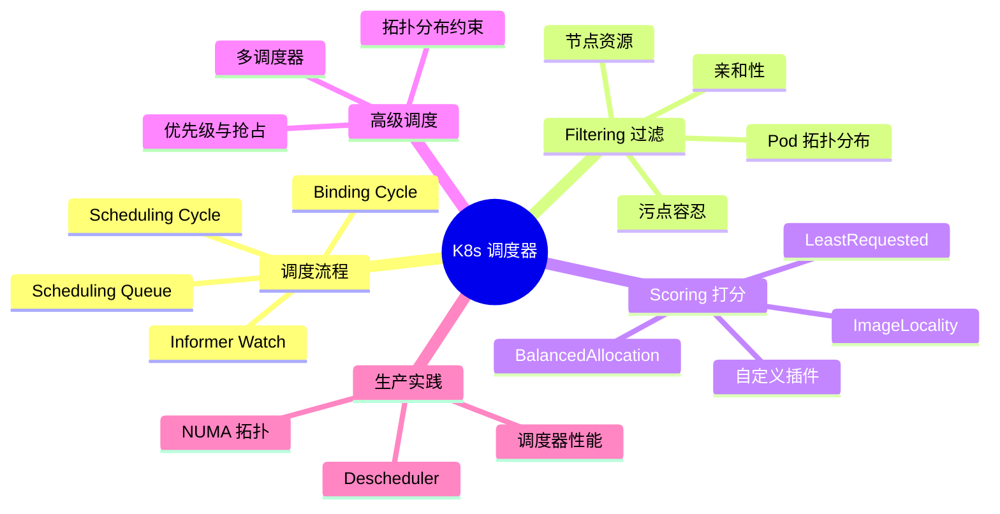
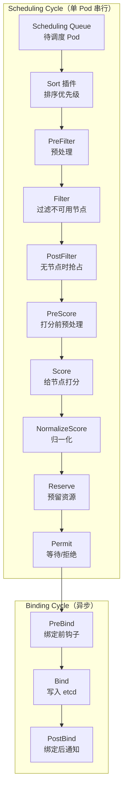
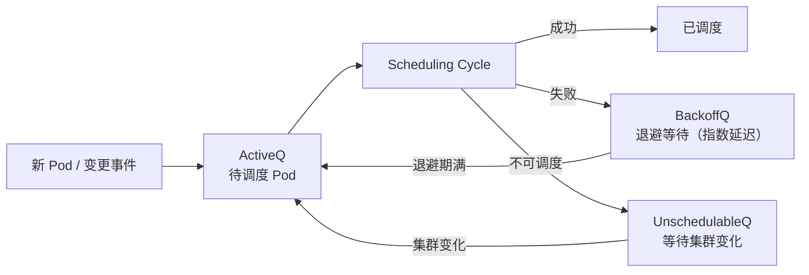
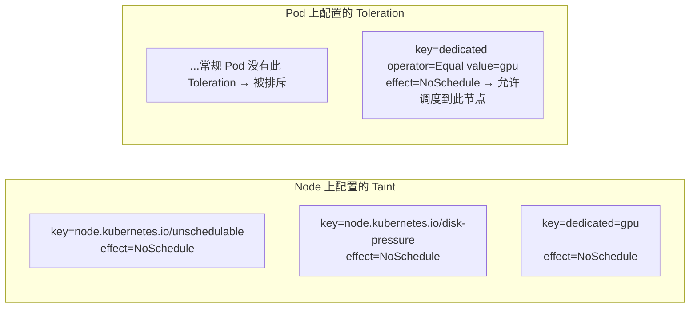
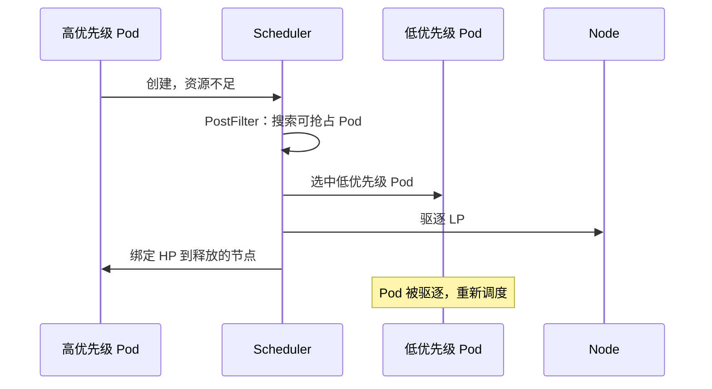
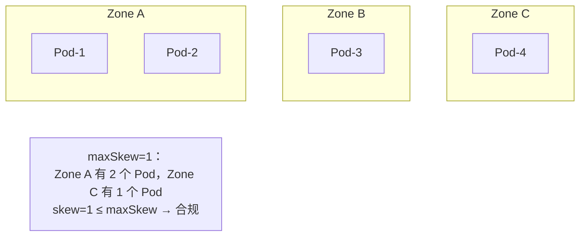
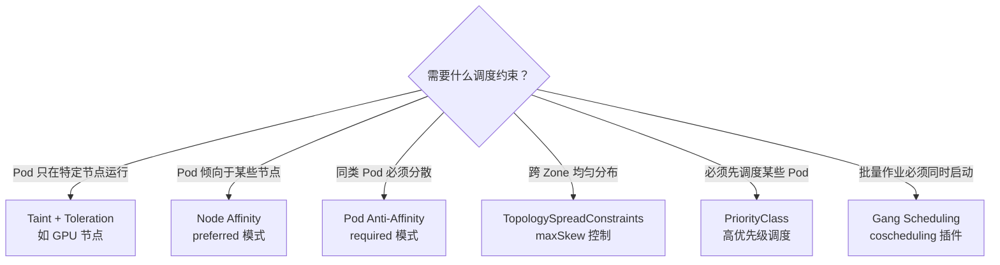

# ⏰ 调度深潜：Pod 如何找到它的"家"

> **前提假设**：你已经了解 Pod 和 Node 的基本概念，知道 scheduler 负责把 Pod 分配到节点（参见[调度概念速览](/interview/breadth/scheduling-review)）。
>
> 本文将从**实现层面**深入剖析调度流程、策略配置和高级场景。

## 架构总览



## 第 1 层：调度框架（Scheduling Framework）

### 整体架构

K8s 1.19+ 的调度框架将调度过程插件化，每个阶段由一组插件按顺序执行：



**关键理解**：Scheduling Cycle 是**串行的**（一次调度一个 Pod），Binding Cycle 是**异步的**（不阻塞下一个 Pod 的调度）。

### 调度队列



三个队列的分工：
- **ActiveQ**：当前等待调度的 Pod（FIFO + 优先级排序）
- **BackoffQ**：调度失败的 Pod，指数退避后重新入队（1s → 2s → 4s → … → 10s 上限）
- **UnschedulableQ**：确认不可调度的 Pod（如资源不足），等集群状态变化后重新入队

## 第 2 层：Filtering — 如何排除节点

### 过滤链

调度器对每个节点依次运行 Filter 插件，**任一插件返回 Unschedulable 即淘汰该节点**：

```mermaid
flowchart TB
    Start["候选节点（全集群）"] --> NF["NodeResourcesFit\n检查 CPU/内存是否够"]
    NF --> NT["NodeUnschedulable\n检查节点是否被 cordon"]
    NT -->||"通过"| TA["TaintToleration\n检查 Pod 是否容忍节点污点"]
    TA -->||"通过"| NA["NodeAffinity\n检查亲和性规则"]
    NA -->||"通过"| IA["InterPodAffinity\n检查 Pod 间亲和/反亲和"]
    IA -->||"通过"| TS["PodTopologySpread\n检查拓扑分布约束"]
    TS -->||"通过"| VN["VolumeNode\nCSI 拓扑限制"]
    VN -->||"通过"| Result["候选节点集合"]
    
    NT -->|"节点被 cordon|❌"| Reject["淘汰"]
    TA -->|"不匹配|❌"| Reject
    NA -->|"不匹配|❌"| Reject
```

### 污点与容忍深度解析



三种 Effect 的区别：

| Effect | 行为 | 典型用途 |
|--------|------|----------|
| **NoSchedule** | 不容忍则拒绝调度，已有 Pod 不受影响 | 节点特性标记（GPU、SSD） |
| **PreferNoSchedule** | 尽量不调度（软约束） | 负载偏好 |
| **NoExecute** | 不容忍则驱逐已有 Pod + 拒绝新 Pod | 节点故障隔离 |

### 亲和性规则对照

| 类型 | 作用域 | 硬约束 | 软约束 |
|------|--------|--------|--------|
| **nodeAffinity** | Pod → Node | `requiredDuringScheduling...` | `preferredDuringScheduling...` |
| **podAffinity** | Pod → Pod（同位置） | `requiredDuringScheduling...` | `preferredDuringScheduling...` |
| **podAntiAffinity** | Pod → Pod（分散） | `requiredDuringScheduling...` | `preferredDuringScheduling...` |

## 第 3 层：Scoring — 如何选出最优节点

### 打分插件与权重

Filter 通过后，调度器对剩余节点打分。默认启用的打分插件和权重：

| 插件 | 默认权重 | 含义 | 高分条件 |
|------|---------|------|----------|
| **NodeResourcesFit** (LeastAllocated) | 1 | 资源利用率越低分越高 | 节点空闲资源多 |
| **NodeResourcesFit** (MostAllocated) | 0（未启用） | 资源利用率越高分越高 | 装箱策略 |
| **ImageLocality** | 1 | 镜像已存在加分 | 节点已有该镜像 |
| **InterPodAffinity** | 2 | 亲和/反亲和性匹配加分 | 满足 Pod 间位置规则 |
| **NodeAffinity** | 1 | 节点亲和性匹配加分 | 匹配 preferred 规则 |
| **TaintToleration** | 1 | 精确匹配污点加分 | 精确匹配（非 Exists） |
| **SelectorSpread** | 1 | 跨 Service/RC 均匀分布 | 原有副本少的节点 |
| **PodTopologySpread** | 2 | 跨拓扑域均匀分布 | 域内 Pod 数更平均 |

最终分数 = Σ(插件分数 × 权重)，选总分最高的节点。

### 打分算法示例：LeastAllocated

```
节点可用资源：
  Node A: 8C 16G → 已用 2C 4G → 可用 6C 12G
  Node B: 4C 8G  → 已用 1C 2G → 可用 3C 6G

LeastAllocated 公式：score = (cpu_ratio + mem_ratio) / 2 * 100
  Node A: ((6/8) + (12/16)) / 2 * 100 = (0.75 + 0.75) / 2 * 100 = 75
  Node B: ((3/4) + (6/8)) / 2 * 100   = (0.75 + 0.75) / 2 * 100 = 75

虽然分数相同，但 Node A 承载力更强 → 下一个 Pod 调度时会体现差异
```

## 第 4 层：高级调度场景

### 优先级与抢占



**要点**：
- 只有高优先级 Pod 处于 Pending 时才触发抢占
- 抢占者需要等待被驱逐 Pod 优雅终止（terminationGracePeriodSeconds）
- 被驱逐的 Pod 回到调度队列，可能被调度到其他节点

### 拓扑分布约束（TopologySpreadConstraints）

```yaml
topologySpreadConstraints:
- maxSkew: 1
  topologyKey: topology.kubernetes.io/zone
  whenUnsatisfiable: DoNotSchedule  # 或 ScheduleAnyway（软约束）
  labelSelector:
    matchLabels:
      app: my-app
```



**与 podAntiAffinity 的区别**：拓扑分布约束在**域级别**控制均匀度（跨 Zone/Region），podAntiAffinity 在**Pod 级别**控制互斥。

### 多调度器

K8s 支持同时运行多个调度器（通过 `schedulerName` 字段）：

```yaml
apiVersion: v1
kind: Pod
metadata:
  name: custom-scheduled-pod
spec:
  schedulerName: my-custom-scheduler  # 不使用 default-scheduler
  containers:
  - name: app
    image: nginx
```

典型场景：
- 为特定工作负载定制调度策略（如 GPU 拓扑感知）
- 批处理任务使用 Gang Scheduling（coscheduling）
- 数据局部性调度（将 Pod 调度到数据所在节点）

## 方案对比与决策

### 调度策略选择框架



### 调度器配置对比

| 场景 | 推荐配置 | 说明 |
|------|---------|------|
| 默认通用 | 默认调度器 + LeastAllocated | 资源均匀分配 |
| 提高装箱率 | MostAllocated 策略 | 尽量填满节点再开新节点 |
| GPU 工作负载 | 自定义调度器 + 拓扑感知 | GPU 拓扑 + NUMA 亲和 |
| 批处理 | coscheduling / volcano | Gang Scheduling |
| 大数据 | Yunikorn / volcano | 队列管理 + 公平调度 |

## 生产实践

### 大规模集群的调度器性能

- 默认调度器每秒可处理约 **100-200 个 Pod**（取决于节点数）
- 瓶颈在 Filter 阶段（节点数越多，遍历成本越高）
- 优化手段：`percentageOfNodesToScore`（默认 0，即全量扫描；设 50 则只扫 50% 的节点）
- 极端大规模（5000+ 节点）：考虑 `nodeFeasibilityPolicy`

### 故障案例：污点导致所有 Pod 无法调度

**问题**：部署一个新 Deployment 后，所有 Pod 一直 Pending，`kubectl describe pod` 显示 `0/3 nodes available: 1 node(s) had untolerated taint`

**根因**：集群管理员对节点添加了 `NoSchedule` 污点，但忘记了添加对应的 Toleration 到命名空间的 Pod 中。

**排查技巧**：
```bash
# 1. 检查节点污点
kubectl describe nodes | grep -A5 Taints

# 2. 检查 Pod 的调度事件
kubectl describe pod <pod-name> | grep -A10 Events

# 3. 模拟调度决策
kubectl get events --field-selector reason=FailedScheduling --sort-by='.lastTimestamp'
```

### 实验验证

```bash
# 调度器调试实验
cd docs/labs/interview/scheduling
bash setup.sh

# 观察调度决策
kubectl get events --watch | grep Scheduled
```

## 面试锦囊

### 必考题

**Q1: 调度器怎么决定 Pod 放在哪个节点？**

> 简答：调度器通过 Filtering（过滤掉不满足条件的节点）和 Scoring（给剩余节点打分）两步决定 Pod 的最终位置。
>
> 展开：Filtering 阶段检查节点资源、污点、亲和性等硬约束；Scoring 阶段根据资源利用率、镜像位置、Pod 分布等软偏好给节点打分。调度框架将这些逻辑插件化，每个阶段由一组插件执行。详见[第 1 层](#第-1-层调度框架scheduling-framework)。

**Q2: Taint/Toleration 和 Node Affinity 的区别？**

> 简答：Taint/Toleration 是**排斥机制**（节点赶走 Pod），Node Affinity 是**吸引机制**（Pod 选择节点）。
>
> 展开：Taint 标在节点上说"没有对应 Toleration 的 Pod 不要来"，Node Affinity 标在 Pod 上说"我喜欢具有某些标签的节点"。两者常配合使用：给 GPU 节点打污点（`dedicated=gpu:NoSchedule`）排斥普通 Pod，同时用 Node Affinity 将 GPU Pod 吸引到这些节点。

**Q3: 什么时候会触发 Pod 抢占？**

> 简答：高优先级 Pod 因资源不足无法调度时，调度器会驱逐低优先级 Pod 来腾出空间。这是 PostFilter 阶段的逻辑。
>
> 展开：抢占条件是 (1) Pod 有 PriorityClass (2) 所有节点都无法满足其资源需求 (3) 存在可被抢占的低优先级 Pod。抢占后，被驱逐的 Pod 优雅终止后重新进入调度队列。详见[第 4 层](#优先级与抢占)。

**Q4: maxSkew 是什么？怎么算？**

> 简答：maxSkew 是拓扑分布约束中允许的**最大不均衡度**，计算方式是"域内 Pod 数最大值 − 最小值"。
>
> 展开：如果 Zone A 有 3 个 Pod，Zone B 有 1 个 Pod，skew=2。若 maxSkew=1，则调度器认为不均衡，下次调度优先选择 Zone B。这是实现跨可用区高可用的核心机制。详见[第 4 层](#拓扑分布约束topologyspreadconstraints)。

**Q5: 什么场景需要多调度器？**

> 简答：当默认调度器的策略无法满足特殊需求时（如 GPU 拓扑感知、Gang Scheduling、数据局部性），需要部署自定义调度器。
>
> 展开：常用第三方调度器：Volcano（批量计算/Gang Scheduling）、Yunikorn（YARN 风格队列管理）、coscheduling（PodGroup 协同调度）。使用 `spec.schedulerName` 指定 Pod 使用哪个调度器。详见[第 4 层](#多调度器)。

### 场景设计题

> **题目**：你有一个 100 个节点的集群，需要部署一个 50 副本的 Web 应用，要求：(1) 每个可用区至少 1 个 Pod (2) 每个节点最多 1 个 Pod (3) 发布时逐个替换，不能有中断。请设计调度策略。
>
> **关键考量**：
> 1. 用 TopologySpreadConstraints 保证跨可用区均匀分布（`maxSkew=1, topologyKey=topology.kubernetes.io/zone`）
> 2. 用 PodAntiAffinity (required) 保证每个节点最多 1 个 Pod（`topologyKey=kubernetes.io/hostname`）
> 3. Deployment 默认滚动更新 + maxUnavailable=0 保证零中断
> 4. 配合 PDB（`maxUnavailable=1`）防止维护操作导致不可用
>
> **参考架构**：
> ```
> 50 副本 Deployment
>   + TopologySpreadConstraints (zone-level, maxSkew=1)
>   + PodAntiAffinity: required, hostname-level
>   + PDB: maxUnavailable=1
>   + Strategy: RollingUpdate, maxSurge=1, maxUnavailable=0
> ```

### 加分项

- 能解释调度框架的插件扩展点（PreFilter → Filter → Score → Reserve → Permit → Bind）
- 能分析默认调度器 vs Volcano/Yunikorn 的架构差异
- 了解调度器性能优化（percentageOfNodesToScore、nodeFeasibilityPolicy）
- 能聊 Gang Scheduling / Coscheduling 的实现原理
