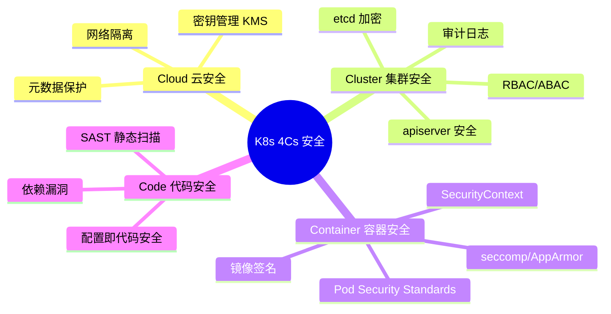
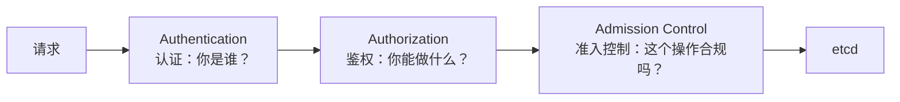
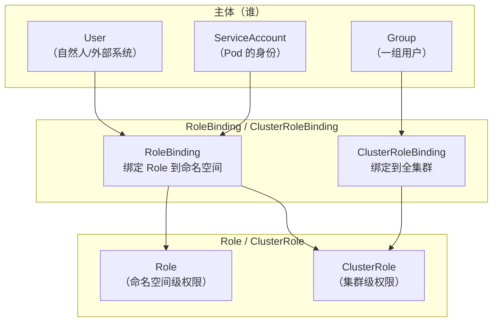
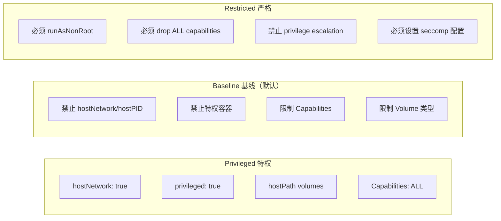
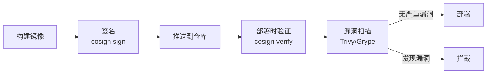
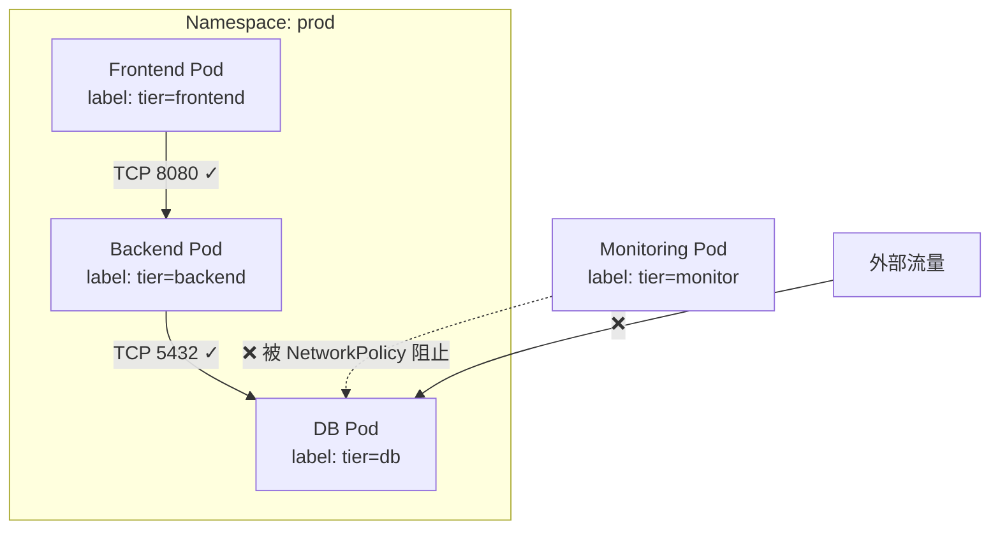
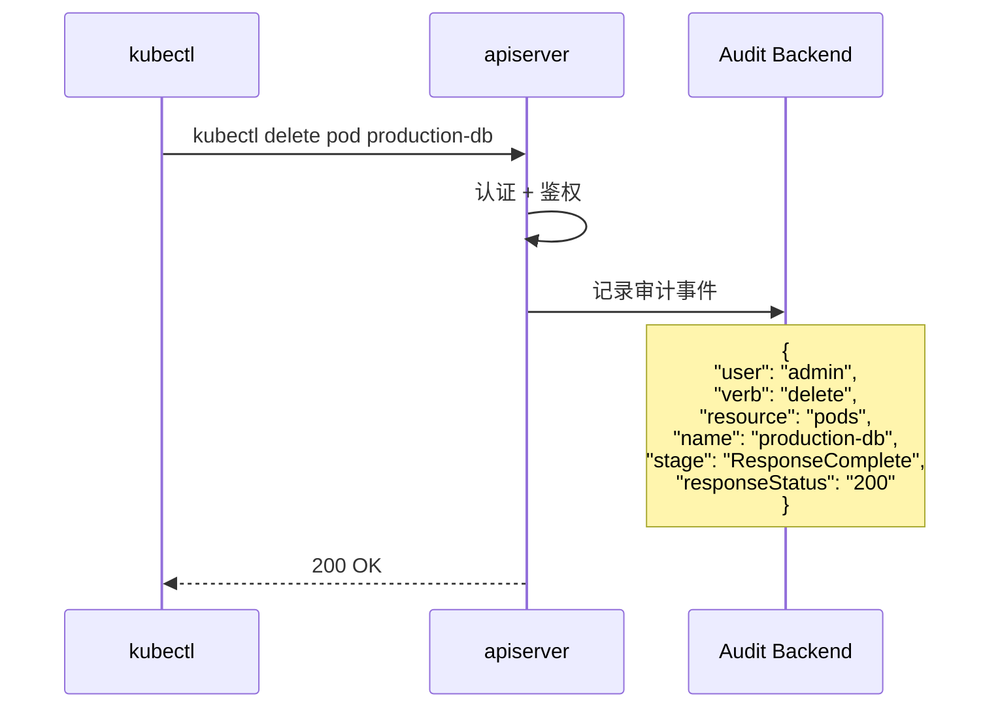

# 🔒 安全深潜：K8s 的纵深防御体系

> **前提假设**：你已经了解 RBAC 的基本概念（ServiceAccount、Role、RoleBinding），知道 Pod Security Context 的存在（参见 [RBAC](/beginner/14-rbac) 和 [Pod 安全上下文](/beginner/24-pod-security)）。
>
> 本文将从**防御体系**层面剖析 K8s 安全，覆盖从 Cloud 到 Code 的 4Cs 纵深防御。

## 架构总览



## 第 1 层：集群安全（Cluster）

### apiserver 三段处理链



**认证（Authentication）**：识别请求者身份
- **X.509 客户端证书**：kubelet、controller-manager 等组件使用
- **Bearer Token**：ServiceAccount Token、Bootstrap Token
- **OIDC**：集成企业身份系统（如 LDAP、Azure AD）
- **Webhook Token Authentication**：自定义认证服务

**鉴权（Authorization）**：检查请求者是否有权限执行此操作
- **RBAC**（推荐）：基于角色的访问控制
- **Node Authorizer**：限制 kubelet 只能访问本节点的资源
- **Webhook**：外部鉴权服务
- **ABAC**：基于属性的访问控制（已弃用，不推荐）

**准入控制（Admission Control）**：在写入 etcd 前执行最后检查
- **MutatingAdmissionWebhook**：修改请求（如注入 Sidecar、设置默认值）
- **ValidatingAdmissionWebhook**：验证请求（如检查安全策略、命名规范）
- **内置插件**：ResourceQuota（配额限制）、LimitRanger（设置默认资源）

### RBAC 深度解析



**最小权限原则实践**：

```yaml
# ❌ 坏做法：给 cluster-admin
apiVersion: rbac.authorization.k8s.io/v1
kind: ClusterRoleBinding
metadata:
  name: dev-team-admin
subjects:
- kind: Group
  name: dev-team
roleRef:
  kind: ClusterRole
  name: cluster-admin  # 太宽了！

# ✅ 好做法：精确权限
apiVersion: rbac.authorization.k8s.io/v1
kind: Role
metadata:
  namespace: app-prod
  name: app-deployer
rules:
- apiGroups: ["apps", ""]
  resources: ["deployments", "pods", "services", "configmaps"]
  verbs: ["get", "list", "watch", "create", "update", "patch"]
# 注意：没有 delete (防止误删)
```

### etcd 加密

```yaml
# EncryptionConfiguration
apiVersion: apiserver.config.k8s.io/v1
kind: EncryptionConfiguration
resources:
- resources:
  - secrets
  providers:
  - aescbc:
      keys:
      - name: key1
        secret: <base64-encoded-32-byte-key>
  - identity: {}  # 兜底：不加密（读取旧数据时用）
```

**关键**：etcd 默认不加密存储 Secret 数据，攻击者获取 etcd 文件即可读取所有 Secret。生产环境必须配置 EncryptionConfiguration。

## 第 2 层：容器安全（Container）

### Pod Security Standards (PSS)

K8s 1.25+ 用 Pod Security Admission (PSA) 替代了 PodSecurityPolicy (PSP)：



```yaml
# 给命名空间设置安全策略
apiVersion: v1
kind: Namespace
metadata:
  name: production
  labels:
    pod-security.kubernetes.io/enforce: restricted
    pod-security.kubernetes.io/warn: baseline
    pod-security.kubernetes.io/audit: restricted
```

三个模式：
- **enforce**：违反策略则拒绝 Pod 创建
- **warn**：仅告警不拒绝（帮助团队渐进迁移）
- **audit**：记录到审计日志

### SecurityContext 关键字段

```yaml
spec:
  securityContext:          # Pod 级
    runAsNonRoot: true       # 禁止 root 运行
    runAsUser: 1000          # 指定 UID
    fsGroup: 2000            # 文件系统组
    seccompProfile:
      type: RuntimeDefault   # 使用容器运行时的默认 seccomp
  
  containers:
  - name: app
    securityContext:         # 容器级
      allowPrivilegeEscalation: false  # 禁止提权
      readOnlyRootFilesystem: true     # 根文件系统只读
      capabilities:
        drop: ["ALL"]                  # 删除所有能力
        add: ["NET_BIND_SERVICE"]      # 仅添加必要能力
```

### 镜像安全



**镜像签名工具**：
- **cosign** (sigstore)：无钥签名，与 OCI 注册表集成
- **Notation** (Notary v2)：Azure 主导，OCI 标准

**漏洞扫描**：
- **Trivy**：开源，扫描 OS 包和应用依赖
- **Grype**：Anchore 出品，快速扫描
- 集成到 CI/CD：`trivy image --severity HIGH,CRITICAL my-image:latest`

## 第 3 层：网络与运行时安全

### NetworkPolicy 纵深



```yaml
# 仅允许 backend → db 的 5432 流量
apiVersion: networking.k8s.io/v1
kind: NetworkPolicy
metadata:
  name: db-ingress
spec:
  podSelector:
    matchLabels:
      tier: db
  policyTypes: ["Ingress"]
  ingress:
  - from:
    - podSelector:
        matchLabels:
          tier: backend
    ports:
    - protocol: TCP
      port: 5432
```

### seccomp 与 AppArmor

**seccomp**（Secure Computing Mode）：系统调用过滤

```json
// 一个极简的 seccomp profile
{
  "defaultAction": "SCMP_ACT_ERRNO",
  "architectures": ["SCMP_ARCH_X86_64"],
  "syscalls": [
    {
      "names": ["read","write","exit","exit_group","futex","nanosleep"],
      "action": "SCMP_ACT_ALLOW"
    }
  ]
}
```

即使一个进程被攻破（如代码注入），seccomp 也能阻止攻击者执行未授权的系统调用（如 `execve` 执行反弹 shell）。

**AppArmor**（仅 Linux）：文件路径级别访问控制

```bash
# 限制 Pod 只能写 /tmp 和日志目录
profile k8s-apparmor flags=(attach_disconnected) {
  file,
  /tmp/** rw,
  /var/log/** rw,
  deny /etc/** w,
  deny /proc/sys/** w,
}
```

### 审计日志（Audit Logging）



审计策略示例：
```yaml
apiVersion: audit.k8s.io/v1
kind: Policy
rules:
- level: Metadata
  # 记录所有请求的元数据（谁、什么时候、做了什么）
- level: RequestResponse
  resources:
  - group: ""
    resources: ["secrets"]
  # 对 Secret 访问记录完整的请求和响应（⚠️ 可能包含敏感数据）
- level: None
  # 忽略健康检查等噪音
  userGroups: ["system:nodes"]
  verbs: ["get"]
  resources:
  - group: ""
    resources: ["nodes/status"]
```

## 第 4 层：安全最佳实践矩阵

| 层级 | 控制手段 | 防御目标 | 关键工具 |
|------|---------|---------|---------|
| **Cloud** | 网络 ACL、KMS、IAM | 基础设施访问 | AWS KMS、Vault |
| **Cluster** | RBAC、etcd 加密、审计日志 | 集群内权限控制 | kube-bench、Falco |
| **Container** | PSS、SecurityContext、镜像签名 | 容器逃逸防御 | Trivy、cosign |
| **Code** | SAST、依赖扫描、IaC 安全 | 供应链安全 | Checkov、Snyk |

### 纵深防御检查清单

```
□ apiserver 配置 TLS + 审计日志
□ etcd 启用静态加密 (EncryptionConfiguration)
□ RBAC 遵循最小权限原则，无 cluster-admin 绑定到普通用户
□ 所有 Production Namespace 启用 restricted PSS
□ 所有容器 runAsNonRoot + readOnlyRootFilesystem
□ 所有容器 drop ALL capabilities，仅 add 必要能力
□ 镜像经 Trivy 扫描（severity ≥ HIGH 阻断）
□ 镜像经 cosign 签名验证
□ NetworkPolicy 默认 deny-all + 按需白名单
□ Secret 使用 external-secrets-operator / Vault 注入（不硬编码）
□ 定期运行 kube-bench 检查
□ 部署 Falco 进行运行时异常检测
```

## 面试锦囊

### 必考题

**Q1: 什么是 K8s 的 4Cs 安全模型？**

> 简答：Cloud（基础设施安全）、Cluster（集群安全）、Container（容器安全）、Code（代码安全）——四个层次的纵深防御。
>
> 展开：这四层各有不同的威胁面和控制手段。集群层用 RBAC+etcd 加密+审计日志，容器层用 PSS+SecurityContext+镜像签名，代码层用 SAST+依赖扫描，云层用 IAM+KMS+网络隔离。四层中任一层的突破不应导致全线溃败。详见[架构总览](#架构总览)。

**Q2: RBAC 中 Role、ClusterRole、RoleBinding、ClusterRoleBinding 的区别？**

> 简答：Role 是命名空间级权限，ClusterRole 是集群级权限。RoleBinding 在命名空间内绑定，ClusterRoleBinding 在全集群绑定。
>
> 展开：ClusterRole 可以定义集群级资源（Node、Namespace、PV）的权限，也可以通过 RoleBinding 绑定到特定命名空间来实现"集群范围定义、命名空间使用"的模式。例如：定义 ClusterRole "secret-reader"（可读所有 Secret），通过 RoleBinding 只绑定到 dev 命名空间。详见[第 1 层](#rbac-深度解析)。

**Q3: Pod Security Standards 三个级别是什么？**

> 简答：Privileged（无限制）、Baseline（基础限制，禁止已知提权手段）、Restricted（严格限制，遵循 Pod 加固最佳实践）。生产环境用 Restricted。
>
> 展开：Privileged 允许 hostNetwork/hostPID/特权容器。Baseline 禁止这些但允许 runAsUser: 0。Restricted 强制 runAsNonRoot + drop ALL capabilities + 必须设置 seccompProfile。通过 PSA 的 enforce/warn/audit 三个模式渐进迁移。详见[第 2 层](#pod-security-standards-pss)。

**Q4: 为什么需要镜像签名？cosign 怎么工作？**

> 简答：镜像签名确保**镜像是你构建的而不是被篡改的**。cosign 使用 OIDC 无钥签名，将签名存储在 OCI 注册表中。
>
> 展开：攻击路径：侵入 CI 流水线 → 替换镜像 → 所有新 Pod 运行恶意代码。cosign 在构建时签名、部署时验证，阻断被篡改的镜像。cosign 支持 Keyless 签名（通过 OIDC token 向 Fulcio CA 申请短期证书），不需要管理长期密钥。详见[第 2 层](#镜像安全)。

**Q5: 容器运行时的 seccomp 和 AppArmor 有什么区别？**

> 简答：seccomp 限制**系统调用**（进程能做什么），AppArmor 限制**文件访问**（进程能访问哪些文件）。两者互补。
>
> 展开：seccomp 用 BPF 过滤系统调用号——即使拿到 shell，`execve`/`ptrace` 被过滤也无法执行新程序。AppArmor 用路径规则限制文件读写——攻击者即使突破了 seccomp，也无法修改 `/etc/passwd`。组合使用提供两层防护。详见[第 3 层](#seccomp-与-apparmor)。

**Q6: 为什么 etcd 需要静态加密？**

> 简答：etcd 存储所有集群数据包括 Secret。如果不加密，任何能访问 etcd 数据文件的人（备份泄露、磁盘被盗）都能直接读取所有 Secret、Token、证书。
>
> 展开：配置 EncryptionConfiguration 后，Secret 在写入 etcd 前用 AES-CBC 加密存储，读取时自动解密。注意：(1) 已有 Secret 需要手动重写才会被加密 (2) 加密密钥需要安全存储（推荐外部 KMS）。

### 场景设计题

> **题目**：为一家金融科技公司设计 K8s 安全策略。要求：(1) 多团队共享集群 (2) PCI-DSS 合规 (3) 防止数据泄露 (4) 审计追溯。
>
> **关键考量**：
> 1. 命名空间隔离 + NetworkPolicy（每个团队独立 ns，默认 deny-all + 按需白名单）
> 2. RBAC 细粒度权限（每团队只读/写自己的 ns，禁止 cross-ns 访问）
> 3. Restricted PSS + Trivy 扫描 + cosign 签名验证（Pod 安全 + 供应链安全）
> 4. encrypted etcd + external-secrets-operator（Secret 不存储在 K8s 中，使用 Vault/AWS Secrets Manager）
> 5. 审计日志 → SIEM 系统（所有 Secret 访问、RBAC 修改、Pod exec 记录并告警）
> 6. Falco 运行时检测 + 异常告警
>
> **参考架构**：
> ```
> 控制平面: TLS + OIDC 认证 + RBAC + etcd 加密
> 准入控制: OPA/Gatekeeper (拒绝不合规资源) + cosign verify (签名检查)
> 运行时: Falco + seccomp RuntimeDefault + restricted PSS
> Secret: external-secrets-operator → AWS Secrets Manager
> 网络: NetworkPolicy default-deny + Cilium (eBPF 可观测)
> 审计: Audit Log → S3 → SIEM
> ```

### 加分项

- 能解释 apiserver 三段处理链并画出调用顺序（AuthN → AuthZ → Admission）
- 了解 OPA/Gatekeeper 和 Kyverno 的区别
- 能聊 Pod 逃逸的真实案例和防御措施
- 了解 K8s 威胁模型（STRIDE）和 MITRE ATT&CK for Containers
