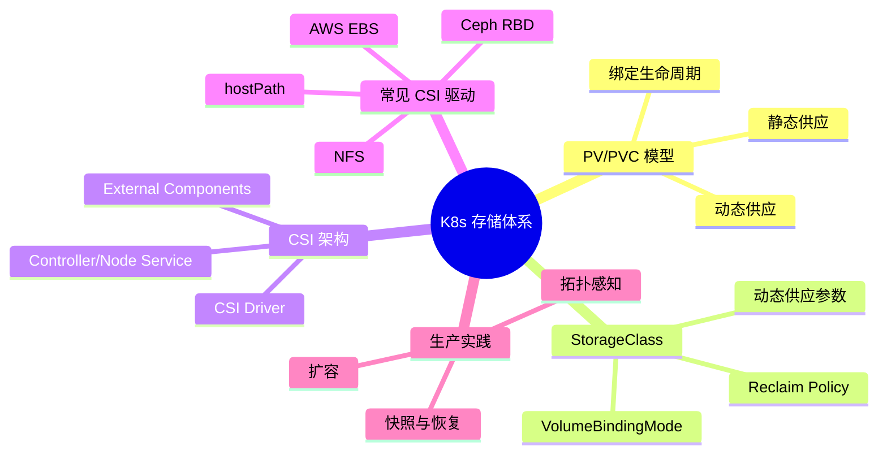
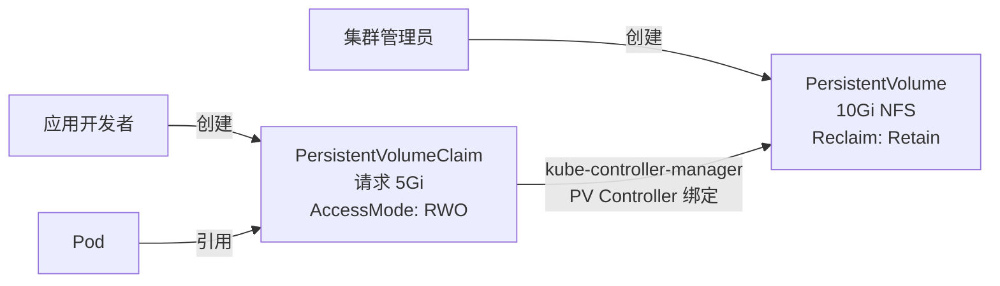
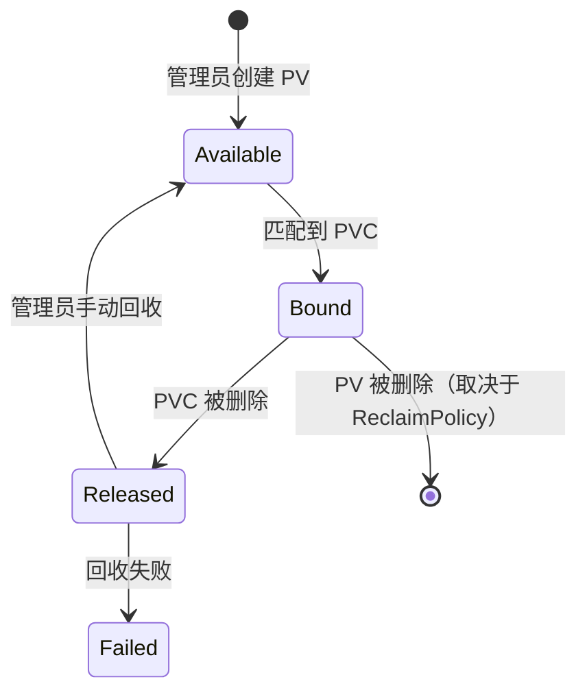
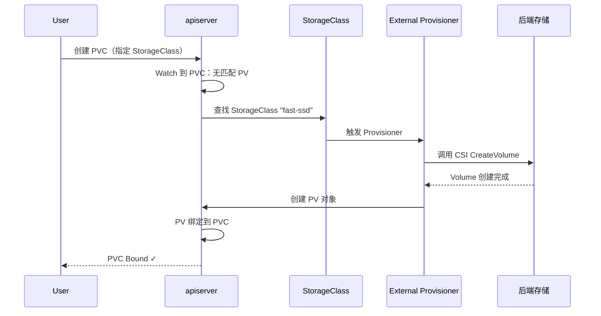
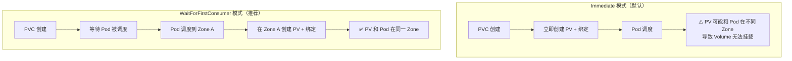
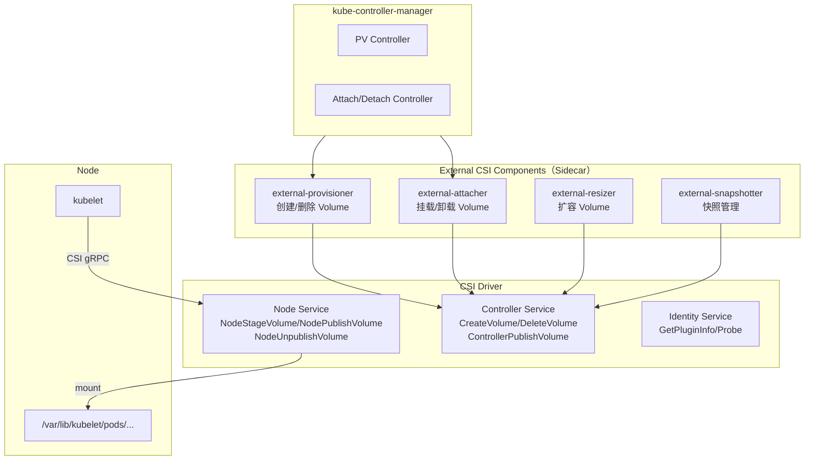
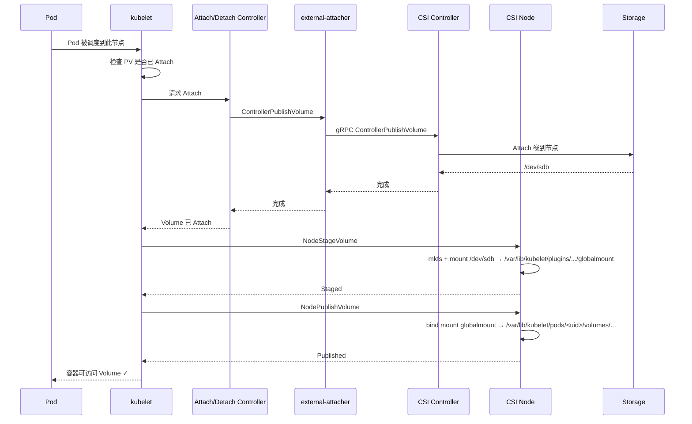

# 💾 存储深潜：从 PVC 到磁盘的完整链路

> **前提假设**：你已经知道 PV/PVC 是什么，会用 hostPath 挂载存储（参见[存储基础](/beginner/10-storage-basics)）。
>
> 本文将从**实现层面**剖析 K8s 存储体系，带你打通从 PVC 创建到数据落盘的全链路。

## 架构总览



## 第 1 层：PV/PVC 静态供应模型

### 资源模型



PV/PVC 的设计遵循**关注点分离**：
- **集群管理员**负责基础设施（PV）——需要知道底层存储类型、容量、访问模式
- **应用开发者**只声明需求（PVC）——需要多大、什么访问模式，不需要知道底层是 NFS 还是 Ceph

### 绑定生命周期



**绑定规则**：
1. PVC 按容量、AccessMode、StorageClass、Selector 匹配 PV
2. 选择**满足需求的最小 PV**（而不是随机或最大）
3. 绑定是**一对一**的，一旦绑定其他 PVC 无法使用该 PV
4. 如果没有匹配的 PV，PVC 保持 Pending

## 第 2 层：StorageClass 动态供应

### 从静态到动态



动态供应的关键：用户只需 `<StorageClass>` → 系统自动完成 `PV 创建 + 绑定`。

### StorageClass 关键参数

```yaml
apiVersion: storage.k8s.io/v1
kind: StorageClass
metadata:
  name: fast-ssd
provisioner: ebs.csi.aws.com
parameters:
  type: gp3
  iopsPerGB: "3000"
  encrypted: "true"
reclaimPolicy: Delete        # 删除 PVC 时自动删除 PV + 后端存储
volumeBindingMode: WaitForFirstConsumer  # 延迟绑定
allowVolumeExpansion: true   # 允许在线扩容
```

### Reclaim Policy 选择

| Policy | 删除 PVC 时 PV 的处理 | 后端存储 | 适用场景 |
|--------|----------------------|----------|---------|
| **Delete** | 删除 PV | **删除**存储（⚠️ 数据丢失） | 开发/测试环境 |
| **Retain** | PV 变为 Released | **保留**存储（需手动清理） | 生产环境 |
| **Recycle** | 清空数据后变 Available | 清空数据（⚠️ 已弃用） | 不推荐 |

### VolumeBindingMode



**推荐**：生产环境使用 `WaitForFirstConsumer`，避免跨 Zone 挂载失败。

## 第 3 层：CSI 架构

### 整体架构



### CSI 接口详解

| 接口 | 方法 | 职责 |
|------|------|------|
| **Identity** | GetPluginInfo | 返回驱动名称和版本 |
| | Probe | 健康检查 |
| | GetPluginCapabilities | 驱动支持的功能 |
| **Controller** | CreateVolume | 在后端存储创建卷 |
| | DeleteVolume | 删除卷 |
| | ControllerPublishVolume | Attach 卷到节点 |
| | ControllerUnpublishVolume | Detach 卷 |
| | CreateSnapshot / DeleteSnapshot | 快照管理 |
| | ControllerExpandVolume | 扩容卷 |
| **Node** | NodeStageVolume | 将块设备格式化 + 挂载到 GlobalMountPath |
| | NodePublishVolume | 将 GlobalMountPath bind mount 到 Pod 目录 |
| | NodeUnpublishVolume | 卸载 Pod 目录 |
| | NodeExpandVolume | 在节点上扩容文件系统 |

### Volume 挂载完整流程



## 第 4 层：常见 CSI 驱动对比

| 驱动 | 存储类型 | 性能 | 多节点读写 | 动态供应 | 生产就绪 |
|------|---------|------|-----------|---------|---------|
| **hostPath** | 本地文件系统 | 极高 | ❌ | ❌ | ❌（仅测试） |
| **NFS** | 网络文件系统 | 一般 | ✅ | ✅ | ✅ |
| **AWS EBS** | 块存储 | 高 | ❌（仅单 AZ） | ✅ | ✅ |
| **AWS EFS** | NFS 文件系统 | 中 | ✅ | ✅ | ✅ |
| **GCE PD** | 块存储 | 高 | ❌（仅单 Zone） | ✅ | ✅ |
| **Ceph RBD** | 块存储 | 中高 | ❌ | ✅ | ✅ |
| **CephFS** | 文件系统 | 中 | ✅ | ✅ | ✅ |
| **Longhorn** | 分布式块存储 | 中 | ❌ | ✅ | ✅ |
| **local-path** | 本地路径 | 极高 | ❌ | ✅ | ✅（单节点） |

> 💡 **云原生选择建议**：AWS 上 EBS 用于数据库（单副本）、EFS 用于共享文件；自建集群 Ceph 或 Longhorn；单节点开发用 hostPath 或 local-path。

## 生产实践

### 故障案例：PVC Pending 排查

**问题**：创建 PVC 后一直 Pending

**排查清单**：
```bash
# 1. 检查 PVC 状态和事件
kubectl describe pvc <name>
# 关键信息："waiting for a volume to be created" vs "no persistent volumes available"

# 2. 检查 StorageClass 是否存在
kubectl get sc

# 3. 检查 Provisioner Pod 状态
kubectl get pods -n kube-system | grep -E "provisioner|ebs-csi|nfs"

# 4. 检查 CSI Driver Pod 日志
kubectl logs -n kube-system deployment/ebs-csi-controller -c csi-provisioner --tail=50
```

**常见原因与修复**：

| 症状 | 根因 | 修复 |
|------|------|------|
| `no persistent volumes available` + 无 StorageClass | PVC 未指定 StorageClass 且无默认 SC | 指定 SC 或设置默认 SC |
| `waiting for a volume to be created...` | Provisioner 异常 | 检查 provisioner Pod 日志 |
| `waiting for first consumer` | WaitForFirstConsumer 模式，Pod 未创建 | 正常行为，创建 Pod 后自动绑定 |
| StorageClass 不可用 | CSI Driver 未安装或崩溃 | `kubectl get csidrivers` 检查 |

### 快照与恢复

```yaml
# 创建快照
apiVersion: snapshot.storage.k8s.io/v1
kind: VolumeSnapshot
metadata:
  name: db-snapshot-20260101
spec:
  volumeSnapshotClassName: csi-aws-ebs-snapclass
  source:
    persistentVolumeClaimName: db-pvc

---
# 从快照恢复
apiVersion: v1
kind: PersistentVolumeClaim
metadata:
  name: db-restored
spec:
  dataSource:
    name: db-snapshot-20260101
    kind: VolumeSnapshot
    apiGroup: snapshot.storage.k8s.io
  accessModes: ["ReadWriteOnce"]
  resources:
    requests:
      storage: 100Gi
```

### Volume 扩容

```bash
# 在线扩容 PVC（需要 StorageClass allowVolumeExpansion: true）
kubectl patch pvc data-pvc -p '{"spec":{"resources":{"requests":{"storage":"20Gi"}}}}'

# 查看扩容状态
kubectl describe pvc data-pvc | grep -A5 Conditions
# Conditions:
#   Type       Status  ...  Message
#   FileSystemResizePending  ...
```

**限制**：某些 CSI 驱动不支持在线扩容（需要重启 Pod），具体取决于驱动能力。

## 面试锦囊

### 必考题

**Q1: PV 和 PVC 的区别？为什么需要这个模型？**

> 简答：PV 是**实际存储资源**（管理员管理），PVC 是**存储需求声明**（开发者使用）。这个模型实现了基础设施和应用的关注分离。
>
> 展开：开发者声明需求（容量、访问模式），不需要知道底层是 NFS 还是 Ceph。管理员管理底层存储资源。PVC 通过容量、AccessMode、StorageClass 匹配 PV。绑定后一对一独占。详见[第 1 层](#第-1-层pv-pvc-静态供应模型)。

**Q2: StorageClass 的 Reclaim Policy 有哪些？怎么选？**

> 简答：`Delete` 删除 PVC 时删除 PV 和底层存储，`Retain` 保留存储需手动清理。生产环境用 `Retain`，开发环境用 `Delete`。
>
> 展开：`Delete` 适合 CI/CD（自动清理），`Retain` 适合生产（数据安全，误删 PVC 不会丢数据）。还有 `Recycle`（已弃用）。详见[第 2 层](#reclaim-policy-选择)。

**Q3: CSI 的 Controller Service 和 Node Service 分别做什么？**

> 简答：Controller Service 在控制平面运行，负责 Volume 的创建/删除/Attach。Node Service 在每个节点运行，负责把 Volume mount 到 Pod 目录。
>
> 展开：Controller 通过 gRPC 与后端存储 API 交互（CreateVolume、DeleteVolume、ControllerPublishVolume）。Node 负责本地 mount 操作（NodeStageVolume 格式化并挂载到全局路径，NodePublishVolume bind mount 到 Pod 目录）。详见[第 3 层](#csi-接口详解)。

**Q4: WaitForFirstConsumer 模式解决了什么问题？**

> 简答：解决了**跨 Zone 挂载失败**问题。默认 Immediate 模式在 Pod 调度前就创建 PV，可能导致 PV 在 Zone A、Pod 调度到 Zone B → 挂载失败。WaitForFirstConsumer 等 Pod 调度完再在同 Zone 创建 PV。
>
> 展开：该模式对 AWS EBS/GCE PD 等单 Zone 块存储尤其重要。代价是 PVC 在 Pod 调度前保持 Pending 状态。详见[第 2 层](#volumebindingmode)。

**Q5: PV/PVC 绑定后可以解绑吗？**

> 简答：可以，但需要删除 PVC 并手动处理 PV（根据 ReclaimPolicy）。PV 变为 Released 状态后，管理员可手动清理并标记为 Available 供其他 PVC 使用。
>
> 展开：绑定是**终身的**——PVC 存在期间 PV 不会被释放。如果 ReclaimPolicy 是 `Delete`，删除 PVC 时 PV 也会删除。如果 `Retain`，PV 保留但需要手动删除其中的数据后才能重用。

### 场景设计题

> **题目**：设计一个有状态应用的存储方案：PostgreSQL 数据库，要求 (1) 性能优 (2) 支持快照备份 (3) 跨可用区故障时能恢复 (4) 允许在线扩容。
>
> **关键考量**：
> 1. 块存储（EBS/gp3 或类似）满足数据库 IOPS 需求
> 2. VolumeSnapshot + CronJob 定期快照，配合 S3/对象存储异地备份
> 3. 跨可用区恢复：不能用单 AZ 块存储做多 AZ 读写，需接受 RTO > 0（从快照恢复到新 AZ）
> 4. StorageClass 设 `allowVolumeExpansion: true` + CSI 驱动支持在线扩容
>
> **参考架构**：
> ```
> StatefulSet: postgres (replicas=1)
>   + PVC: 100Gi gp3, Retain
>   + VolumeSnapshotClass: 定期快照
>   + CronJob: 1h 一次 Snapshot + 异地备份
>   + PDB: maxUnavailable=0（阻止同时驱逐）
> ```

### 加分项

- 能解释 CSI 的 gRPC 接口（Identity/Controller/Node 三组 Service）
- 能画 Volume 挂载的完整时序（Provision → Attach → Stage → Publish → Mount）
- 了解 Volume Health Monitoring（CSI 1.5+ 的 ListVolumes + VolumeCondition）
- 能对比 Ceph RBD 和 CephFS 的适用场景
