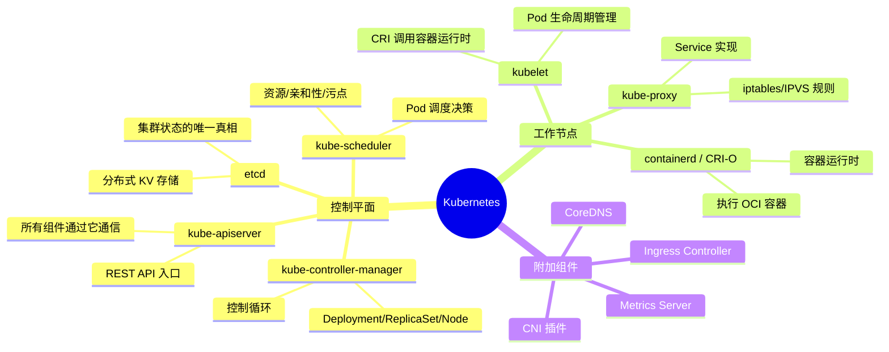
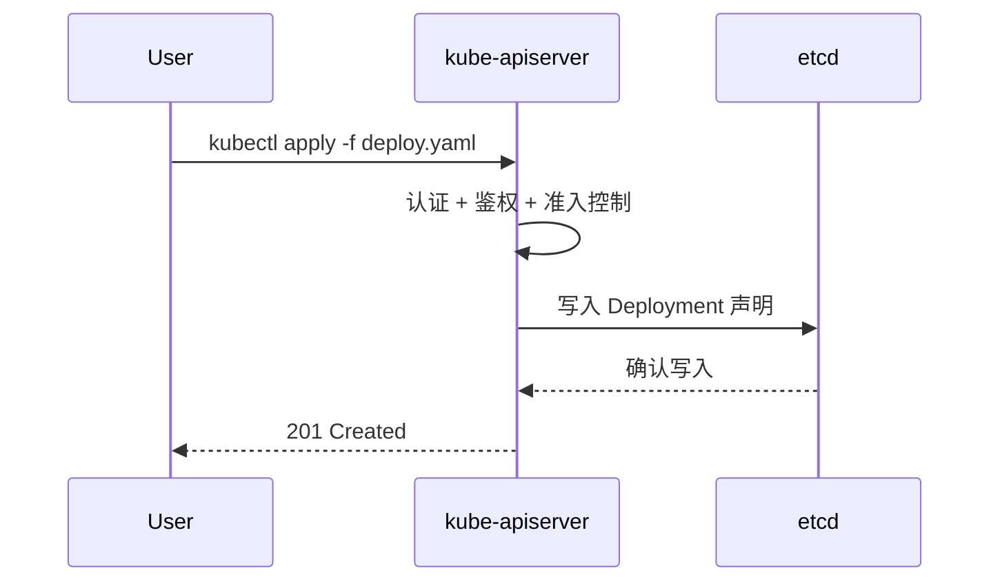
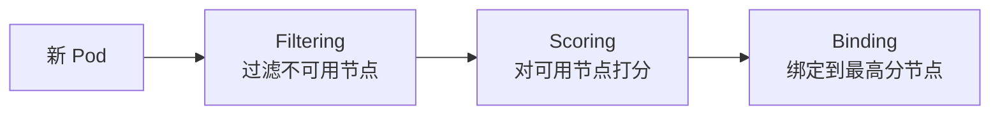
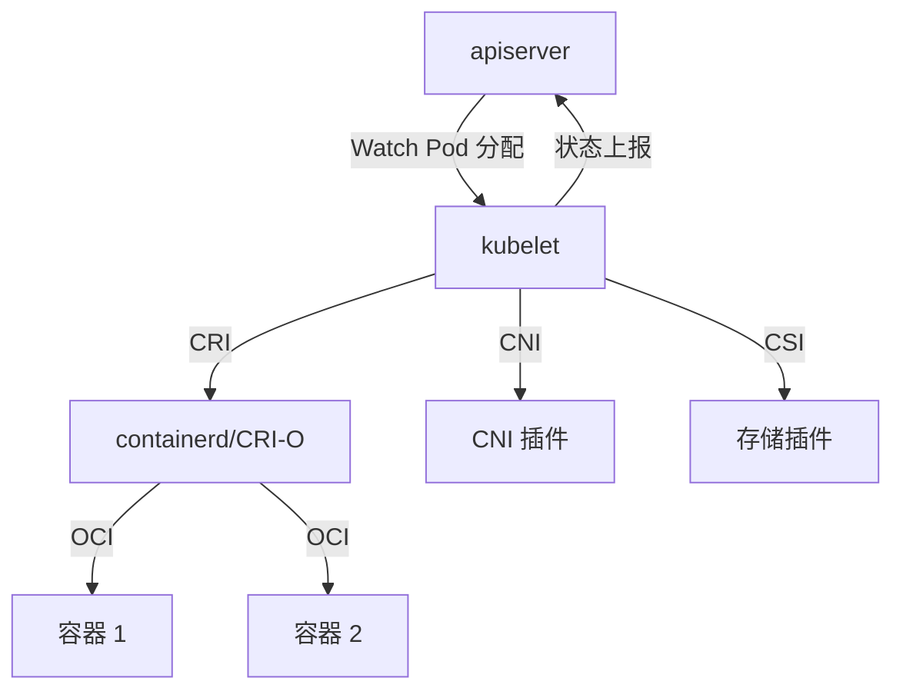
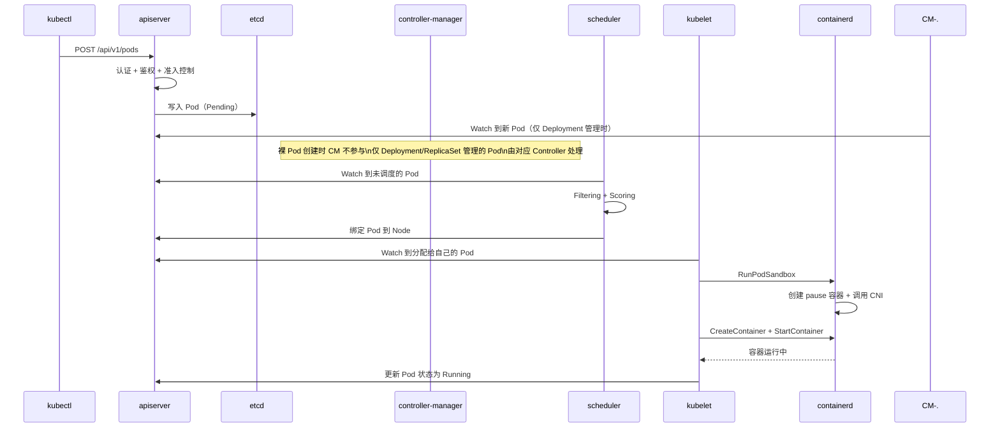

# K8s 系统全景图

<!-- 🎨 AI插图 | 千问万相 prompt -->
<!-- 提示词: "扁平化风格的Kubernetes全景架构图，蓝色科技感，
     展示控制平面和工作节点的关系，用箭头表示通信方向，
     简洁清晰，白色背景，16:9横版" -->
<!-- 文件: docs/assets/k8s-system-overview.png -->

## 为什么需要全景图

面试中，"讲讲 K8s 的架构"几乎是必考题。你需要能在 2 分钟内画出整体架构，解释每个组件的职责和交互方式。

本文假设你已经有 K8s 基础（了解 Pod/Deployment/Service），现在从**系统层面**重新认识整个 K8s。

## 全景脑图

## 控制平面详解

### kube-apiserver：所有操作的入口

关键知识点：

- **所有**组件都通过 apiserver 通信（不直接访问 etcd）
- 请求经过三个阶段的处理链：认证（Authentication）→ 鉴权（Authorization）→ 准入控制（Admission Control）
- 是唯一直接读写 etcd 的组件

### etcd：集群状态的唯一真相

- Raft 协议保证一致性
- 存储所有 K8s 资源对象（Pod、Deployment、ConfigMap 等）
- **etcd 挂了 = 集群挂了**，所以生产环境必须高可用 + 定期备份
- Watch 机制：组件通过 watch etcd 来感知变化

### kube-scheduler：调度决策

调度分两步：

1. **Filtering**（过滤）：排除不满足条件的节点（资源不足、污点、亲和性不匹配）
2. **Scoring**（打分）：对剩余节点评分（资源均衡、亲和性偏好），选最高分

### kube-controller-manager：控制循环

包含多个控制器，每个都运行独立的控制循环：

| 控制器 | 职责 |
|--------|------|
| Deployment Controller | 管理 ReplicaSet，驱动滚动更新 |
| ReplicaSet Controller | 确保 Pod 数量与期望一致 |
| Node Controller | 监控节点健康状态 |
| EndpointSlice Controller | 维护 Service 和 Pod 的映射 |
| ServiceAccount Controller | 为新 namespace 创建默认 SA |

## 工作节点详解

### kubelet：Pod 生命周期管理

关键接口：

- **CRI**（Container Runtime Interface）：与容器运行时通信
- **CNI**（Container Network Interface）：配置 Pod 网络
- **CSI**（Container Storage Interface）：管理持久化存储

### kube-proxy：Service 的实现

kube-proxy 在每个节点上运行，负责实现 Service 的流量转发：

| 模式 | 原理 | 适用场景 |
|------|------|----------|
| iptables | 生成 iptables DNAT 规则 | 中小规模集群 |
| IPVS | 内核级负载均衡 | 大规模集群（Service 数量多） |

## 一次完整的 Pod 创建流程

面试高频题——"描述一下 kubectl apply 之后发生了什么"：

## 广度速览

选择你要深入的领域：

- [🌐 网络概念速览](./breadth/networking-review) — Service、CNI、NetworkPolicy
- [⏰ 调度概念速览](./breadth/scheduling-review) — 调度流程、亲和性、污点

## 领域深潜

选一个领域打穿（面试中展示深度）：

- [🌐 CNI 网络深潜](./deep-dive/cni-deep-dive) — 从 CNI 合约到 eBPF

## 面试锦囊

### 必考题

**Q: 描述 K8s 控制平面的组件和职责**

> apiserver 是入口、etcd 存状态、scheduler 管调度、controller-manager 跑控制循环。所有组件通过 apiserver 通信，不直接访问 etcd。

**Q: Pod 创建流程是什么？**

> kubectl 发请求到 apiserver → 认证鉴权后写入 etcd → scheduler watch 到未调度 Pod 做调度决策 → kubelet watch 到分配给自己的 Pod → 通过 CRI 调用容器运行时创建容器 → 更新状态回 apiserver。

### 加分项

- 能解释 apiserver 的三段处理链（认证→鉴权→准入控制）
- 能说出 kubelet 的三个关键接口（CRI/CNI/CSI）
- 能对比 kube-proxy 的 iptables 和 IPVS 模式
