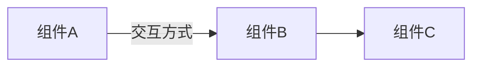

# 文章标题

## 概念引入

> 用生活化比喻引入概念，建立直觉。
> 回答"这是什么？为什么需要它？"
>
> 例如：Pod 就像一艘小船，容器是船上的水手，它们共享同一个网络空间和存储空间。

<!-- 🎨 AI插图 | 千问万相 prompt -->
<!-- 提示词: "扁平化风格插画，[描述具体画面]，蓝色科技感配色，
     简洁干净，白色背景，16:9横版构图" -->
<!-- 文件: docs/assets/[filename].png -->
<!-- 生成图片后取消下面的注释：

-->

## 原理讲解

> 讲解核心原理，够用就好，不深入实现细节。
> 使用 Mermaid 图表辅助理解。



### 关键点 1

*讲解内容...*

### 关键点 2

*讲解内容...*

## 动手实验

> 配套实验位于 `docs/labs/beginner/<topic>/`

```bash
# 进入实验目录
cd docs/labs/beginner/<topic>

# 启动实验环境
bash setup.sh

# 按实验步骤操作...

# 完成后清理
bash teardown.sh
```

**预期输出：**

```
$ kubectl get pods
NAME                  READY   STATUS    RESTARTS   AGE
example-pod-xxxxx     1/1     Running   0          10s
```

## 自检问题

> 回答以下问题，检验你是否理解了本文内容：

1. **[基础]** *问题 1*
2. **[理解]** *问题 2*
3. **[应用]** *问题 3*

<details>
<summary>查看答案</summary>

1. *答案 1*
2. *答案 2*
3. *答案 3*

</details>

## 下一步

→ *下一篇标题（替换此链接）*
