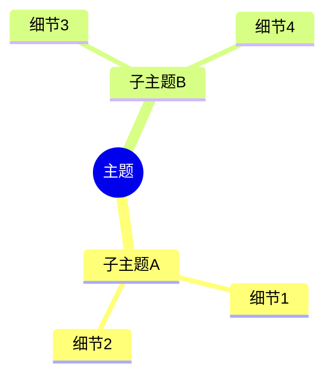
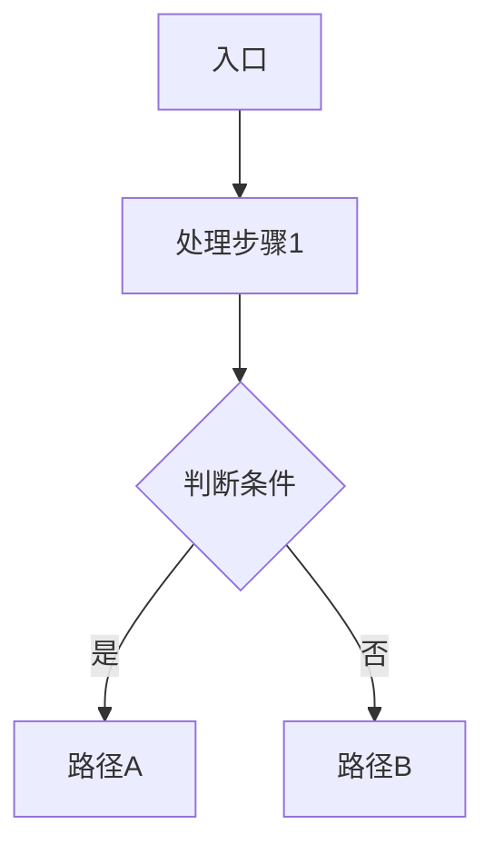
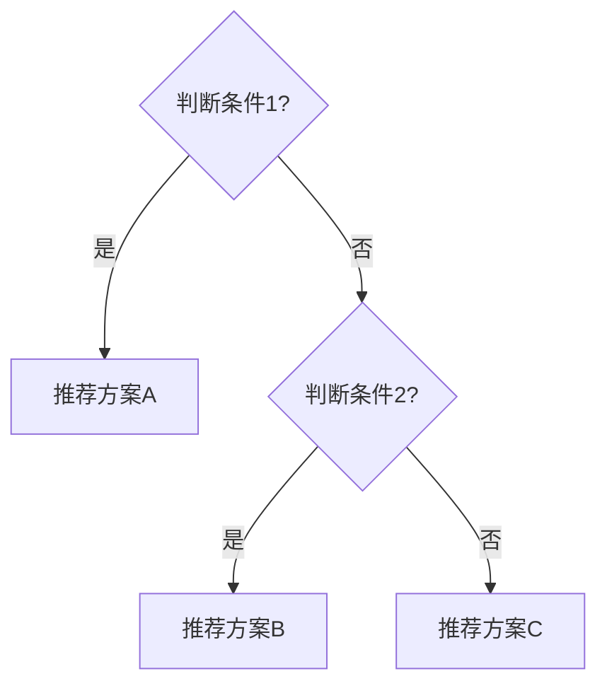

# 🌐/⏰/💾/🔒/📊 领域深潜：标题

> 前提假设：你已经会 *<基础操作>*，知道 *<基础概念>*。
> 本文将从实现层面深入剖析。

## 架构总览

> 系统级视角，不解释基础概念。
> 用脑图展示整体结构。



## 源码/实现剖析

### 第 1 层：基础机制

> 深入内核/代码层面的分析。



*深入分析...*

### 第 2 层：进阶机制

*深入分析...*

### 第 3 层：高级机制

*深入分析...*

## 方案对比与决策

### 对比表

| 特性 | 方案 A | 方案 B | 方案 C |
|------|--------|--------|--------|
| 特性 1 | ✅ | ✅ | ❌ |
| 特性 2 | 低 | 中 | 高 |
| 适用场景 | ... | ... | ... |

### 选型决策框架



## 生产实践

### 大规模场景

*生产环境下的考量...*

### 故障案例

**问题**：*描述*

**根因**：*分析*

**解决**：*方案*

### 实验验证

```bash
# 系统验证型实验
cd docs/labs/interview/<topic>
bash setup.sh

# 抓包/性能对比/故障注入...
```

**预期结果：**

```
$ tcpdump -i cni0 -n
...
```

## 面试锦囊

### 必考题

**Q1: *问题***

> 简答：*1-2 句核心回答*
>
> 展开：*详细解释，链接到本文对应章节*

**Q2: *问题***

> 简答：*...*

**Q3: *问题***

> 简答：*...*

**Q4: *问题***

> 简答：*...*

**Q5: *问题***

> 简答：*...*

### 场景设计题

> **题目**：*开放性问题描述*
>
> **关键考量**：
> 1. *考量点 1*
> 2. *考量点 2*
> 3. *考量点 3*
>
> **参考架构**：
> *描述参考方案*

### 加分项

- 能聊 *<高级话题>*
- 能画出 *<复杂架构图>*
- 了解 *<前沿技术>*
